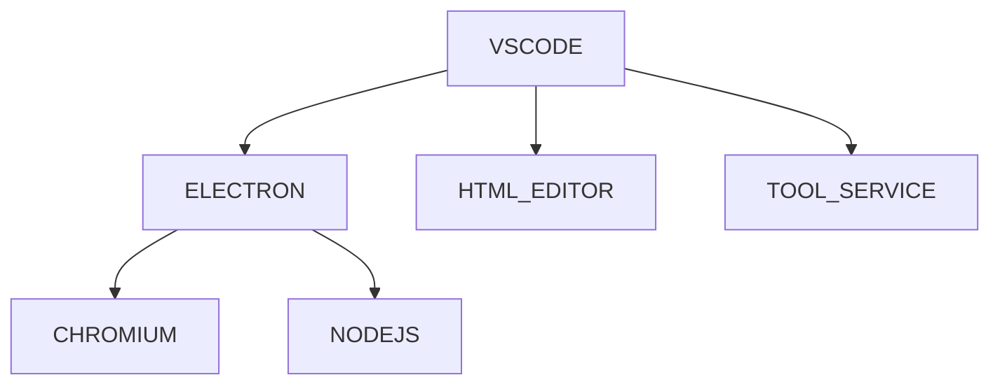

 # Visual Studio Code

## What

Visual Studio Code is an editor. It is lightweight but extensible. The builtin supports include js and basic markdown. And there is a marketplace containing many extensions for different purposes which cover everything about software development from coding, building, testing and deploying.

## Purposes

- easy to use.
- highly configurable for different users.


## When

Whenever we want to edit anything.

## where

For desktop
- Windows
- MacOS
- Linux

## How

### Architecture



### Structure

#### Editing

The editing area is managed in 2 levels - editor groups and editors. The editing area consists of editor groups side by side. An editor group consists of editors in stack.

| Layout | Purposes | Use case|
| --- | --- | --- |
| side by side | for real-time reference | 1.comparison: coding 2. write reference: coding 3. real-time checking: tmux|	
| list| for later reference | 1. analysis & deduction: chrome 2. stack: coding 3. job switch: tmux|  

##### Editor Group Management

- create: `ctrl + \`
- focus to left: `ctrl+k ctrl+leftarrow `
- focus to right: `ctrl+k ctrl+rightarrow `
- move to left: `ctrl+k leftarrow `
- move to right: `ctrl+k rightarrow `
- close: `ctrl+k w`
- close all: `ctrl+K+W`

##### Editor Management

- open
    - preview mode: single click
    - editing mode: double clicks
- focus to left: `ctrl+pageup`
- focus to right: `ctrl+pagedown`
- move to left: `ctrl+shift+pageup`
- move to right: `ctrl+shift+pagedown`
- close: `ctrl+w`

##### Editor

- type
    - tab
    - non-tab

#### Activity

- explorer: `ctrl + shift + E`
- extensions: `ctrl + shift + X`

##### Explorer

- open editors
- project folder structure
- timeline
- outline

##### Extension Management

- installed
- recommended

#### Status Management

- status bar
    - project
        - version control
        - errors & warnings
    - file
        - encoding
        - eol
        - tab width
  
#### Panel

#### Command Center

- what: a place managing all available commands.
- purposes
    - to quickly find and run commands to use some vscode services
- interface: command palette `ctrl+shift+P`

#### Profiles

A Profile is a set of configurations including settings, keybindings, extensions and UI layouts. A profile can be applied by different users to multiple projects like one for markdown projects.

```mermaid
```

- sync: Profiles can be synced among different devices via **github accounts**.
- share: Profiles can be shared online via **github gists**.


##### Setting Management

Settings are used to configure vscode's behaviors in every aspect.

There are 2 types of settings
- user
    - available for all projects of a laptop user. representing the user's personal preference.
    - stored at `~/.config/vscode/User`
- workspace
    - representing the project's preference. shared by coworkers of the project.
    - stored at `project_root/.vscode` 

There are 2 types of interfaces to configure settings.
- setting editor GUI `ctrl+,` providing a tree structure and a search bar
    - single setting configure
        - checkbox
        - list
        - input
- directly access the file `settings.json`
    - format

##### Keybinding Management

A center to manage keybindings. 

We want to configure keybindings for
- creating new ones for efficiency
- resolving conflicts
    - trouble shooting
    - remove rules

There are 2 types of interfaces to configure keybindings.
- keybinding editor `ctrl+K ctrl+S`
- directly access the file `keybindings.json`
    - format
        - key
        - command
        - when
  
To easily memorize, there are 3 groups of commonly used keybindings.
- `ctrl+shift`: general
    - show views
- `shift+alt`: selection
    - elements in a file
        - shrink: `shift+alt+leftarrow`
        - expand: `shift+alt+rightarrow`
    - rows: `shift+alt+up/down`
    - blocks: holding `shift+alt`, then click the other corner
- `ctrl+k`: additional
    - editor group
    - views
        - file diff
        - keybinding editor
        - preview


#### Builtin Language Supports

##### Markdown

- link management
    - test
        - all links to somethings
        - link validation
    - act
        - auto-completion
            - file
                - absolute: `/`
                - relative: `.`
            - header
                - internal: `#`
                - external: `##`
        - file placement: mapping
        - link update
            - headers, links: `F2`
            - file: set to auto
