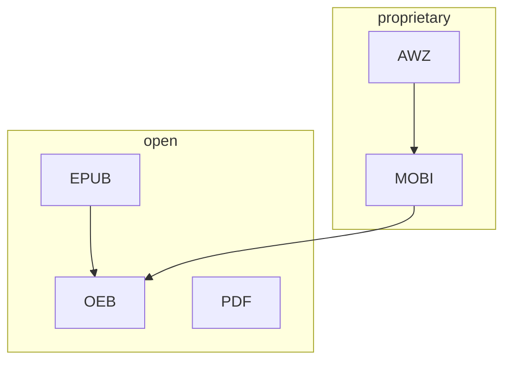

# Popular E-book Formats

## Relationship

## EPUB V.S PDF

EPUB and PDF are the 2 most commonly used e-book formats. The comparison between EPUB and PDF is a comparison between flexibility and stability.

| Aspect | EPUB | PDF |
| --- | --- | --- |
| layout | reflowable | preserved |
| customization | High, including fonts, margins and alignment | Low |
| interactivity | High, enabling video, audio narration and interactive elements.| Low, usually only contains text content.|
| compatibility | High, many readers support it. | Universal, almost all readers can open PDF files|
| Use cases | 1. view docs (usually casual ones like novels) from different devices, especially ones with small displays. 2. want high customizations.| 1. for docs with complex structures or many images and tables, such as academic, business or legal documents which are usually viewed on large screens. 2. for printing.|