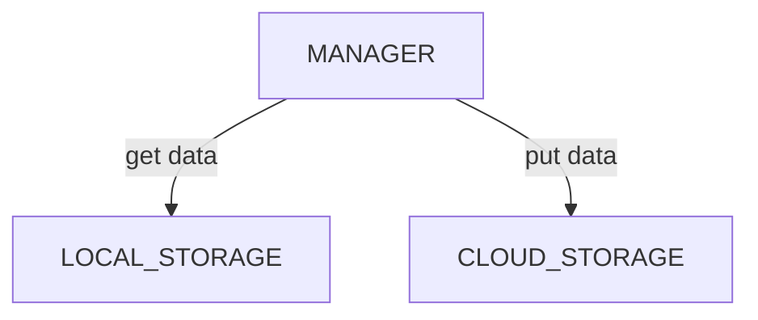

# Photo Automatic Backup

## Structure

## Platform Comparison

| Aspect | Heytap Cloud | Cloud189 | Autosync + Box |
| --- | --- | --- | --- |
| What | A cloud service provided by OPPO | A cloud service by China Telecom | 1. Autosync: an auto sync and backup app provided by MetaCtrl for android. 2. Box: a cloud storage used by Autosync. |
| Purposes | backup & transfer | backup & share | backup & collaboration |
| Free Storage Size | 5 GB | 30 GB | 10 GB |
| Conditions | 1. charging 2. WIFI | 1. wifi 2. power more than 20% | |
| Frequency | once per week | real time | real time |
| Config grain | all photos as a whole | folder(nested folders not working) | folder and all sub ones |
| Mode | version control | upload only | 7 modes |

## Autosync Modes

Autosync has 7 modes for difference purposes.

- mutual sync: for synchronization
- upload: changes from the local storage to the cloud. Changes in the cloud will NOT affect the local.
	- upload only: the cloud for backup. When a photo is added in the local, it is uploaded into the cloud. A local deleted photo will not affect the cloud.  
	- upload mirror: the cloud used as a viewer. Both local adding and deleting will be reflected in the cloud.
	- upload & delete: the cloud used as a storage. When a photo is added in the local, it is uploaded and the local copy is deleted.
- download: changes from the cloud to the local storage. Changes in the local will NOT affect the cloud.
	- download only: the local for backup. When a photo is added in the cloud, it is downloaded into the local. A cloud deleted photo will not affect the local.
	- download mirror: the local used as a viewer. Both cloud adding and deleting will be reflected in the local.
	- download & delete: the local used as a storage. When a photo is added in the cloud, it is downloaded and the cloud copy is deleted.
<!--stackedit_data:
eyJoaXN0b3J5IjpbMTExOTAwNjk1Ml19
-->