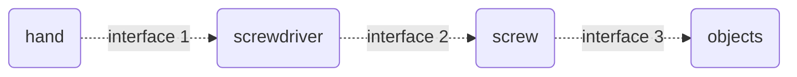

# How to Use Screws

## hand

- what: human hands to turn screwdrivers
- purpose: the source of torque

## screwdriver

- what: a tool to turn screws
- purpose: to centralize the torque
  
## screw

- what: A type of fasteners. They are usually made of metal and consist of a head and a body.
- purpose: to fasten objects.

## objects

- what: hard objects which usually are made of wood or metal.

## Required Interfaces

### Between hands and screwdrivers

Handling with one hand
- index finger to press the long end to fix the driver and apply downward force
- thumb and middle finger to rotate th driver to turn the screw 

### Between screwdrivers and screws

There are 2 requirements

#### type

- slot
- phillips
- hex

#### size

##### Torque transfer

- large contacting areas promotes efficient force transfer.
- the largest contacting area is reached when the screwdriver tip matches with the screw head slot.

##### How to choose the matched size
- check specifications
- test
    - behavior
        - find the screwdriver by which it is the easiest to turn the screw.
    - state
        - feel
            - try from the largest one till the first one whose tip can be entire inserted into the slot. 

### Between screws and objects

The screw body and the hole in objects need to be matched.

Dimensions to consider (ISO: M)
- thread width
- column diameter
- column length
    
    