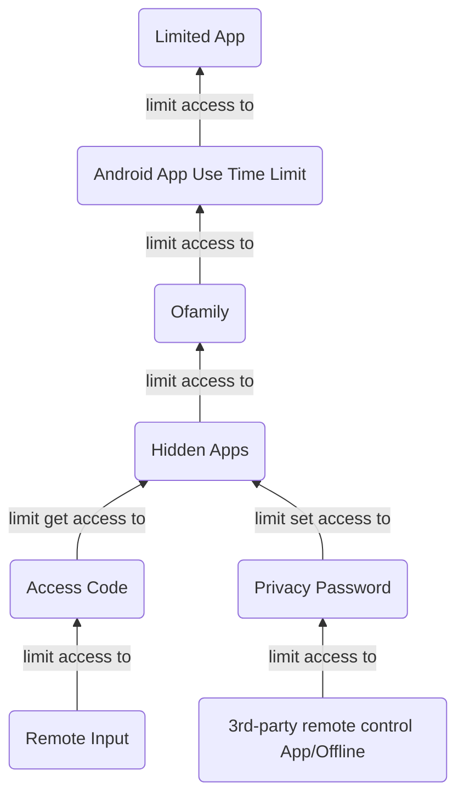

# Phone Blocking

## For Apps

### Principles

#### Builtin Access control

- general
    - App password
- productivity
    - Android app use time limit
- security
    - For individual apps
        - app lock
        - hidden apps
    - For system functionalities
        - linked system supervision apps

#### Password 

##### Management

- brain
- tool

##### Input

- Offline
- Online

### Limit app use

#### Access to apps

| Aspect | *Android app use time limit* | App password | 3rd-party blocking app |
| --- | --- | --- | --- |
| Efficacy | rigid | I can borrow others' accounts for an online service | critical bug: covering page & blocking latency |

When 3rd-party blocking apps detect a target app, they will NOT close the app, but pop out a covering page which can be withdrawn. Besides, there is latency between the target app showing and the covering page showing. Then we can move a step forward during each window time.

#### Access to Android app use time limit

We need someone else as a supervisor.

| Aspect | App use time pswd | *Ofamily* |
| --- | --- | --- |
| Labor | More: 1. the supervisor enters the pswd 2. I adjust config | Less: I can require the supervisor to adjust config. |
| Backdoor | **TURN OFF LIMIT: during config I can turn off a limit, and the supervisor will not know the real-time config.** | **TURN OFF SHARING: I can turn off the app time share to the supervisor directly.** |

#### Access to Ofamily

To avoid turning off sharing, my access to Ofamily needs to be limited.

| Aspect | Ofamily pswd | App lock | *Hidden app* |
| --- | --- | --- | --- |
| Efficacy | unavailable | Y | Y |
| uninstall protection | / | Y | Y |
| labor | / | High: Ofamily can not share the input page of the privacy password to the supervisor, but **App lock forces that each access to a locked app needs the pswd.** | Middle: Ofamily can access the access code to show hidden apps, and it still requires the privacy pswd to hide an app. **Only config needs the privacy pswd.** |

#### Access to Hidden apps

- An access code is needed to show hidden apps.
- The Privacy password is needed to config hidden apps.

#### Access to the access code

The supervisor can hold and input the access code via Ofamily remotely.

#### Access to the privacy password

The privacy password is NOT allowed to be input via Ofamily, then another way to allow a supervisor enter it is needed.

| Aspect | Offline | *3rd-party remote control app* |
| --- | --- | --- |
| Labor | high | low |
| Time | long | short |
| challenge | the supervisor is unavailable | no suitable app |

#### Access control flow

## Site