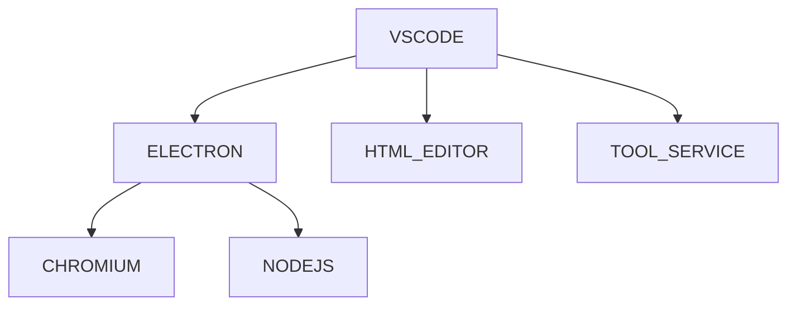

# Visual Studio Code

## What

Visual Studio Code is an editor. It is lightweight but extensible. The builtin supports include js and basic markdown. And there is a marketplace containing many extensions for different purposes which cover everything about software development from coding, building, testing and deploying.

## Purposes

- easy to use.
- configurable for different users.

## When

Whenever we want to edit anything.

## where

For desktop
- Windows
- MacOS
- Linux

## How

### Architecture

### UI structure

- activity bar
    - explorer: `ctrl + shift + e`
    - search
    - run & debug
    - git
    - extension: `ctrl + shift + x`
- primary side bar: `ctrl + b`
    - explorer
        - workspace structure
        - outline
- editor
    - editor group
        - create: `ctrl + \`
        - focus to left: `ctrl+k ctrl+leftarrow `
        - focus to right: `ctrl+k ctrl+rightarrow `
        - move to left: `ctrl+k leftarrow `
        - move to right: `ctrl+k rightarrow `
        - close: `ctrl+k w`
        - editors
    - editor
        - presentation
            - tab
            - non tab
        - mode
            - editing: double-click
            - preview: single-click
        - focus to left: `ctrl+pageup`
        - focus to right: `ctrl+pageup`
        - close: `ctrl+w`
  
    | Layout | Purposes | Use case|
    | --- | --- | --- |
    | side by side | for real-time reference | 1.comparison: coding 2. write reference: coding 3. real-time checking: tmux|	
    | list| for later reference | 1. analysis & deduction: chrome 2. stack: coding 3. job switch: tmux|  
- status bar
    - project
        - version control
        - errors & warnings
    - file
        - encoding
        - eol
        - tab width
- panel
    - debug
    - terminal

### Functionalities

- command palette: `ctrl+shfit+p`
    - category: command
- settings: `ctrl+,`
    - user
        - profiles
            - default
            - created
                - partial config
                - copy from
                    - none
                    - default
                    - template
                    - existing 
    - workspace
    
    - user settings V.S profile
		- At any instance, user settings are bound to a profile. By default, user settings are bound to the default profile. We can create and switch to other profiles.
		- a profile contains not only settings, but keybindings, UI layouts and others.     
- keybindings: `ctrl+k ctrl+s`
    - groups
        - `ctrl+shift`: general
            - show views
        - `shift+alt`: selection
            - elements in a file
                - shrink: `shift+alt+leftarrow`
                - expand: `shift+alt+rightarrow`
            - rows: `shift+alt+up/down`
            - blocks: holding `shift+alt`, then click the other corner
        - `ctrl+k`: additional
            - editor group
            - views
                - file diff
                - keybinding editor
                - preview
    - configure
        - resolve conflict
        - create: key, command, when
        - remove: -command
- sync
    - user
        - default: `~/.config/vscode/User`
        - profiles: `~/.config/vscode/User/profiles`
    - workspace: `project_root/.vscode`

    | Type | what | purposes | where |  
    | --- | --- | --- | --- |
    | user  | sync user settings including all profiles across different devices | to work on multiple devices like a company desktop and personal laptop | between a platform login user (linux) and an online account (github)|
    | workspace | share settings of a workspace between developers | collaboration | a `.vscode` dir under workspace root dir |
- markdown
    - structure management
        - check: outline
        - selection
    - link management
        - test
            - all links to somethings
            - link validation
        - act
            - auto-completion
                - file
                    - absolute: `/`
                    - relative: `.`
                - header
                    - internal: `#`
                    - external: `##`
            - file placement: mapping
            - link update
                - headers, links: `F2`
                - file: set to auto 