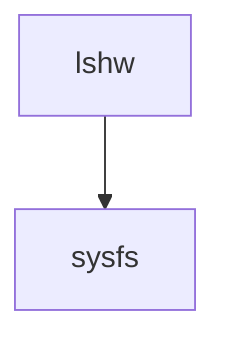

# lshw

## what

- a tool to list hardware devices.

## purposes

- to check all device components of the current platform. 
- to check detailed information about a hard component like the model info, memory configuration and the driver in use of a gpu.

## when

- to know the hardware structure of a system.

## where

- linux command line

## how

### structure

### behaviors

- get
    - `lshw`
        - available data: accessible devices from PCI, USB and other buses.
        - filters
            - class
        - formats
            - tree
        - entity
            - available data
                - name
                - model
                - version: hardware version
                - bus info
                - config
                    - memory
                    - **driver**: currently used
                    - firmware: version