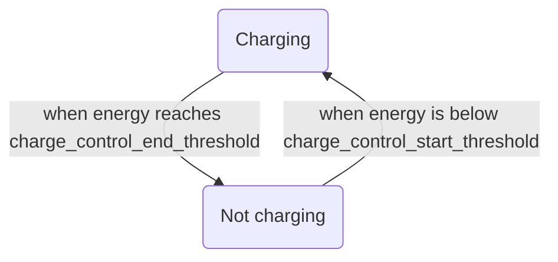

# Linux Battery Management

## What

A system to manage charge behaviors of batteries.

## Purposes

- to main a good State of Charge to extend battery life.

## When

- connected to AC power.
  
## Where

- linux

## How

### Structure

There are 3 charging modes describing how AC handles a battery when it is connected.

#### auto

It provides electricity to both the battery and the rest part of the laptop consuming power. In this case, the battery is charged normally.

Under this mode, there are 2 thresholds to control the state of charge.
- *charge_control_start_threshold*: below which charging will start.
- *charge_control_end_threshold*: above which charging will stop.
In other words, AC will charge a battery with energy below *charge_control_start_threshold* to *charge_control_end_threshold*.

#### inhibit-charge

It does not touch the battery, but only provides power for the system to run. In this case, the battery energy is stable over time. 

#### force-discharge

It does not charge anything. In this case, it has no effects and all power is consumed from the battery.

### Behaviors

- configure
    - the charge mode
        - input: set `/sys/class/power_supply/BAT0/charge_behavior`
            - `auto`
            - `inhibit-charge`
            - `force-discharge`
    - under the `auto` mode, 
        - the threshold to start to charge
            - input: set `/sys/class/power_supply/BAT0/charge_control_start_threshold`
        - the threshold to stop charging
            - input: set `/sys/class/power_supply/BAT0/charge_control_end_threshold`