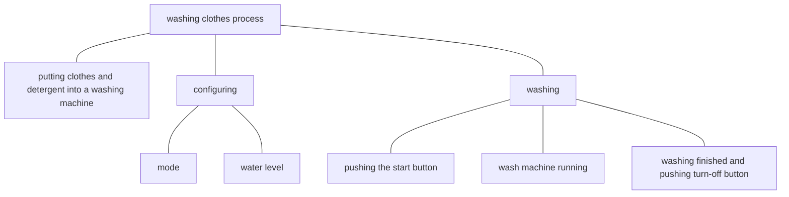

# Goal Achievement

## Testing & Acting

Each instance we are at some state. Testing and acting are two types of states related to goal achievement.

Testing is one when we are analyzing our current situation. During a testing process, following steps are performed.

1. expectation: specify or recall our goal.
2. actuation: examine our current situation.
3. comparison: compare differences between the situation and goal.
4. plan: plan or check a path from the situation to the goal.

We use testing to

1. plan a path to achieve a goal at the beginning.
2. test whether or not we have achieved the goal or a sub goal.
3. clarify whether or not we are on the path when we feel lost, and make adjustment accordingly.
 
Acting is one when we are doing something to achieve our goals. It means that we are on the path.

## Abstraction Degrees

Anything can be divided into smaller parts recursively. For instance, 

Abstraction degrees mean how abstract or specific the description of a procedure is. However what procedures are obvious are various among people and among different stages of the same person. AT the beginning when we do not know how to use a wash machine, simple physical actions like *opening the lid* and *pushing the mode selection button* are obvious. After times of using, when we see higher-level instructions like "configure" and "wash clothes with a wash machine", we directly know how to do it without much thinking.

## Plan

In goal achievement, a goal is a state, and a path is a procedure. 

To make the final goal achievable and manageable, **a top-down approach** is applied to build the path. If we dive to specific steps too soon, the whole path will contain many steps, which is not flexible then not robust. Even we might be detoured and lost. 

### Terms

Path
: a path from its precondition to the goal.

Composite Goal
: a goal consisting of independent sub goals **in space**.

Leaf Goal
: a goal with a quantitative/physical standard.

### Procedure

- For a composite goal, divide it into no more than 3 independent sub goals, and arrange the order of sub goals along the path based on priority.
- For a leaf goal
	- If its path is clear, done.
	- If its path is unclear,
		1. specify the path with a specific verb or a series of more specific steps.
		2. identify the set of needed timing, locations, tools and materials.
		3. treat the meeting of these dependencies as its intermediate goal. 

Repeat this produce recursively for each path segment till all path segments are clear.

### Get

If we want to get something, the getting process can be divided into 2 parts
- [find](find.md): Search methods to find a target from a scope.
- [move](move.md): move the object from its source to our destination.

<!--stackedit_data:
eyJoaXN0b3J5IjpbODgyMzU0MjddfQ==
-->