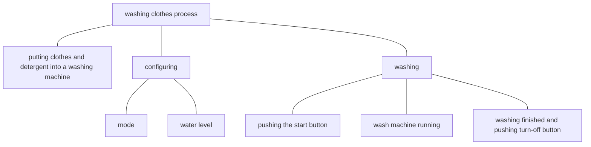

# Goal Achievement

## Testing & Acting

Each instance we are at some state. Testing and acting are two types of states related to goal achievement.

Testing is one when we are analyzing our current situation. During a testing process, following steps are performed.

1. expectation: specify or recall our goal.
2. actuation: examine our current situation.
3. comparison: compare differences between the situation and goal.
4. plan: plan or check a path from the situation to the goal.

We use testing to

1. plan a path to achieve a goal at the beginning.
2. test whether or not we have achieved the goal or a sub goal.
3. clarify whether or not we are on the path when we feel lost, and make adjustment accordingly.
 
Acting is one when we are doing something to achieve our goals. It means that we are on the path.

## Abstraction Degrees

Anything can be divided into smaller parts recursively. For instance, 

Abstraction degrees mean how abstract or specific the description of a procedure is. However what procedures are obvious are various among people and among different stages of the same person. At the beginning when we do not know how to use a wash machine, simple physical actions like *opening the lid* and *pushing the mode selection button* are obvious. After times of using, when we see higher-level instructions like "configure" and "wash clothes with a wash machine", we directly know how to do it without much thinking.

## Plan(TODO)

> Note
> - We do not consider habits now.

In goal achievement, a goal is a state, and a path is a procedure. 

To make the final goal achievable and manageable, **a top-down approach** is applied to build the path. If we dive to specific steps too soon, the whole path will contain many steps, which is not flexible then not robust. Even we might be detoured and lost. 

### Terms

Path
: 	a path from its precondition to the goal.

Composite Goal
: 	a goal consisting of independent sub goals **in space** which need individual handling. For instance, a goal of loosening 5 screws can be viewed as 5 sub goals of loosening one screw. Wiping a box can be divided into wiping its 6 sides. 

Atomic Goal
:	a goal that can be achieved by a simple physical action as a whole like
	- pressing a button
	- wiping a plane surface
	- walking
	- speaking
	- picking something
	- heating a pot

	an atomic goal can have intermediate goals to prepare for the final step.

### Procedure

- For a composite goal, divide it into no more than 3 independent sub goals, and arrange the order of sub goals along the path based on priority and efficiency.
- For an atomic goal, **if actuation does not match expectation in testing**:
	1. consider, organize and compare all available methods to achieve the goal, then choose one.
	2. if the action is unclear, specify the action with
		- a more specific verb
		- tool chains from humans to the object
			- tools needed
			- interfaces between adjacent nodes 
				- manner of the operator
					- force
					- speed
					- angle
					- duration
				- interfaces between tools and between tool and objects
	3. identify needed 
		- tools
		- objects
		- context
			- when
			- where
	4. treat the satisfaction of these prerequisites from 2 as its intermediate goal.
		1. get
		2. **configure**

Repeat this produce recursively for each goal till it is an atomic goal that is
- achieved.
- OR clear and without prerequisites.

Take the instance of clearing clothes. We see it as an atomic goal.
1. ways to clear clothes
	- wash
		- water washing
			- wash with detergents
			- rinse
		- dry washing
	- physically remove dirt
		- wipe
		- brush
		- shake
2. We decide to wash with detergents, then we specify the action of clearing
	- verb: wash
	- tool chain: hand --> wash machine --> water, detergent --> clothes
		- manner: pressing the start button
		- interfaces:
			- water pipe connected and open
			- detergent inside the bucket
			- clothes inside the bucket
3. needed
	- direct tools: washing machine, water, detergent
	- objects: clothes 
4. prepare prerequisites
	1. get
	2. configure
		- washing machine
			- electricity
			- mode

#### Get

Preparation involves getting materials.

Firstly, we need to think about **whether we need THE item or just anyone severing the same purpose**. The later is usually the case, and we might have available alternatives easy to ignore. Remember to check what we have before buying new ones.

If we want to get something, the getting process can be divided into 2 steps
- [find](find.md): Search methods to find a target from a scope.
- [move](move.md): move the object from its source to our expected destination.

<!--stackedit_data:
eyJoaXN0b3J5IjpbODgyMzU0MjddfQ==
-->