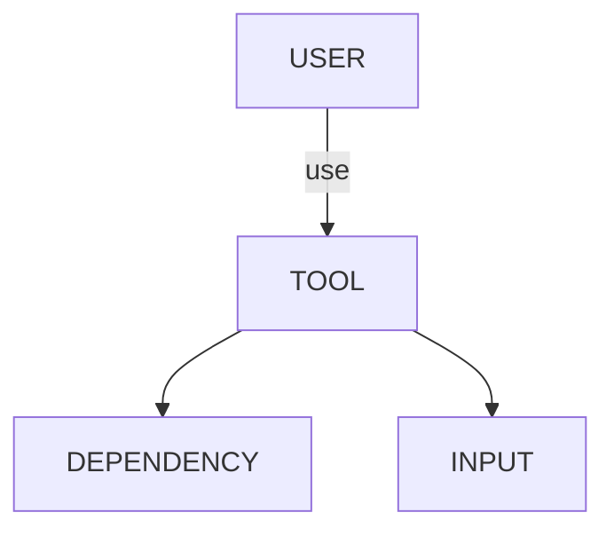
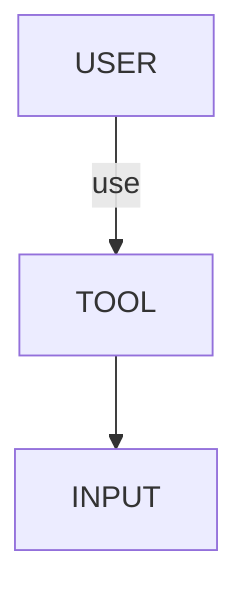
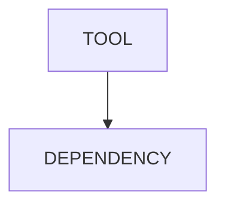

# Cohesive Tool

Each tool serves some purposes, which is the focus in understanding the tool. Let us take the example of Git, the distributed version control system used to manage projects.

Based on [this model](./../problem_solving/root_cause_analysis_methodology.md#environment)

This article only consider cohesive tools which only have one main purpose not composite tool.

## Interface

The combination of input and output form an interface between the user and the tool. There are usually multiple interfaces to access an tool, which means different ways to use the tool. For instance, we can get the Git services by a set of commands including `add`, `status`, `commit` and so on, each of which serves a different purpose.

$$
output\space Instruction(object)
$$

### Input

Input is what the user asks the tool to do, like in the command `git add foo.txt`, we ask Git to add a file called `foo.txt`. 

An input consists of two parts - an instruction and an object. To avoid ambiguity, the input should follow the requirement from the tool.

#### Instruction

An instruction means the specific action that the user wants the tool to do like `git add`.

##### Configuration

An instruction can contain configuration for specific cases.  
- Some tools only have one mode of working like that a kettle can be only toggled on or off.
- Many others enable users to configure how it works for a job like air conditioners provide options of temperature, timer, and the intensity of wind. 

#### Object

Objects mean to which the action should be done like in case of `git add foo.txt` the file `foo.txt` should be added.

### Output

Output means a service that the tool provides which is configurable. There are two types of service - get & set.

#### Get

The service is to extract some information from the object.
- A description of the state of the object like the report of `git status`.
- A further computation based on the object.

**Focus** 
- source (object)
    - which attributes are available
- filter(specify items to use)
    - for a group of items, filter items
    - for a single item, filter attributes
- output format 
    - structure

#### Set

The service can be a change to **the object** like `git add foo.txt` will copy file `foo.txt` from the working tree into the index.

**Focus**
- What does the tool do to the object specifically?

### Service Management

To organize related services and have a clear picture of the overall mechanism of the tool, we model the tool with philosophy and the object with behavior diagrams.

#### Philosophy

Philosophy describes how the tool views and acts on the object to achieve the goals of efficiency and security.

#### Behavior Diagrams

Behavior diagrams organizes related set operations and helps to depict the state transfer of the object, which helps us understand what the tool does.

##### Data flow Diagram

For example, interfaces `git add`, `git commit` and `git restore` are used to handle files between the working tree, the index and the HEAD in the 3-tree system of a repository.

##### State Diagram

When there are multiple set operations to change an object and its components between different states, a state diagram can be used to catch the flows. 

For instance, tabli tab management.

### Manager Tools

There are a type of tools whose purpose is to manage a **group** of items for efficient retrieval like dictionaries managing words, kernels managing user processes and shops managing goods. 

For these tools, "get" operations are to search for and display specific items, and "set" ones are to add or remove items and maintain the whole structure. One of the most efficient way to manage items is via classification tree which is still **goal oriented**. For instance, shops usually manage goods based on functionalities recursively. At the top level there are types of foods, electronics, clothes and so on. For foods, there are meals, snacks, and health-assisting ones.

## Internal

Structures determine behaviors.

We want to dive into the structure of the tool **for**
- Functionality reasoning: 
    - to induce the behaviors of the tool when the manual is not clear enough.
    - to verify whether the tool has a specific functionality which is hard to test directly like one about safety.
- Problem solving: We need to solve a problem about the tool.
- Inspiration & Deduction: We want some reference from the tool to develop new tools.

