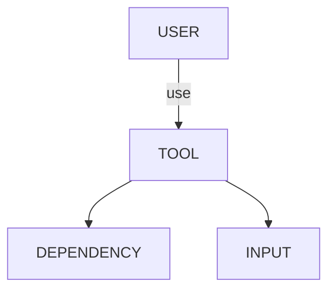
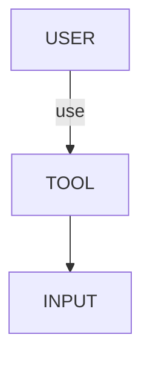
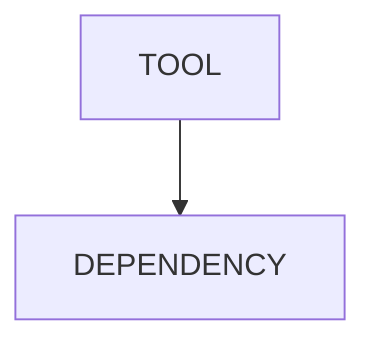

# Tool

Each tool serves some purposes, which is the focus in understanding the tool. Let us take the example of Git, the distributed version control system used to manage projects.

Based on [this model](../problem_solving/root_cause_analysis_methodology.md#environment)

## Interface

The combination of input and output form an interface between the user and the tool. There are usually multiple interfaces to access an tool, which means different ways to use the tool. For instance, we can get the Git services by a set of commands including `add`, `status`, `commit` and so on, each of which serves a different purpose.

$$
output\space Instruction(object)
$$

### Input

Input is what the user asks the tool to do, like in the command `git add foo.txt`, we ask Git to add a file called `foo.txt`. 

An input consists of two parts - an instruction and an object. To avoid ambiguity, the input should follow the requirement from the tool.

#### Instruction

An instruction means the specific action that the user wants the tool to do like `git add`.

#### Object

Objects mean to which the action should be done like in case of `git add foo.txt` the file `foo.txt` should be added.

### Output

Output means the service that the tool provides. There are two types of service - get & set.

#### Get

The service is to extract some information from the object.
- A description of the state of the object like the report of `git status`.
- A further computation based on the object.

Focus: 
- source (object)
    - which attributes are available
- filter(specify items to use)
    - for a group of items, filter items
    - for a single item, filter attributes
- output format 
    - structure

#### Set

The service can be a change to **the object** like `git add foo.txt` will copy file `foo.txt` from the working tree into the index.

Focus: 
- What does the tool do specifically?

##### Diagrams

Diagrams help to group related operations and depict the whole picture, which helps us understand what the tool does.

###### Data flow Diagram

For example, interfaces `git add`, `git commit` and `git restore` are used to handle files between the working tree, the index and the HEAD in the 3-tree system of a repository.

###### State Diagram

When there are multiple set interfaces to change an object and its components between different states, a state diagram can be used to catch the flows. 

For instance, tabli tab management.

## Internal

Structures determine behaviors.

We want to dive into the structure of the tool **for**
- Functionality reasoning: The manual of tool is not clear enough, and we want from the structure to induct the behaviors of the tool.
- Problem solving: We need to solve a problem about the tool.
- Inspiration & Deduction: We want some reference from the tool to develop new tools.

