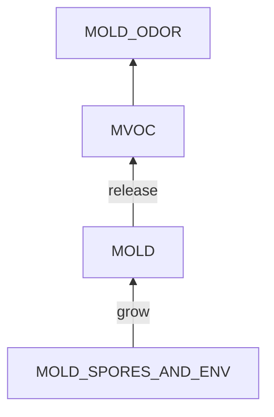
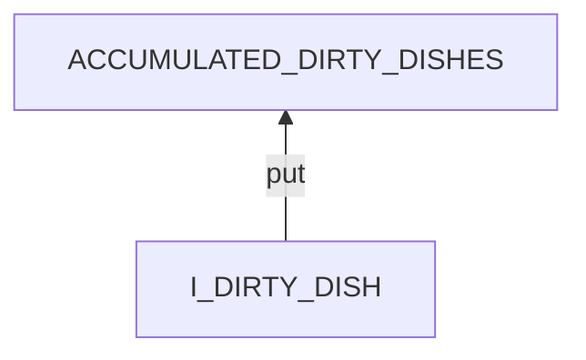
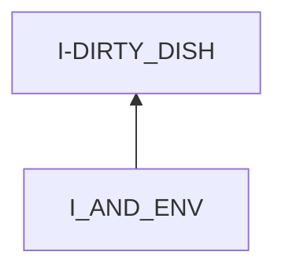
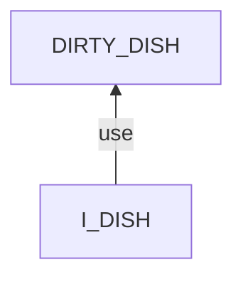

# Mold

## Examination
[problem overview]: #
[a problem can be of services or env of a system]: #

The presence of molds at my house.

### Context

#### When
[Specification: year, season, daytime, during & after some events, duration]: #

- In winter and spring
- During rainy days

#### Where
[Localization]: #

- **[KITCHEN]**kitchen
    - **[DESK]**walls
    - wooden chopsticks
    - **[BOWLS]**dirty bowls
- **[CLOTHING]**bedroom
    - quilts on bed
    - **[CABINET]**clothes in the cabinet
- STORAGE
    - **[CHOPSTICKS]**one-time-use chopsticks
    - **[BAGS]**on food bags
- **[BATHROOM]**bathroom
    - walls
    - water cup

### Symptoms
[avoid jumping to conclusions and confirmation biases]: #
[collect evidence used by hypothesis built in the root cause analysis phrase]: #
[comparison between actuation and expectation]: #
[specification: location, degree]: #
[when direct examination is hard, we can use tools like light and magnifiers to amplify the signals]: #

#### Vision

- gray powdery patches on walls and ceramics
- green spots on clothes
- green fuzzy spots on fruits

#### Hearing

#### Smell

- the iconic moldy odor from clothes

#### Taste

#### Touch & Feel

- Molds on ceramics are easy to erase

## Root Cause Analysis
[backward cause reasoning for general problems]: #
[recursive trouble shooting for engineering problems to an atomic level (build hypothesis, use evidence (examination  + unit tests))]: #

MOLD
:   visible mold or mildew spots.

    MOLDY_FOODS
    :   MOLDY_DISHES

        MOLDY_STORED_FOODS

    MOLDY_CLOTHES

    MOLDY_WALLS
    :   MOLDY_KITCHEN

        MOLDY_BATHROOM
        :   TILES

            CUPS

        MOLDY_WALLPAPER

MOLD_SPORES_AND_ENV
:   MOLD_SPORES
    :   Evidence
        :   Pos
            :   - > Spores are everywhere.[^everywhere]
    
                    [^everywhere]: https://www.epa.gov/mold/mold-course-chapter-1#Chapter1Lesson1

    ENV
    :   DEP
        :   ENERGY
            :   ORGANISMS
                :   FOOD_REMAINS
                    :   ACCUMULATED_DIRTY_DISHES
                        :   Evidence
                            :   Pos
                                :   - **[BOWLS]**

                        KITCHEN_DESK
                        :   Oily desk and walls.
                        
                            Evidence
                            :   Pos
                                :   - **[DESK]**
                        
                        STORED_FOOD
                        :   wood chopsticks, stored foods.

                            Evidence
                            :   Pos
                                :   - **[CHOPSTICKS]**
                                    - **[BAGS]** 

                    FACILITIES
                    :   WALLPAPER

                        CLOTHES
                        :   Evidence
                            :   Pos
                                :   - **[CLOTHING]**
                    
                    Link
                    :   - > Molds secrete enzymes from het hyphal tips to degrade biopolymers including starch and cellulose into simpler substances which can be absorbed by the hyphae.[^nutrients]

                        [^nutrients]: https://en.wikipedia.org/wiki/Mold

                        - **test**: Molds grow on wood clips but not plastic ones.

            OTHER_SERVICES
            :   WATER
                :   Link
                    :   - test: In my house, molds usually grow in wet space like the bathroom or the kitchen.
                        - > Moisture is a key to mold growth.[^moisture]
                            [^moisture]: https://www.epa.gov/mold/mold-course-chapter-1#Chapter1Lesson2
                        - > Molds grows where the relative humidity is above 60%. [^RH]
                            [^RH]: https://www.epa.gov/mold/mold-course-chapter-2#Chapter2Lesson3

                    Evidence
                    :   Pos
                        :   - **[BATHROOM]**
                            - **[KITCHEN]**
                            - RH
                                - kitchen: 99%
                                - bedroom: 89%
                                - bathroom: 90%

        INPUTS
        :   ~~ACTIVE~~   

            PASSIVE
            :   NATURAL
                :   LIGHT
                    :   dark env.

                        Link
                        :   - > UV can kill molds.

                        Evidence
                        :   Pos
                            :   - **[CABINET]**
                                - **[BATHROOM]**

                    AIR
                    :   close space

                        Link
                        :   - Close space promotes accumulation of spores.
                            - **test**: Wood clips in a plastic packaging are easier to grow molds than outside.

                        Evidence
                        :   Pos
                            :   - **[CABINET]**

                    TEMPERATURE
                    :   
                        Link
                        :   - 25~30 is best temp range for molds to grow
                            - Few molds grow below 4 degrees.

                        Evidence
                        :   - kitchen: 21.4
                            - bedroom: 25.1
                            - bathroom: 24.9

                ~~TEMPTATIONS~~

I_DIRTY_DISH
:   ~~I~~

    I-DIRTY_DISH
    :   I directly put a used dish into the pool.

    DIRTY_DISH

I_AND_ENV
:   I
    :   MIND
        :   RULE
            :   IGNORANCE

                NOT_IMPORTANT
                :   Washing dishes is a trifle.
            
            STATE
            :   EMOTION
                :   LAZINESS

        BODY
        :   HIGH_BLOOD_SUGAR

    ENV
    :   ~~DEP~~

        INPUT
        :   ~~ACTIVE~~

            PASSIVE
            :   ~~NATURAL~~

                TEMPTATION
                :   LIVING_ALONE
                    :   Only I use the pool.

I_DISH
:   I
    :   IGNORANCE_ONE_TIME

    I-DISH
    :   MISMATCH
        :   ~~STATE~~

            BEHAVIOR
            :   ALWAYS_USE_BOWLS  

        ~~LOOSE~~

    ~~DISH~~

## Brainstorming
[removal of touchable physical objects is applicable]: #
[replacement V.S repair. Localize the problem to an atomic level where fixing it components is more expensive than replacing it as a whole]: #

~~MOLD_ODOR~~
:   a perception.

MVOC
:   - ventilation by
        - opening windows **<5>**
        - range hood **<6>**
        - air conditioner **<11>**
    - absorb via baking soda **<20>**
     
MOLDY_DISHES
:   wash dishes **<7>**

MOLDY_STORED_FOODS
:   throw them away **<21>**

MOLDY_CLOTHES
:   - kill molds: rubbing alcohol for clothes & furniture **<3>**
    - remove them: wash clothes **<2>**

MOLDY_WALLS
:   - kill: vinegar **<4>**
    - remove: use towels and brushes. **<1>**

MOLD_SPORES
:   reduce the density of spores via air exchange by
    - opening windows during 3 meals **<5>**
    - ventilation fan **<6>**
    - air conditioner **<11>**
  
ACCUMULATED_DIRTY_DISHES
:   wash dishes **<7>**

KITCHEN_DESK
:   wipe cooking desk **<8>**

~~STORED_FOOD~~
:   I need these.

~~WALLPAPER~~
:   I need it.

~~CLOTHING~~
:   I need these clothes.

WATER
:   maintain a RH of 30%~50% in the kitchen, bedroom, bathroom and clothes cabinet by
    - dehumidifying via Air Conditioners **<12>**
    - removing moisture via desiccants
        - Calcium Chloride **<9>**

LIGHT
:   open curtain during morning and noon. **<10>**

AIR
:   open windows during 3 meal time. **<5>**

TEMPERATURE
:   - put foods in the refrigerator for storage. **<13>**
    - reduce temperature indoors via air conditioners **<19>**

I-DIRTY_DISH
:   intervention
    - sticky notes **<14>**

DIRTY_DISH
:   wash it after eating. **<15>**

IGNORANCE
:   understand the role of food remains to mold growth, and practice to rinse dishes before putting into the pool. **<16>**

~~NOT_IMPORTANT~~
:   It is indeed not important, and should not waste much time.

LAZINESS
:   practice a strong mind by doing 3 unwilling things each day. **<17>**

HIGH_BLOOD_SUGAR
:   rest for 20 mins after eating **<18>**

~~LIVING_ALONE~~
:   not change currently.

IGNORANCE_ONE_TIME
:   practice to think whether I can save a bowls by using cheaper one-time-use tableware. **<22>**
    - pancakes with protecting paper

ALWAYS_USE_BOWLS
:   sticky note: Whether needed? **<23>**

## Analysis of Solutions

### Comparison
| Solution | Cost | Effective Duration | Side Effects & Risks |
| --- | --- | --- | --- |
| 5 | LOW | DAYS | NOT_ENOUGH |
| 6 | MIDDLE | HOURS | NO |
| 11 | MIDDLE | DAYS | NO |
| 20 | LOW | 1 WEEK | NO |
| - | - | - | - |
| 21 | LOW | WEEKS | NO |
| 1 | LOW | DAYS | NO |
| 2 | LOW | ? | NO |
| 3 | LOW | ? | NO_ENOUGH |
| 4 | LOW | DAYS | NO_ENOUGH |
| - | - | - | - |
| 7 | MIDDLE | WEEKS | NO |
| 8 | LOW | 1 DAY | NO |
| 9 | LOW | WEEKS | NO |
| 12 | MIDDLE | ? | NO |
| 10 | LOW | 1 DAY | NO_ENOUGH|
| 13 | LOW | 3 DAYS | NO_ENOUGH |
| 19 | LOW | 1 DAY | NO |
| - | - | - | - |
| 14 | LOW | LONG | NOT_ENOUGH|
| 15 | MIDDLE | 1 WEEK | RELUCTANCE |
| - | - | - | - |
| 16 | MIDDLE | LONG | NO |
| 17 | HIGH | LONG | GIVE_UP |
| 18 | LOW | 4 HOURS| NOT_ENOUGH |
| 22 | MIDDLE | LONG | NO |
| 23 | LOW | LONG | NO |

### Priority & Trace
[try from treatments to prevention based on time bound]: #

- *5*
- *20*
    - [Thu May  2 12:48:29 AM CST 2024] baking soda is very efficient to remove indoor odors.
    - [Tue Jul  2 08:30:47 AM CST 2024] After a week it is dissolved.
    - [Tue Jul  2 09:18:19 AM CST 2024] refill baking soda. 
- *6*
    - range hoods can remove moisture quickly, but humidity increases back soon after turning off the device.
- ~~11~~
    - mini split A/C can not ventilate a room.
- *21*
    - TODO: how long can a fridge reserve foods?
    - after 2 days, a dish becomes spoiled.
- *1*
- *4*
    - [Tue Jul  2 10:19:32 AM CST 2024] applied it.
- *2*
- *3*
- *9*
    - [Tue Jul  2 10:48:29 AM CST 2024] refilled bags.
- *7*
- *8*
- *12*
    - A/C reduces RH to 70%.
- *13*
- *19*
- *10*
- *14*
- *15*
- *16*
- *17*
- *18*
- *23*
- *22*

## Thinking
[Lessons learned from this experience]: #

