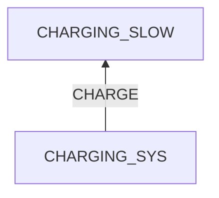
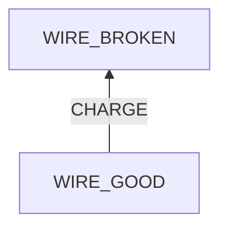

# Honor Phone Charging Slow

## Examination
[problem overview]: #
[a problem can be the output or input of a process. For output, it can be a bad output. For input, it can be a waste of resources]: #

My Honor phone charges slowly.

### Context

#### When
[Specification: year, season, daytime, during & after some events, duration]: #

#### Where
[Localization]: #
- at my balcony
- HW
	- Model: DUA-AL00
- SW
	- OS: Android 8.1.0
- Adapter: Apple

### Symptoms
[avoid biases]: #
[collect evidence used by hypothesis built in the root cause analysis phrase]: #
[comparison between actuation and expectation]: #
[specification: location, degree]: #

#### Vision

- After a night of charging, the energy has not increased a lot, or even decreased.

#### Hearing

#### Smell

#### Taste

#### Touch & Feel

- **[LOOSE_CONNECTION]** The connection between the phone and the wire is loose.
- **[HOT_ADAPTER]** The adapter is very hot during charging.
- **[HOT_PHONE]** The phone is very hot during charging.

## Root Cause Analysis
[backward cause reasoning for general problems]: #
[
process
	- stable
		- expected
		- unexpected
	- human	
]: #
[recursive trouble shooting for engineering problems to an atomic level (build hypothesis, use evidence (examination  + unit tests))]: #

CHARGING_SYS
:	TRIGGER
	:	~~ELECTRICITY~~
		:	Evidence
			:	Neg
				: 	- **[WALL_OUTLET_UNIT_TEST]** The charging process involving another phone, another charger and the same wall outlet is fine.
		
	STRUCTURE
	:	~~WALL_OUTLET~~
		:	Evidence
			:	Neg
				: 	- **[WALL_OUTLET_UNIT_TEST]**
				
		~~WALL_OUTLET-CHARGER~~
		:	Evidence
			:	Neg
				: 	- fastened.
				
		CHARGER
		:	Evidence
			:	Pos
				:	- **[LOOSE_CONNECTION]**
					- **[HOT_ADAPTER]**
					- **[CHARGER_UNIT_TEST]** ==After replacing the charge, the phone charges well.==
			
			~~ADAPTER~~
			:	Evidence
				:	Neg
					:	- **[ADAPTER_UNIT_TEST]** ==The adapter works well in a system containing alternative outlet, wire and phone.==
					
			WIRE
			:	Evidence
				:	Pos
					:	- **[LOOSE_CONNECTION]**
						- **[ADAPTER_UNIT_TEST]**
			
		~~CHARGER-PHONE~~
		:	Evidence
			:	Neg
				: 	- fastened.
				
		~~PHONE~~
		:	Evidence
			:	Pos
				:	- **[LOOSE_CONNECTION]**
					- **[HOT_PHONE]**
					- The phone is cheap and old.
				Neg
				:	- **[CHARGER_UNIT_TEST]**

CHARGE
:	~~PLUG~~

	~~WAIT~~
	
	UNPLUG
	:	Evidence
		:	Pos
			:	- I tend to unplug by holding and pulling the phone, which bends the connection.	
	
	
## Brainstorming
[removal of touchable physical objects is applicable]: #
[replacement V.S repair. Localize the problem to an atomic level where fixing it components is more expensive than replacing it as a whole]: #

WIRE
:	replace it. **<1>**

UNPLUG
:	hold the connection and pull tenderly. **<2>**

## Analysis of Solutions

### Comparison
| Solution | Cost | Effective Duration | Side Effects & Risks |
| --- | --- | --- | --- |
| 1 | MIDDLE | LONG | NO |
| 2 | LOW | LONG | NO |

### Priority & Trace
[try from treatments to prevention based on time bound]: #

- *1*

	[Thu Sep 14 06:49:06 AM CST 2023] used a new cable.
	
- *2*

	[Thu Sep 14 06:49:06 AM CST 2023] started to practice it. 

## Thinking
[Lessons learned from this experience]: #

- The importance of main structures

<!--stackedit_data:
eyJoaXN0b3J5IjpbLTM0MjMwODMwN119
-->