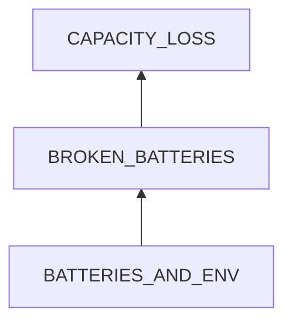
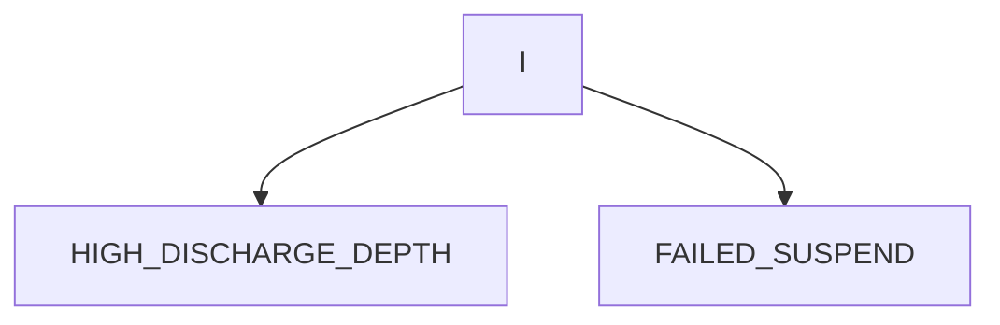
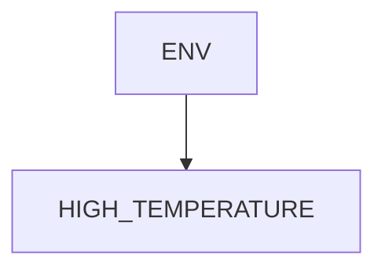

# Battery Capacity Loss

## Examination
[problem overview]: #
[a problem can be of services or env of a system]: #

The batteries of my laptop can only support 1 hour.

### Context

#### When
[Specification: year, season, daytime, during & after some events, duration]: #

- **[7-YEARS]** After 7 years of usage.
- My laptop is usually charged. 

#### Where
[Localization]: #

- the 2 batteries of my Thinkpad T460s laptop.

### Symptoms
[avoid biases]: #
[collect evidence used by hypothesis built in the root cause analysis phrase]: #
[comparison between actuation and expectation]: #
[specification: location, degree]: #

#### Vision

- The capacity drops respectively to 
    - 22%
    - 52%
- The power mode is balanced.

#### Hearing

#### Smell

#### Taste

#### Touch & Feel

## Root Cause Analysis
[backward cause reasoning for general problems]: #
[recursive trouble shooting for engineering problems to an atomic level (build hypothesis, use evidence (examination  + unit tests))]: #

BROKEN_BATTERIES
:   > Ions for transferring electric charges have lodged on the electrodes permanently.[^failure_cause]

[^failure_cause]: https://batteryuniversity.com/article/bu-808b-what-causes-li-ion-to-die

BATTERIES_AND_ENV
:   BATTERIES
    :   ELECTROLYTE
        :   the type of electrolyte is not durable.

    ENV
    :   DEPENDENCY
        :   ENERGY
            :   ~~VOLTAGE~~
                :   charge level is too high or too low. 

                    > 1. **3.92V/cell** provides the best compromise.
                    > 2. voltage higher than 4.2V/cell will damages batteries.[^failure_cause]

                    Evidence
                    :   Neg
                        :   - The AC charges 5 cells with 20V, then 4V/cell.

                CURRENT
                :   charge rate is too fast.

                    > We should charge at **1C** or lower rates.[^failure_cause]

                    Evidence
                    :   - TODO: check the AC adapter.

        INPUT
        :   ACTIVE
            :   MANNER
                :   CYCLES
                    :   The batteries has reached the expected cycles.

                        > **A 3-year battery life of 500 full cycles** is expected.[^failure_cause]

                        Evidence
                        :   Pos
                            :   - **[7-YEARS]**

                    STATE_OF_CHARGE
                    :   HIGH_CHARGE_DEPTH
                        :   The batteries remain full for a long time.

                            > - Keeping batteries full for long will damage them.
                            > - Modern AC adapter will stop charging when full, and a topping charge happens when power drops to a certain level.[^full_charge] 
                            
                            [^full_charge]: https://www.digitaltrends.com/computing/how-to-care-for-your-laptops-battery/#dt-heading-keeping-your-battery-in-zone

                            Evidence
                            :   - TODO: check the AC adapter.
                        
                        HIGH_DISCHARGE_DEPTH
                        :   The batteries drains to emptiness.

                            > full discharges will damage batteries. [^soc]

                            [^soc]: https://batteryuniversity.com/article/bu-808-how-to-prolong-lithium-based-batteries 

                            Evidence
                            :   - Sometimes I let the batteries drain.

                    INTENSIVE_USAGE
                    :   my laptop uses power intensively but **unnecessarily**.

                        SYSTEM_LEVEL
                        :   ~~HIGH_POWER_MODE~~
                            :   Evidence
                                :   Neg
                                    :   - I almost never use the high performance mode.   

                            FAILED_SUSPEND
                            :   > After tests, I find that suspending the laptop when not using it can save a lot of power.   
                            
                                Evidence
                                :   Pos
                                    :   - I usually use the keyboard shortcut `Super+L`, which however will **NOT** suspend the system, but just locks the screen. As a result, power has dropped a lot when logging in later.      
                    
                        HARDWARE    
                        :   Reports from `powertop`
                        
                            INTERNAL
                            :   SCREEN

                                GPU
                                :   INTEL

                                    NVIDIA 

                                AUDIO_CODEC

                                ETHERNET

                            EXTERNAL
                            :   MONITOR

                                USB_KEYBOARD

                        SOFTWARE
                        :   Reports from `systemd-cgtop`
                        
                            CHROME
                            :   EXTENSIONS

                            DAEMONS
                            

            PASSIVE   
            :   NATURAL
                :   HIGH_TEMPERATURE
                    :   The temperature of the battery is above 30.

                        > High temperature damages batteries.

                        Evidence
                        :   Pos
                            :   - When I took the laptop from the bag, I found that it became very hot.

I
:   MIND
    :   RULES
        :   LESS_INFORMED
            :   I did not know the knowledge.

ENV
:   INPUT
    :   ACTIVE
        :   INTENSIVE_USAGE

        PASSIVE
        :   NATURAL
            :   ENV_TEMPERATURE
                :   The laptop is used in hot environment.

                AIRFLOW_BLOCKED
                :   The airflow for releasing heat is not enough.

                    INTERNAL

                    EXTERNAL

## Brainstorming
[removal of touchable physical objects is applicable]: #
[replacement V.S repair. Localize the problem to an atomic level where fixing it components is more expensive than replacing it as a whole]: #

BROKEN_BATTERIES
:   replace with new ones.

ELECTROLYTE
:   use better batteries.

~~CYCLES~~
:   any battery has an expected full cycles.   

~~SCREEN~~
:   I have already turned the brightness to the lowest level in which I can view the screen clearly.

~~INTEL~~
:   I use it as my main GPU.

NVIDIA
:   turn off it by `sudo prime-select intel`

AUDIO_CODEC
:   TODO

ETHERNET
:   - turn on auto suspend.
    - totally turn off the device.

~~USB_KEYBOARD~~
:   This is my main keyboard. I need to keep it on to achieve high performance.

EXTENSIONS
:   disable unused extensions.

DAEMONS
:   TODO

LESS_INFORMED
:   After this experience, I have learned
    - charge the laptop once the power drops to 20%.
    - use Gnome GUI to suspend.

INTENSIVE_USAGE
:   - apply other solutions.
    - let the laptop rest for a while.

ENV_TEMPERATURE
:   move it to cool places from heat sources including 
    - natural
        - sunshine
        - fire
    - man-made
        - hot air conditioners

AIRWAY_BLOCKED
:   - clear the fan.
    - never use it on bed.
    - **never put running laptops into bags.**

## Analysis of Solutions

### Comparison
| Solution | Cost | Effective Duration | Side Effects & Risks |
| --- | --- | --- | --- |
|||||

### Priority & Trace
[try from treatments to prevention based on time bound]: #

## Thinking
[Lessons learned from this experience]: #

<!--stackedit_data:
eyJoaXN0b3J5IjpbMjEzNzQ0NjcxNl19
-->