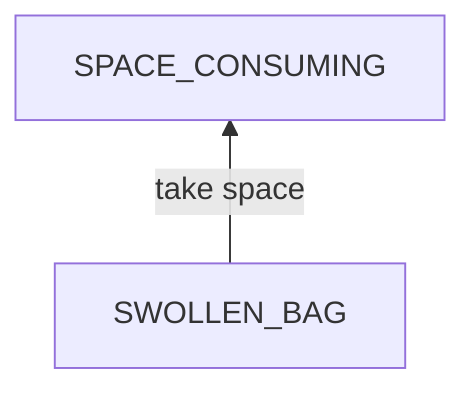
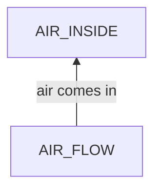
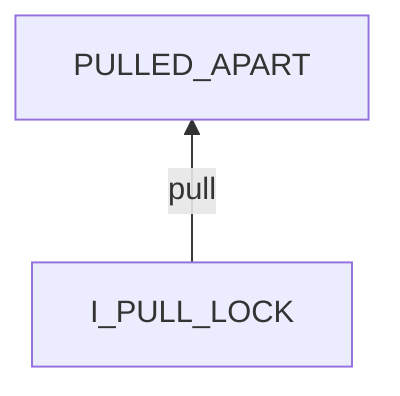
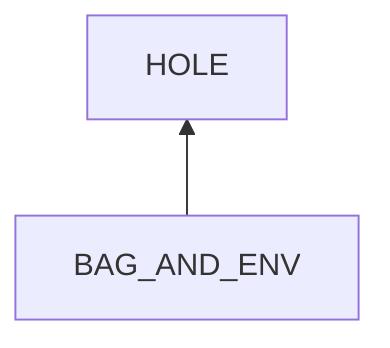
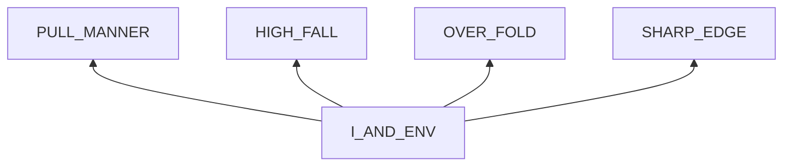

## Compression Bags Inflation

### examination

#### what

The compressing bags for clothes inflate.

#### context

##### when

- Days or weeks after extracting air 

##### where

- At my house
- At Zhou's house

#### symptoms

##### vision

- The bags inflate and take large space.

##### hearing

- There is a sound of sharp air flow just after being applied.

##### smell

##### taste

##### feel

- Clothes turn soft from being hard.

## root cause analysis

### SWOLLEN_BAG

SWOLLEN_BAG
:   ~~BAG~~

    AIR_INSIDE

    ~~CLOTHES~~

### AIR_FLOW

AIR_FLOW
:   SYS
    :   ~~AIR~~
        :   Evidence
            :   Neg
                :   - **[NEW_BAG]**

        BAG
        :   the compressing bags do not isolate well.

            Evidence
            :   Pos
                :   - **[NEW_BAG]** a new bag keeps clothes inside tight for months at the same house.

            ~~ZIP_LOCK~~
            :   not seal tightly.

                Evidence
                :   Neg
                    :   - closed well
                        - no visible cut

            ZIP_LOCK-SHEET
            :   ~~MISMATCH~~

                LOOSE
                :   NATURE
                    :   ~~IMPURITY~~
                        :   Evidence
                            :   Neg
                                :   - when the zip-lock and sheet are fastened well, not dust can enter inside.

                        AGING
                        :   Evidence
                            :   TODO

                    HUMAN
                    :   PULLED_APART
                        :   Link
                            :   Pos
                                :   - I hear air flow sound from the crack.

                            Evidence
                            :   Pos
                                :   - Some portion is apart due to pulling.

            SHEET
            :   HOLE
                :   tiny holes on the bag sheet.

                    Link
                    :   Pos
                        :   - when blocking the hole with a finger, I hear no sound and the clothes stop inflating.

                    Evidence
                    :   Pos
                        :   - I find one hole.

        ~~CLOTHES~~
        :   Evidence
            :   Neg
                :   - **[NEW_BAG]**

    ~~ENV~~

### I_PULL_LOCK

I_PULL_LOCK
:   SYS
    :   I
        :   PSY
            :   ~~RULES~~

                STATES
                :   ~~VIEW~~

                    ~~MENTAL_DISORDER~~

            ~~PHY~~

        I-LOCK
        :   MISMATCH
            :   ~~STATE~~

                BEHAVIOR
                :   PULL
                    :   MANNER
                        :   INTENSITY
                            :   too much force

                                Evidence
                                :   Pos
                                    :   - I tend to apply a suddenly large force once I feel restriction. 

                            PACE
                            :   I rush

                                Evidence
                                :   I hope to open it fast, and I usually open it with large motions.

                            ANGLE
                            :   I hold the edges of the opening.

                                Link
                                :   Pos
                                    :   - **If I only hold the edges of the sheet but do not hold the inner sides of the zip lock when pulling them apart, there will be a large strain between the sheet and the zip lock.**

                                Evidence
                                :   Pos
                                    :   - My fingers sometimes slide to edges and do not hold the zip lock firmly.

                        ~~DURATION~~
                        :   Evidence
                            :   Neg
                                :   - I stop pulling once it opens.

            LOOSE
            :   ~~NATURE~~

                HUMAN
                :   FINGER_SLIP

        ~~WEAK_LOCK~~
        :   the zip lock is not attached to the sheet firmly.

            Evidence
            :   Neg
                :   - From my experience, the zip lock does not get detached under careful pulling.
                    - No other customers found report this problem. 

    ~~ENV~~

### BAG_AND_ENV

BAG_AND_ENV
:   BAG
    :  ~~SHEET~~
        :   low quality

            Evidence
            :   Pos
                :   - some customers also report the hole problem after short-term use.

                Neg
                :   - the newly bought one works well for over 2 months under frequent friction.   

    ENV
    :   DEP
        :   ~~ENERGY~~

            ~~OTHER_SERVICES~~

        INPUT
        :   ACTIVE
            :   ~~PUNCTURE~~

            PASSIVE
            :   NATURE
                :   ~~LIGHT~~
                    :   Evidence
                        :   Neg
                            :   - I store these bags inside without sunshine. 

                    ~~SOUND~~

                    ~~TEMPERATURE~~

                    *HUMIDITY*

                HUMAN
                :   BEHAVIORS
                    :   HIGH_FALL    
                        :   Link
                            :   Pos
                                :   - MY test: a plastic bag full of water got tiny holes when falling from a high place.
        
                            Evidence
                            :   Pos
                                :   - sometimes I fall these bags with little care.

                        OVER_FOLD
                        :   Link
                            :   TODO
                            
                            Evidence
                            :   Pos
                                :   - In the past I crumpled them into a ball when not using.
                            
                    TEMPTATIONS
                    :   SHARP_EDGE
                        :   CLOSET_EDGE
                            :   Evidence
                                :   Pos
                                    :   - When a bag is moved into or out of the closet, It might scrape against the sharp edges. 

                            CROWDY_PLACES
                            :   Evidence
                                :   Pos
                                    :   - test: I put a bag near my nightstand which I move frequently. The nightstand scraped the bag sometimes, and someday the bag inflated. 

###  I_AND_ENV

I_AND_ENV
:   I
    :   PSY
        :   RULES
            :   BAG_USE
                :   ignorance
                
                    PULL_RULE

                    FIRM_HOLD

                    NEAT_FOLD

                    SHARP_EDGE_CAUTION

            STATES
            :   ~~VIEWS~~

                EMOTIONS
                :   IMPATIENT
                    :   Evidence
                        :   Pos
                            :   - I am usually impatient and want to finish soon when doing handwork.    

                ~~MENTAL_DISORDERS~~

        ~~PHY~~

    ~~ENV~~

## solutions

~~SPACE_CONSUMING~~
:   transient effect.

### SWOLLEN_BAG

AIR_INSIDE
:   extract it again. **<1>**

### AIR_FLOW

PULLED_APART
:   repair with the glue. **<2>**

HOLE
:   patch the holes with the water/gas proofing tape.  **<3>**

### I_PULL_LOCK

INTENSITY
:   intervention by sticky note: gradually increase force **<4>**

PACE
:   intervention by sticky note: pull slowly **<5>**

ANGLE
:   intervention by sticky note: hold the inner sides of the zip lock firmly. **<6>**

FINGER_SLIP
:   remove oil by washing hands before pulling. **<7>**

### BAG_AND_ENV

HIGH_FALL
:   sticky note: hold it firmly when moving  **<8>**

OVER_FOLD
:   sticky note: fold them neatly. **<9>**

CLOSET_EDGE
:   handle the interface
    - sticky note: note the edges.  **<10>**
    - block the direct access by covering edges with smooth tape. **<11>**

CROWDY_PLACES
:   - sticky note: never put these bags next to other things **<12>**
    - clean house **<13>**
    - try to put bags in closets or other protecting containers **<14>**

###  I_AND_ENV

PULL_RULE
:   practice  **<16>**
    - intensity: gradually increase force
    - pace: pull slowly
    - angle: hold the inner sides of the zip lock firmly
    
FIRM_HOLD
:   practice to hold bags firmly and avoid falling during moving. **<17>**

NEAT_FOLD
:   practice to fold bags neatly when not using. **<18>**

SHARP_EDGE_CAUTION
:   practice to notice and keep bags away from sharp edges or points. **<19>**

IMPATIENT
:   - relax by deep breathe **<20>**
    - follow goal achievement procedure **<21>**
    - practice one-time investment principle **<22>**

## Analysis of Solutions

### Comparison

| Solution | Cost | Effective Duration | Side Effects |
| --- | --- | --- | --- |
| 1 | LOW | HOURS | NO |
| - ||||
| 2 | MIDDLE | ? | NOT_WORKING |
| 3 | MIDDLE | ? | NOT_WORKING |
| - ||||
| 4 | LOW | LONG | NOT_ENOUGH |
| 5 | LOW | LONG | NOT_ENOUGH |
| 6 | LOW | LONG | NOT_ENOUGH |
| 7 | LOW | HOURS | NOT_ENOUGH |
| - ||||
| 8 | LOW | LONG | NOT_ENOUGH |
| 9 | LOW | LONG | NOT_ENOUGH |
| 10 | LOW | LONG | NOT_ENOUGH |
| 11 | LOW | LONG | NO |
| 12 | LOW | LONG | NOT_ENOUGH |
| 13 | MIDDLE | WEEKS | NO |
| 14 | LOW | LONG | NO |
| - ||||
| 16 | MIDDLE | LONG | NO |
| 17 | MIDDLE | LONG | NO |
| 18 | MIDDLE | LONG | NO |
| 19 | MIDDLE | LONG | NO |
| 20 | LOW | HOURS | NO |
| 21 | MIDDLE | LONG | NO |
| 22 | MIDDLE | LONG | NO |

### Tracking

- *1*
- *2*
    - FAILED: the bag still inflates the second day.
- *3*
    - FAILED: the bag still inflates the second day.
- *4*
- *5*
- *6*
- 7
- *11*
- *14*
    - In closet
    - In a large bag
- *8*
- *9*
- *10*
- *12*
- *13*
- *16*
- *17*
- *18*
- *19*
- *21*
- *22*
- *20*
