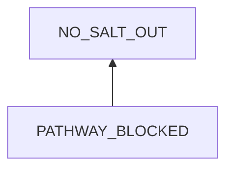
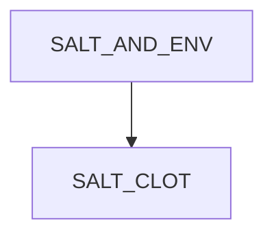
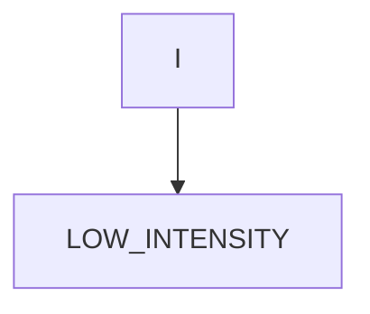
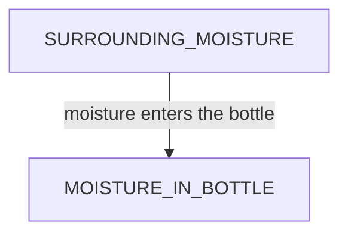
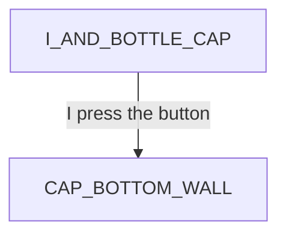

# Salt Bottle Hole Blocked

## Examination
[problem overview]: #
[a problem can be of services or env of a system]: #

Little salt comes out.

### Context

#### When
[Specification: year, season, daytime, during & after some events, duration]: #

- March, 2024
- When trying to pour it from the salt bottle

#### Where
[Localization]: #

- from the salt bottle

### Symptoms
[avoid jumping to conclusions and confirmation biases]: #
[collect evidence used by hypothesis built in the root cause analysis phrase]: #
[comparison between actuation and expectation]: #
[specification: location, degree]: #
[when direct examination is hard, we can use tools like light and magnifiers to amplify the signals]: #

#### Vision

- Little salt out after pushing the opening and shaking the bottle for seconds.

#### Hearing

#### Smell

#### Taste

#### Touch & Feel

- Hands feel tired.

## Root Cause Analysis
[backward cause reasoning for general problems]: #
[recursive trouble shooting for engineering problems to an atomic level (build hypothesis, use evidence (examination  + unit tests))]: #

PATHWAY_BLOCKED
:   IN_PORT_BLOCKED
    :   SALT_CLOT
        :   Evidence
            :   Pos
                -   Sometimes when blocked, I see salt clot at the inner port.

        CAP_BOTTOM_WALL
        :   Evidence
            :   Pos
                :   - Sometimes I find the chamber is empty but the inner port is covered by the cap wall.     

    SPACE_BLOCKED
    :   SALT_CLOT
        :   Evidence
            :   Pos
                :   - When the pathway is blocked, I usually see that the chamber inside the cap is full of salt. 

SALT_AND_ENV
:   SALT
    :   salt powder itself is prone to attract water and then stick together.

        > TODO

    ENV
    :   ~~DEP~~

        INPUT
        :   ACTIVE
            :   SHAKING
                :   LOW_INTENSITY
                    :   Evidence
                        :   Pos
                            :   - I usually shake it gently.
                            
                        > Experiment: The pathway is blocked faster when shaking the bottle with a lower intensity.

            PASSIVE
            :   NATURAL
                :   MOISTURE_IN_BOTTLE
                    :   Evidence
                        :   Pos
                            :   - The inner wall of the bottle feels wet and sticky.

                ~~TEMPTATIONS~~

I 
:   MIND
    :   RULES
        :   IGNORANCE

        ~~STATE~~
 
    ~~BODY~~

SURROUNDING_MOISTURE
:   WATER_TAP
    :   USE
    
        ~~LEAK~~

    OUTSIDE

    OUTSIDE_KITCHEN
    :   moisture flows from outside into the kitchen through windows

    IN_KITCHEN_AIR

    AIR_BOTTLE
    :   BOTTLE_EDGE
        :   Evidence
            :   Pos
                :   - no seal ring

        HOLE

~~I~~

I-BOTTLE_CAP
:   WRONG_USE
    :   DEPTH
        :   I press the button to the end.

BOTTLE_CAP
:   PORTS_NOT_ALIGNED
    :   The inner port and outer port are not aligned, which is designed to restrict the salt amount of each taking. 

## Brainstorming
[removal of touchable physical objects is applicable]: #
[replacement V.S repair. Localize the problem to an atomic level where fixing it components is more expensive than replacing it as a whole]: #

NO_SALT_OUT
:   open the cap and pour salt directly. **<1>**

SALT_CLOT
:   hit the bottom of the bottle against a table to make the salt clot fall back into the bottle. **<2>**

~~SALT~~
:   cannot change its chemical properties.

LOW_INTENSITY
:   increase the shaking intensity. **<3>**

MOISTURE_IN_BOTTLE
:   remove moisture inside by desiccants. **<4>**
    - silica gel

IGNORANCE
:   notice that **<5>**
    - shake the bottle with a large force

~~USE~~
:   I need to use the water tap for washing and drinking water.

~~OUTSIDE~~
:   out of my control

OUTSIDE_KITCHEN
:   close windows. **<6>**

IN_KITCHEN_AIR
:   remove moisture in kitchen's air by 
    - range hood **<7>**
    - baking soda powder **<8>**
    - Calcium Chloride **<14>**
    - wipe out water on surfaces of windows, tables and walls **<15>**

BOTTLE_EDGE
:   seal it with
    - tissue papers **<9>**

~~HOLE~~
:   I need to open the port to get salt when cooking.

DEPTH
:   - restricted use mode: release the button to let salt enter the chamber, then press the button to the end to pour all salt in the chamber out. **<10>**
    - continuous use mode: press the button to the middle and hold it to form a narrow pathway. **<12>** 

BOTTLE_CAP
:   buy another type of bottles. **<13>**

PORTS_NOT_ALIGNED
:   make a new inner port. then when releasing the button, the out port is still blocked. When pressing the button to the end, both are fully open. **<11>**

## Analysis of Solutions

### Comparison
| Solution | Cost | Effective Duration | Side Effects & Risks |
| --- | --- | --- | --- |
| 1 | LOW | SHORT: 1-time use | POUR_TOO_MUCH |
| 2 | LOW | SHORT: 1-time use | NO |
| 3 | LOW | 1-time use | NOT_ENOUGH |
| 4 | MIDDLE | ? | NO |
| 5 | LOW | 1-time use | NOT_ENOUGH |
| 6 | LOW | LONG | NOT_ENOUGH |
| 7 | MIDDLE | DAYS | NO |
| 8 | LOW | DAYS | NO |
| 9 | LOW | WEEKS | NOT_WORKING |
| 10 | MIDDLE | 1-time use | TEDIOUS |
| 11 | MIDDLE | LONG | CAP_BROKEN |
| 12 | MIDDLE | 1-time use | HAND_SOUR |
| 13 | HIGH | LONG | NOT_WORKING |
| 14 | HIGH | ? | NO |
| 15 | LOW | ? | NO |

### Priority & Trace
[try from treatments to prevention based on time bound]: #

- *6*
- *11*
- *4*
    [Tue Mar 19 04:54:17 PM CST 2024] start testing 
- *9*
- *8*
- 7
- *2*
- *3*
- *12*
- *5*
- *15*
- 14
- 13
- 1
- 10
  
## Thinking
[Lessons learned from this experience]: #

- moisture transmission: group all physical nodes along a path to get an overall picture for efficiency analysis 
- NEVER JUMP TO CONCLUSIONS: each factor needs evidence to support.
