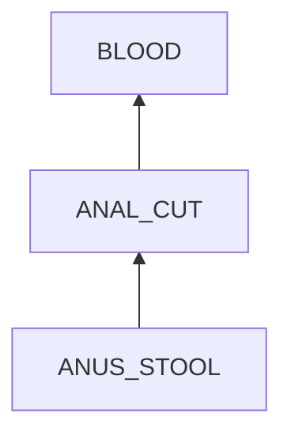
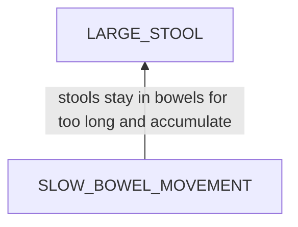
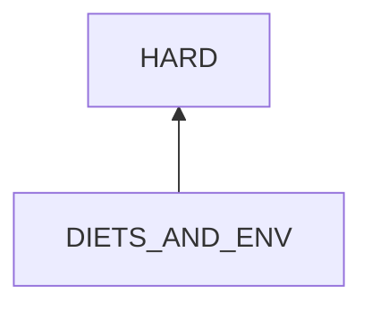
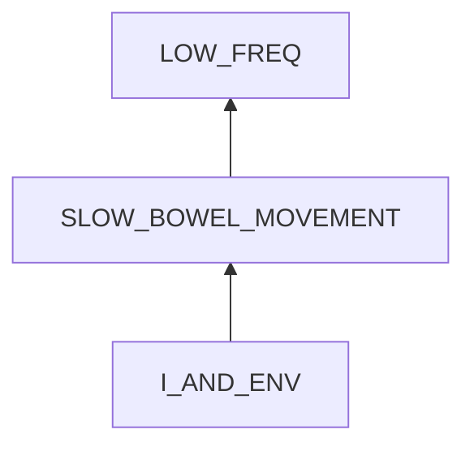
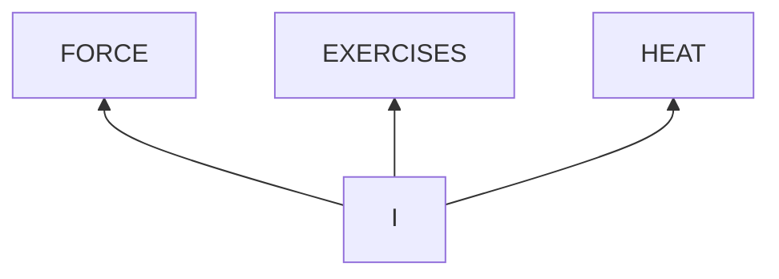

# Constipation

## Examination
[problem overview]: #
[a problem can be of services or env of a system]: #

My defecation freq reduces.

### Context

#### When
[Specification: year, season, daytime, during & after some events, duration]: #

- **[MAY]** time: May 2024
- duration: 3 weeks

#### Where
[Localization]: #

- at my house

### Symptoms
[avoid jumping to conclusions and confirmation biases]: #
[collect evidence used by hypothesis built in the root cause analysis phrase]: #
[comparison between actuation and expectation]: #
[specification: location, degree]: #
[when direct examination is hard, we can use tools like light and magnifiers to amplify the signals]: #

#### Vision

- **[LOW_FREQ]** The frequency reduces from once per day to once or twice per week.
- The appearance of stools
    - color: light yellow
    - **[HARD]** hardness: a little hard
    - dryness: middle
    - **[BULK]** bulk: large
- bleeding sometimes when defecation
 
#### Hearing

#### Smell

#### Taste

#### Touch & Feel

- The defecation experience is NOT painful.
- abdominal bloating & slight pain

## Root Cause Analysis
[backward cause reasoning for general problems]: #
[recursive trouble shooting for engineering problems to an atomic level (build hypothesis, use evidence (examination  + unit tests))]: #

### Bleeding

ANUS_STOOL
:   ANUS_AND_STOOL
    :   ANUS
        :   WEAK_SKIN
            :   Evidence
                :   Pos
                    :   - a single lining.

            RECTAL_PROLAPSE
            :   Link
                :   - TODO

                Evidence
                :   Pos
                    - I touch and feel it after poop.

        ANUS-STOOL
        :   MISMATCH
            :   STATE
                :   LARGE_STOOL
                    :   Stools are too large in diameter compared to my anus and tear it.

                        Evidence
                        :   Pos
                            :   - **[BULK]**

                BEHAVIOR
                :   MANNER
                    :   FORCE
                        :   large strain on anus.

                            Evidence
                            :   Pos
                                :   - I strain my anus greatly when poop.

                        ~~SPEED~~
                        :   too fast.

                            Evidence
                            :   Neg
                                :   - I defecate slowly.

                        ~~ANGLE~~
                        :   a curved angle.

                            Evidence
                            :   Neg
                                :   - I squat to poop, which is easier to empty bowels.

                    ~~DURATION~~

            ~~LOOSEN~~

        STOOL
        :   HARD
            :   My stools are hard.

                Evidence
                :   Pos
                    :   - **[HARD]**

    ENV
    :   ~~DEP~~

        INPUT
        :   ~~ACTIVE~~

            ~~PASSIVE~~
              

FOOD_AND_ENV
:   DIETS
    :   ~~NO_ENOUGH_WATER_INTAKE~~
        :   Link
            :   - water can soften stools.

            Evidence
            :   Neg
                :   - My daily water drinking does not change compared to before.

    ENV
    :   ~~DEP~~

        INPUT
        :   promoting water loss

            NATURE
            :   HIGH_TEMPERATURE
                :   Evidence
                    :   Pos
                        :   - **[MAY]** It becomes hot.

            HUMAN
            :   SLOW_BOWEL_MOVEMENT
                :   Stools stay in colon for long.

                    Link
                    :   - colon removes water from stools.

                    Evidence
                    :   Pos
                        :   - **[LOW_FREQ]**

### Low Freq

I_AND_ENV
:   I
    :   MIND
        :   ~~RULE~~

            STATE
            :   ~~VIEW~~

                EMOTION
                :   STRESS
                    :   TODO

                ~~MENTAL_DISORDER~~

        BODY
        :   ~~AGE~~
            :   Evidence
                :   Neg
                    :   -   I am 29.
        
            BOWEL_DISEASES
            :   Evidence
                :   TODO

    ENV
    :   DEP
        :   ~~ENERGY~~
            :   not eat enough

                Evidence
                :   Neg
                    :   - I eat a lot each meal.

            OTHER_SERVICES
            :   ~~FIBER~~
                :   no enough fiber intakes

                    Link
                    :   - Our digestion system can not digest fibers, then they have bulk leftover, which promotes bowel movement.

                    Evidence
                    :   Neg
                        :   - I eat oatmeals and vegetable each day. 

                ~~MEDICATIONS~~
                :   Evidence
                    :   Neg
                        :   - I do not eat any medicines recently.

        INPUT
        :   ~~ACTIVE~~

            PASSIVE
            :   ~~NATURE~~

                HUMAN
                :   ACTIONS
                    :   LITTLE_EXERCISES
                        :   no enough physical exercises

                            Link
                            :   - Exercises promote bowel movements.

                            Evidence
                            :   Pos
                                :   - I have not ridden bike for 1 month.

                    ~~TEMPTATIONS~~

I
:   MIND
    :   RULE
        :   IGNORANCE
            :   FORCE

                EXERCISES

                HEAT

        ~~STATE~~

    ~~BODY~~

## Brainstorming
[removal of touchable physical objects is applicable]: #
[replacement V.S repair. Localize the problem to an atomic level where fixing it components is more expensive than replacing it as a whole]: #

BLOOD
:   - flush toilet **<1>**
    - wipe blood at anus after finishing poop. **<2>**

ANAL_CUT
:   - push rectal prolapse in by fingers after poop to block these cuts. **<3>**
    - heal it naturally **<12>**

~~WEAK_SKIN~~
:   biologic nature

RECTAL_PROLAPSE
:   TODO

LARGE_STOOL
:   defecate slowly to enable stools be passed in small pieces. **<4>**

FORCE
:   sticky notes to remind to relax and just apply light force. **<5>**

HARD
:   insert a water tube into my anus to use water to soften stools. **<6>**

HIGH_TEMPERATURE
:   - reduce heat intake by using air conditioners to lower indoor temperature. **<7>**
    - increase heat loss by 
        - using fans **<8>**
        - wearing fewer clothes. **<9>**

~~LOW_FREQ~~
:   not a touchable physical object.

SLOW_BOWEL_MOVEMENT
:   laxative **<13>**

LITTLE_EXERCISES
:   Zhou reminds me to ride each week. **<10>**

IGNORANCE
:   keep in mind that **<11>**
    - too much force will tear my anus.
    - exercises promote bowel movement.
    - reduce heat to reduce inner water loss.
    - hydration help soften stools
    - fibers promote bowel movement.

## Analysis of Solutions

### Comparison
| Solution | Cost | Effective Duration | Side Effects & Risks |
| --- | --- | --- | --- |
| 1 | LOW | DAYS | NO |
| 2 | LOW | DAYS| NO |
| --- | --- | --- | --- |
| 3 | LOW | DAYS | DISCOMFORT |
| 12 | MIDDLE | DAYS | NO |
| --- | --- | --- | --- |
| 4 | MIDDLE | DAYS | DISCOMFORT |
| 5 | LOW | LONG | NOT_ENOUGH |
| 6 | MIDDLE | DAYS | DISCOMFORT |
| --- | --- | --- | --- |
| 7 | MIDDLE | 1 DAY | ? |
| 8 | LOW | HOURS | NO |
| 9 | LOW | LONG | NO |
| --- | --- | --- | --- |
| 13 | MIDDLE | DAYS | ? |
| --- | --- | ---| --- |
| 10 | MIDDLE | WEEK | NO |
| --- | --- |--- | --- |
| 11 | MIDDLE | LONG | NO |

### Priority & Trace
[try from treatments to prevention based on time bound]: #

- *1*
- **2*
- *3*
- *12*
- *5*
- *4*
- *6*
- *9*
- 7
- 8
- 13
- *10* 
- *11*

## Thinking
[Lessons learned from this experience]: #

