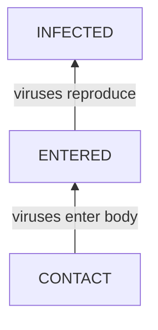
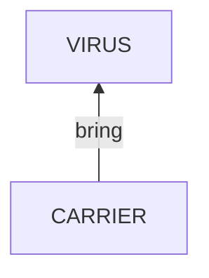
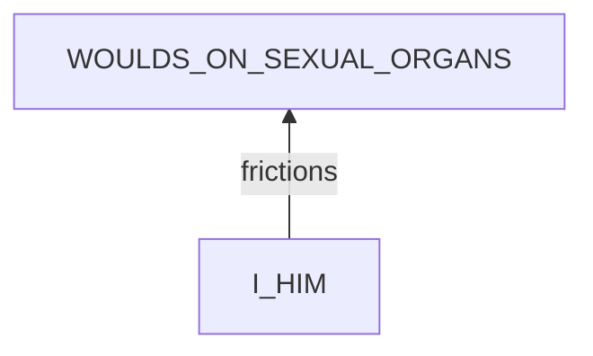
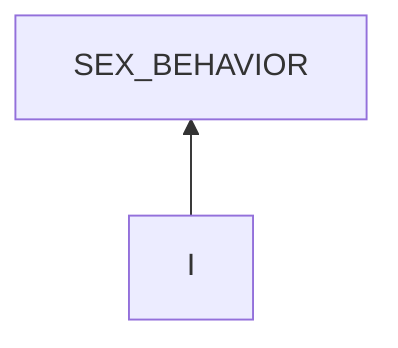
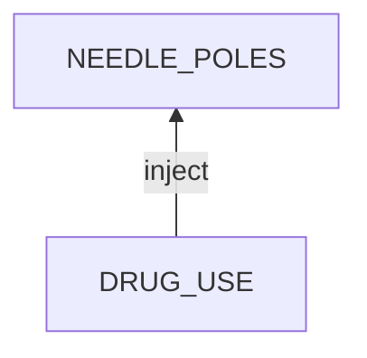
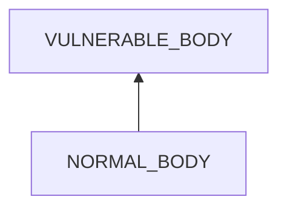

# HIV

## Test
[problem overview]: #
[a problem can be of services or env of a system]: #

The flu-like symptoms related to HIV in the acute stage can be caused by many other diseases. The only way to know if you have HIV is to get tested.

### Types

There are 3 types of tests in terms of what a test looks for.
- antibody test: looking for antibodies
- antibody/antigen test: looking for antibodies and antigens
- nucleic acid test: looking for HIV viruses

| | antibody | rapid antibody/antigen | lab antibody/antigen | nucleic acid |
| --- | --- | --- | --- | --- |
| window period | 23 - 90 d | 18 - 90 d | 18 - 45 d | 10 - 33 d |
| waiting result time | 20 mins | 30 mins | days | days |
| test sample | blood from a finger stick or oral fluid | blood from a finger stick or oral fluid | blood from a vein | blood from a vein |

### HIV diagnosis procedure

## Root Cause Analysis
[backward cause reasoning for general problems]: #
[recursive trouble shooting for engineering problems to an atomic level (build hypothesis, use evidence (examination  + unit tests))]: #

CONTACT
:   VIRUS_BODY
    :   VIRUS
        :   the existence of HIV viruses

        INTERFACE
        :   WOULDS
            :   woulds on skins
                > HIV viruses can only survive in blood and some types of body fluids. Normal body contacts will not transmit HIV.

                WOULDS_ON_SEXUAL_ORGANS

                NEEDLE_POLES

                IN_MOUTH

                OTHERS

            MOTHER_CHILD
            :   A mother can transmit HIV to her child.

        VULNERABLE_BODY
        :   Normal people can NOT immune HIV.

CARRIER
:   having contact with someone having HIV.

I_HIM
:   SYSTEM
    :   I
        :   MIND
            :   RULES
                :   ANAL_SEX_ONLY
                    :   Only anal sex can meet my desire.

                STATE
                :   EMOTION
                    :   SEX_DESIRE
                        :   strong sex desire.

            BODY
            :   THIN_PENIS_SKIN
                :   The skin of the sex organ is thin.
                    
                    Evidence
                    :   Pos
                        :   - From my experience, the skin of the penis is easy to break.

        I-HIM
        :   MISMATCH
            :   SIZE
                :   His anus is too tight relative to my penis.

                    Evidence
                    :   Pos
                        :   - I often feel restriction when inserting my penis at the beginning.

                SEX_BEHAVIOR
                :   ~~ANGLE~~
                    :   My penis is not aligned to his rectum.

                        Evidence
                        :   Neg
                            :   - I insert from his behind which is the most natural posture.

                    ~~PACE~~
                    :   Too fast.

                        Evidence
                        :   Neg
                            :   - Compared to porns, my speed is normal.
                                - I usually have breaks.
                        
                    INTENSITY
                    :   I insert with strong force.
                    
                        Evidence
                        :   Pos
                            :   - I try hard to insert my penis fully into his anus even when feeling restriction and pain.

        HIM
        :   HIS_MIND

            BODY
            :   RECTUM_LINING
                :   Evidence
                    :   Pos
                        :    - The rectum's lining is thin.[^anal_sex]
    
                            [^anal_sex]: https://www.cdc.gov/hiv/basics/hiv-transmission/ways-people-get-hiv.html

I
:   MIND
    :   RULES
        :   SEX_PREPARATION_IGNORANCE

## Brainstorming
[removal of touchable physical objects is applicable]: #
[replacement V.S repair. Localize the problem to an atomic level where fixing it components is more expensive than replacing it as a whole]: #

INFECTED
:   [treatment](https://www.cdc.gov/hiv/basics/livingwithhiv/index.html)

ENTERED
:   clear viruses with PEP

~~VIRUS~~
:   HIV viruses are invisible by raw eyes.

WOULDS_ON_SEXUAL_ORGANS
:   woulds during sex are inevitable. **use condoms to prevent woulds from touching others' fluids**

MOTHER_CHILD
:   TODO: a special medical method to cut off

CARRIER
:   test HIV before risky contacts to stay away from carriers.

ANAL_SEX_ONLY
:   Think about [less risky sex activities](/Learning/biology/physiology/diseases/STDs/HIV/HIV.md#risky-activities).

SEX_DESIRE
:   TODO: how to control sex desire

~~THIN_PENIS_SKIN~~
:   human nature

SIZE
:   - use lubricants.
    - anus relaxation
        - deep breath
        - use fingers

INTENSITY
:   use the feeling of restriction or pain as a signal reminder to pause for a while.

~~HIS_MIND~~
:   not touchable

~~RECTUM_LINING~~
:   human nature.

SEX_PREPARATION_IGNORANCE
:   practice 
    - always to prepare and use lubricants
    - first insertion
        - slow
        - hold for a while

ATTRACTIVE_GUY
:   practice not to steer at others

PORN
:   stay away from porns.

NO_LUBRICANT
:   prepare it enough.

DRUG_USE
:   not use drugs or at least not share needles

IN_MOUTH
:   no oral sex.

    > Very rarely, transmission has occurred if both partners have sores or bleeding gums.

NORMAL_BODY
:   - take PrEP as prescribed.

    > no vaccine currently available.

~~OTHERS~~
:    some tiny woulds are very hard to discover.

## Analysis of Solutions

### Comparison
| Solution | Cost | Effective Duration | Side Effects & Risks |
| --- | --- | --- | --- |
|||||

### Priority & Trace
[try from treatments to prevention based on time bound]: #

## Thinking
[Lessons learned from this experience]: #

