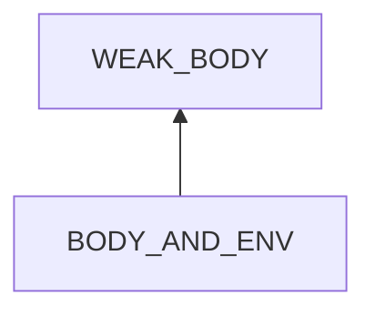
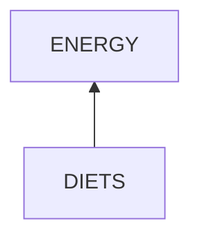
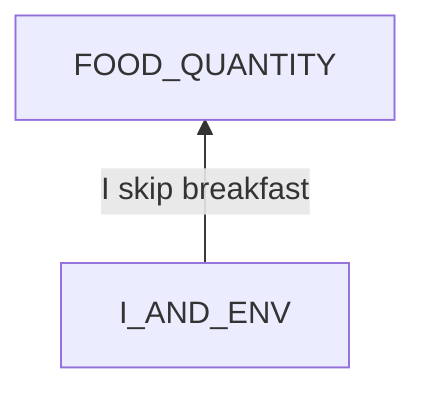
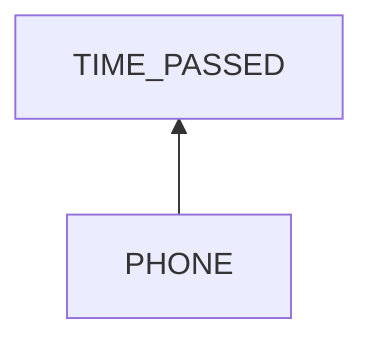
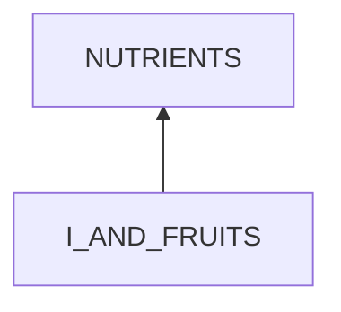

# Name of the problem

## Examination
[problem overview]: #
[a problem can be of services or env of a system]: #

### Context

#### When
[Specification: year, season, daytime, during & after some events, duration]: #

#### Where
[Localization]: #

### Symptoms
[avoid jumping to conclusions and confirmation biases]: #
[collect evidence used by hypothesis built in the root cause analysis phrase]: #
[comparison between actuation and expectation]: #
[specification: location, degree]: #
[when direct examination is hard, we can use tools like light and magnifiers to amplify the signals]: #

#### Vision

#### Hearing

#### Smell

#### Taste

#### Touch & Feel

## Root Cause Analysis
[backward cause reasoning for general problems]: #
[recursive trouble shooting for engineering problems to an atomic level (build hypothesis, use evidence (examination  + unit tests))]: #

BODY_AND_ENV
:	~~NORMAL_BODY~~

	ENV
	:	FOODS
		:	ENERGY
			:	no enough energy
				
				Evidence
				:	Pos
					:	- **[IRREGULAR_DIETS]** Breakfasts are usually skipped. Lunch time is not fixed.
						- I usually feel hungry late at night.

			NUTRIENTS
			:	no enough nutrients
	
				Evidence
				:	Pos
					:	- *search symptoms of lack of nutrients*
					
		SLEEP
		:	no enough sleep
			
			Evidence
			:	Pos
				:	- hard to achieve 8 hours of sleep each night.	
						
		DISEASE
		:	Evidence
			:	Pos
				:	- **[COLD]**
					- *search symptoms*
 
		MEDICINE
		:	Evidence
			:	Pos
				:	- **[PEP]**
					- *search symptoms*

DIETS
:	~~QUALITY~~
	:	Evidence
		:	Neg
			:	- **[HIGH_CALORIES]** I eat rice and noodles which contain high amounts of energy.
			
	FOOD_QUANTITY
	

I_AND_ENV
:	I
	:	~~BODY~~
		:	Evidence
			:	Neg
				:	- I have appetites.
					- I can eat much.
		
		MIND
		:	BREAKFAST_UNCLEAR
			:	I am unclear of the importance of breakfast.

	TIME_PASSED
	:	I often get up near lunch time.
	
		Evidence
		:	Pos
			:	- When I get up before 9 am, I usually eat breakfast.

 PHONE
 :	playing phone late at night.

I_AND_FRUITS
:	FRUITS_UNCLEAR
	:	I am unclear of the importance of fruits.
	
	FRUITS
	:	Fruits cost.	

## Brainstorming
[removal of touchable physical objects is applicable]: #
[replacement V.S repair. Localize the problem to an atomic level where fixing it components is more expensive than replacing it as a whole]: #

~~WEAK_BODY~~
:	A weak body is not directly removable but reversible.

ENERGY
:	supplement with foods of high energy **<6>**
	- rice
	- noodles
	- cookies
	- candies

FOOD_QUANTITY
:	eat more. **<7>**

BREAKFAST_UNCLEAR
:	learn the importance of breakfast. **<8>**

~~TIME_PASSED~~
:	I can not change time.

NUTRIENTS
:	supplement with **<9>**
	- foods
	- medicines

FRUITS_UNCLEAR
:	learn the importance of fruits. **<10>**

FRUITS
:	buy cheap ones. **<11>**
	- choose the cheapest but nutrient types.
	- choose the cheapest selling platforms.

SLEEP
:	refer to the problem solving of *health.physiology.sleep* **<>**

DISEASE
:	refer to the problem solving of *health.physiology.diseases* **<>**

~~MEDICINE~~
:	I have to take PEP.

## Analysis of Solutions

### Comparison
| Solution | Cost | Effective Duration | Side Effects & Risks |
| --- | --- | --- | --- |
|||||

### Priority & Trace
[try from treatments to prevention based on time bound]: #

## Thinking
[Lessons learned from this experience]: #

