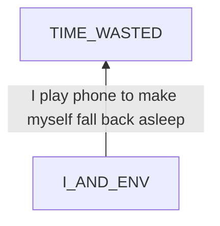
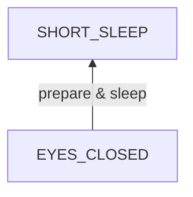
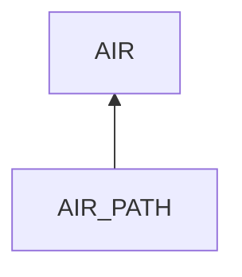

# Short Sleep

## Examination
[problem overview]: #
[a problem can be of services or env of a system]: #

I can not maintain enough sleep at night.

### Context

#### When
[Specification: year, season, daytime, during & after some events, duration]: #

- Less than 5 hours
    - I start to sleep around 3 am.
    - I usually wake up before 8 am.
- Once waking, it is hard for me to fall asleep again before noon.
- I usually have a supplemental sleep for more than 4 hours in the afternoon.

#### Where
[Localization]: #

- At my house.

### Symptoms
[avoid jumping to conclusions and confirmation biases]: #
[collect evidence used by hypothesis built in the root cause analysis phrase]: #
[comparison between actuation and expectation]: #
[specification: location, degree]: #
[when direct examination is hard, we can use tools like light and magnifiers to amplify the signals]: #

#### Vision

- I play phone for hours before sleep.
- During that time when I can not fall asleep again, I still play phone to kill time.
- I expect to have a continuous sleep for 8 to 9 hours, but the whole process costs me over 12 hours.
 
#### Hearing

#### Smell

#### Taste

#### Touch & Feel

- My head feels heavy after waking up.
- It is upset that I can not fall into sleep again quickly even if my head is unclear.
- I am angry about time wasting afterwards.

## Root Cause Analysis
[backward cause reasoning for general problems]: #
[recursive trouble shooting for engineering problems to an atomic level (build hypothesis, use evidence (examination  + unit tests))]: #

I_AND_ENV
:   I
    :   MIND
        :   RULE
            :   8_HOUR
                :   I need at least 8 hours of sleep per day to have a clear mind for daily work.

                RELAXATION_METHODS
                :   PHONE_PLAY
                    :   Playing phone can make me relaxed and fall asleep gradually.

                    LYING_IN_BED_NOT_WORKING
                    :   From my experience, it does not work to lie in bed to fall asleep again quickly.

                    IGNORANCE_OF_OTHER_METHODS

            STATE
            :   VIEW
                :   SHORT_SLEEP
                    :   I am awake and just have a sleep of 4 to 5 hours.

                    TIRED_BUT_NOT_SLEEPY
                    :   I feel tired but not sleepy.

                EMOTION
                :   UPSET

                    STRESS
                    :   I really want to fall asleep again quickly and no to waste more time.

                MENTAL_DISORDER
                :   PHONE_ADDICTION

        BODY
        :   *HORMONES*
            :   Link
                :   - TODO

    ENV
    :   ~~DEP~~

        INPUT
        :   ~~ACTIVE~~

            PASSIVE
            :   ~~NATURE~~
                :   ~~Link~~
                    :   - I tend to play phone whenever I feel tired or bored regardless nature factors including temp, light and sound.

                HUMAN
                :   BEHAVIOR
                    :   THINK
                        :   Think too much after waking.

                            Link
                            :   - From my test, thinking makes me less sleepy and makes it harder to fall asleep again.

                            Evidence
                            :   - I tend to think problems once waking.

                    TEMPTATION
                    :   PHONE

EYES_CLOSED
:   I
    :   MIND
        :   RULE
            :   SLEEP_IMPORTANCE

                BEDTIME
                :   It is fine to go to sleep anytime before 3 am.

            STATE
            :   VIEW
                :   BUSY_MIND

                    Link
                    :   - My test: It takes longer to fall asleep if I think things.
                        - Science: TODO

                    Evidence
                    :   - Sometimes cliches like "fuck China" xxx in my mind when I lie in bed.

                EMOTION
                :   STRESS

                    UNSAFETY
                    :   If I do not cover the upper and back of my head, I feel insecure. 

                    NIGHTMARE
                    :   Link
                        :   - if I have a bad dream, I either wake in advance or with head very painful.
                        
                        Evidence
                        :   - Sometimes I have.

                ~~MENTAL_DISORDER~~
                

        BODY
        :   SHORT_TERM
            :   STOMACH
                :   EMPTINESS
        
                RECTUM
                :   STOOL
        
                BLADDER
                :   URINE
        
                MUSCLE
                :   NECK

                    ARMS

                    LEGS
                
                LUNG
                :   AIR
                    :   no enough air inhalation  

                SKIN
                :   itchy skin
                
                    DIRT

                    BITE
                    :   mosquito bites

                HORMONE
                :   Link
                    :   - TODO: what hormones will affect sleep?

            LONG_TERM
            :   BIOLOGICAL_CLOCK

                DISEASE
                :   Link
                    :   - TODO: which diseases affect sleep?
    
    ENV
    :   DEP
        :   ~~ENERGY~~

            ~~OTHER_SERVICES~~

        INPUT
        :   ~~ACTIVE~~

            PASSIVE
            :   NATURE
                :   TEMPERATURE
                    :   Link
                        :   - If temperature is hot, it is harder to fall asleep.
                            - TODO: What is the best temp range for sleep?
                
                    LIGHT

                    SOUND
                    :   TRAFFIC

                        COMPRESSOR

                        BED_FRAME
                        :   Evidence
                            :   Pos
                                :   - When shaken, it makes a little sound.

                HUMAN
                :   BEHAVIOR
                    :   PHONE_PLAY
                        :   Link
                            :   - TODO: will playing phone affect sleep?

                    TEMPTATION
                    :   BED
                        :   uncomfortable bed

                            BED_SHEET
                            :   messy and easy to move

                            MATTRESS
                            :   ~~NOT_FLAT~~
                                :   Evidence
                                    :   Neg
                                        :   - the mattress is pretty flat.

                                ~~HARD~~
                                :   Evidence
                                    :   Neg
                                        :   - the surface layer is soft.

AIR_PATH
:   ~~ROOM~~
    :   no enough in the room.

        Link
        :   - TODO: How long can oxygen in a closed bedroom support a person?

        Evidence
        :   Neg
            :   - There are a very few nights when I feel no enough air.

    AIRWAY_RESTRICTED
    :   airway is restricted.

        Evidence
        :   Pos
            :   - If I change my position to face upwards, I never feel air shortage.

    LUNG
    :   lung dysfunctions.

        Evidence
        :   - TODO

## Brainstorming
[removal of touchable physical objects is applicable]: #
[replacement V.S repair. Localize the problem to an atomic level where fixing it components is more expensive than replacing it as a whole]: #

~~TIME_WASTED~~
:   If the time has passed, it is gone.

---

8_HOUR
:   TODO: Is is necessary to sleep for 8 hours?

PHONE_PLAY
:   TODO: Can playing phone help to sleep?

LYING_IN_BED_NOT_WORKING
:   TODO: How long it takes usually to fall asleep when lying in bed?

IGNORANCE_OF_OTHER_METHODS
:   Learn other quick sleep skills.

~~SHORT_SLEEP~~
:   It is a fact.

TIRED_BUT_NOT_SLEEPY
:   Apply quick sleep skills.

UPSET
:   Practice that
    - past principle: We can not change things that happened in the past, so we need to face the problem.
    - problem solvingmakes me less sleepy: after analyzing this problem systematically, I have solutions.

STRESS
:   - deep breath.
    - note that I have solutions after problem solving
    - learn the statistics
        - the time needed to fall asleep again
        - the time needed to regulate my biologic clock

PHONE_ADDICTION
:   link

THINK
:   - Sticky note: No thinking after a deficient sleep.
    - Practice a rule: If I wake and feel tired, do not think any serious issues.

PHONE
:   block entertainment in phone between 1 am to 9 am by Android restriction period.

---

SLEEP_IMPORTANCE
:   TODO: What are the specific benefits of sleep?

BUSY_MIND
:   TODO: how to empty mind?

UNSAFETY
:   - cover the upper and back of my head with clothes or quilts.

~~NIGHTMARE~~
:   if it is here, there is no available interventions.

EMPTINESS
:   - eat two bags of breads 30 mins before sleep.

STOOL
:   - poop before bed if feeling it.
        
URINE
:   - Do not drink a large amount of water within 2 hours before sleep.
    - urinate immediately before sleep. 

NECK
:   - stretch the neck to left side 
    
ARMS
:   - fingers cross, hands on the chest. 

LEGS
:   - legs naturally straight, feet slightly outwards

DIRT
:   - wash.

BITE
:   - TODO: how to handle the bites?

~~BIOLOGICAL_CLOCK~~
:   - change the env
    - TODO: how to change BC?

TEMPERATURE
:   - in hot summer
        - cool the room with the A/C for half an hour.
        - no clothes during sleep
        - use bamboo sheet

LIGHT
:   - turn off lights
    - close the curtain
    - wear the eye mask

SOUND 
:   - wear earplugs   

TRAFFIC
:   - close windows
    - close doors

COMPRESSOR
:   - turn down
    - move far away from the bed

BED_FRAME
:   - fix it.  

BED_SHEET
:   - arrange it.

AIRWAY_RESTRICTED
:   - lie with face up.

## Analysis of Solutions

### Comparison
| Solution | Cost | Effective Duration | Side Effects & Risks |
| --- | --- | --- | --- |
|||||

### Priority & Trace
[try from treatments to prevention based on time bound]: #

## Thinking
[Lessons learned from this experience]: #

