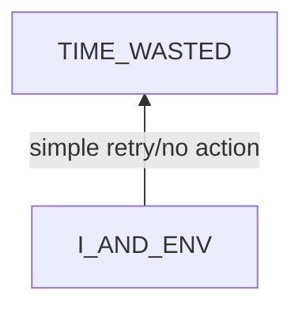
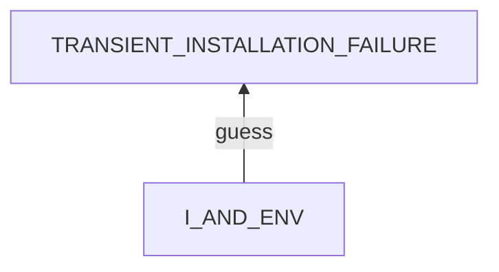
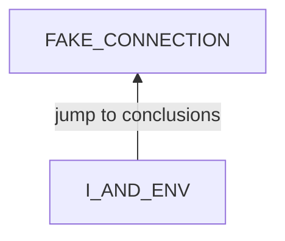
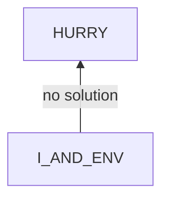

# Insensitive to Problems

## Examination
[problem overview]: #
[a problem can be of services or env of a system]: #

I am insensitive to problems and I do not treat some seriously.

### Context

#### When
[Specification: year, season, daytime, during & after some events, duration]: #

- **[UPDATE_FAILED]** An error pops during updating BlockSite.
- The FB app is not usable but Meituan is while the VPN shows being connected.

#### Where
[Localization]: #

### Symptoms
[avoid jumping to conclusions and confirmation biases]: #
[collect evidence used by hypothesis built in the root cause analysis phrase]: #
[comparison between actuation and expectation]: #
[specification: location, degree]: #
[when direct examination is hard, we can use tools like light and magnifiers to amplify the signals]: #

#### Vision

- For the installation problem of the BlockSite app,
    - I just retry to install again and again.
    - **[ERROR_MSG]** Later I find that error message shows a conflict signature detected.
- For the connection problem of the VPN, I have no reaction.

#### Hearing

#### Smell

#### Taste

#### Touch & Feel

- For the installation problem of the BlockSite app, 
    - **[UNCLEAR]** I am not clear of what happened.
    - **[TRANSIENT]** I think that it might work after retry some times.
    - **[RUSH]** I rush to eat dinner with Zhou, so I hope to finish the installation ASAP.
- For the connection problem of the VPN, 
    - **[FAKE_CONNECTION]** I assume that the VPN is fake connected, then apps really requiring the VPN can not connect to their servers but domestic apps work well.

## Root Cause Analysis
[backward cause reasoning for general problems]: #
[recursive trouble shooting for engineering problems to an atomic level (build hypothesis, use evidence (examination  + unit tests))]: #

I_AND_ENV
:   I
    :   PSY
        :   RULES
            :   RETRY
                :   Transient electronic problems will disappear later without intervention, then retry is enough.

                OUT_OF_CONTROL
                :   If the VPN can not connect, there is little that I can do. 

            STATES
            :   VIEWS
                :   TRANSIENT_INSTALLATION_FAILURE
                    :   This failure might be a transient problem.

                        Evidence
                        :   Pos
                            :   - **[TRANSIENT]**

                    FAKE_CONNECTION
                    :   This is a fake connection of a **new type** in which blocked sites are still inaccessible but others not.

                        Evidence
                        :   Pos
                            :   - **[FAKE_CONNECTION]**

                ~~EMOTIONS~~
                
                ~~MENTAL_DISORDERS~~

        ~~PHY~~
        :   Evidence    
            :   Neg
                :   - This problem can happen anytime, even when I am energized.

    ~~ENV~~

I_AND_ENV
:   I
    :   PSY
        :   RULES
            :   TRANSIENT_COMMON
                :   Many electronic problems are due to dynamic resource limits like memory and network. The systems are intelligent enough to clean wastes and solve the problem automatically.

                IGNORANCE_TO_CHECK_THE_SITUATION
                :   Not sensitive to see this as a problem and check the case critically and instantly.

                    Evidence
                    :   Pos
                        :   - **[UNCLEAR]**
                            - **[ERROR_MSG]** 

            STATES
            :   ~~VIEWS~~

                EMOTIONS
                :   HURRY

                    Evidence
                    :   Pos
                        :   - **[RUSH]** 

                ~~MENTAL_DISORDERS~~

        ~~PHY~~

    ENV
    :   ~~DEP~~

        INPUTS
        :   ~~ACTIVE~~

            PASSIVE
            :   ~~NATURE~~

                HUMAN
                :   UPDATE_FAILURE

                    Evidence
                    :   Pos
                        :   - **[UPDATE_FAILED]** 

I_AND_ENV
:   I
    :   PSY
        :   RULES
            :   FAKE_CONNECTION_COMMON
                :   The express VPN app shows fake connections frequently where the status icon is green but no network indeed.

                IGNORANCE_OF_TESTING

            STATES
            :   ~~VIEWS~~

                EMOTION
                :   LAZINESS
                    :   Evidence
                        :   Pos
                            :   - I do not want to spend much on this issue.

                ~~MENTAL_DISORDERS~~
            

        ~~PHY~~

    ENV
    :   ~~DEP~~

        INPUTS
        :   ~~ACTIVE~~

            PASSIVE
            :   ~~NATURE~~

                HUMAN
                :   STRANGE_NETWORK
                    :   VPN_GREEN
                        :   The VPN status icon is green which means being connected.

                        FB_INACCESSIBLE
                        :   The facebook app can not refresh.

                        MEITUAN_ACCESSIBLE
                        :   The meitan app can refresh.

I_AND_ENV
:   I
    :   PSY
        :   RULES
            :   NO_EXPERIENCES
                :   I have not encountered the problem before.

                    Evidence
                    :   Pos
                        :   - **[UNCLEAR]**

                PROBLEM_SOLVING_COSTS_TIME
                :   The systematical problem solving procedure is time-consuming.

                    Evidence
                    :   Pos
                        :   - From my experience, it takes at least 1 hour to solve a problem systematically.
            
            STATES
            :   VIEWS
                :   MUST_UPDATE
                    :   I need to update the app at that time.

                ~~EMOTIONS~~

                ~~MENTAL_DISORDERS~~

        ~~PHY~~

    ENV
    :   DEP
        :   ~~ENERGY~~

            OTHER_SERVICES
            :   TIME_SHORTAGE
                :   No enough time. It was later then, and many restaurants will close soon.

        INPUTS
        :   ~~ACTIVE~~

            PASSIVE
            :   HUMANS
                :   ZHOU_WAITING
                    :   Zhou is waiting.

## Brainstorming
[removal of touchable physical objects is applicable]: #
[replacement V.S repair. Localize the problem to an atomic level where fixing it components is more expensive than replacing it as a whole]: #

~~TIME_WASTED~~
:   if time is wasted, it is gone. 

~~RETRY~~
:   Simple retry is a good solution for transient electronic problems.

~~OUT_OF_CONTROL~~
:   truth for VPN.

~~TRANSIENT_INSTALLATION_FAILURE~~
:   A wrongly reasoned view.

~~FAKE_CONNECTION~~
:   A wrongly reasoned view.

HURRY
:   relax by deep breathe. **<1>**

TRANSIENT_COMMON
:   This kind of problems only take a small portion. And they usually slag the device. Other problems requires explicit handling. **<2>**

IGNORANCE_TO_CHECK_THE_SITUATION
:   practice to be **<3>**
    - sensitive to problems
    - critical

~~UPDATE_FAILURE~~
:   An electronic effect.

    Final solution: TODO

~~FAKE_CONNECTION_COMMON~~
:   truth for expressvpn

IGNORANCE_OF_TESTING
:   practice that **<4>**
    - testing is the best method to overcome jump and bias.
    notice that
    - the fact that meituan is accessible conflicts with the VPN rule of blocking all traffic when connection is failed.

LAZINESS
:   practice **<5>**
    - one-time investment principle
    - shortcut principle

~~STRANGE_NETWORK~~
:   an electronic effect
    
    Final solution: add FB into the list of apps using the VPN in split tunneling.

~~NO_EXPERIENCES~~
:   True at that time.

~~PROBLEM_SOLVING_COSTS_TIME~~
:   True.

MUST_UPDATE
:   I can do it later actually. **<6>**

~~TIME_SHORTAGE~~
:   True at that time.

~~ZHOU_WAITING~~
:   Dinner with him is more important than the update issue. I can not cancel it because of this issue.

## Analysis of Solutions

### Comparison
| Solution | Cost | Effective Duration | Side Effects & Risks |
| --- | --- | --- | --- |
| 1 | LOW | HOURS | NO |
| 2 | LOW | LONG | NO |
| 3 | MIDDLE | ? | NO |
| - | - | - | - |
| 4 | MIDDLE | ? | NO |
| 5 | LOW | LONG | NO |
| - | - | - | - |
| 6 | LOW | LONG | NO |

### Priority & Trace
[try from treatments to prevention based on time bound]: #

- *2*
- *1*
- *3*
- *5*
- *4*
- *6*

## Thinking
[Lessons learned from this experience]: #

