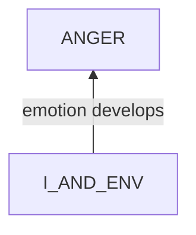
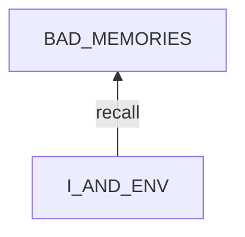
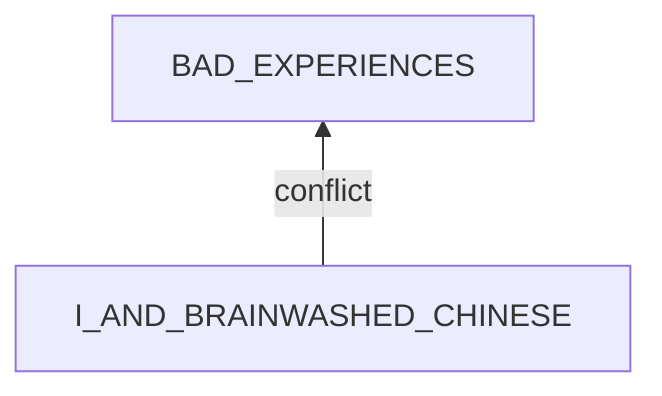
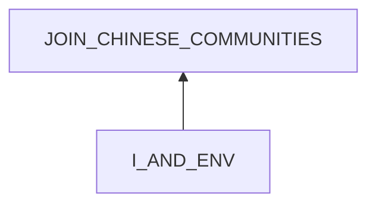
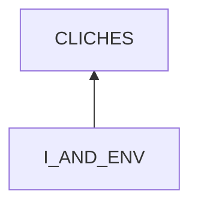
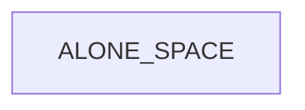

# Anger to Brainwashed Chinese People

## Examination

### what

I feel extremely angry.

### context

#### when

- events
    - **[DOING_THINGS]** when doing 
        - **[CHORES]** chores
            - boiling water
            - making a cup of coffee
            - cooking
        - **[WORK]** work    
            - installing/repairing sth
            - searching for sth
        - **[REST]** rest
            - playing phone
            - pooping
- duration
    - It lasts for minutes to hours.

#### where

- At my house alone.

### symptoms

#### vision

- What I am doing is interrupted.
- I become restless, and move around.
- I even punch the table sometimes.

#### hearing

- **[CLICHES]** I either speak these cliches unconsciously or shout these continually as mental revenge when being angry.
    - geneal
        - "I love China."
        - "NO, Fuck China"
        - "Fuck the CCP"
        - "All Chinese are brain washed"
        - "People brainwashed by the CCP have special behavior patterns."
        - "Thought reform and the psychology of totalism: A study of brainwashing in China."
        - "Very funny?"
        - "I am a little special as those common methods of scaring and controlling people never work to me."
        - "I have not been brainwashed even after 20 years of mental torture, but it will take my lifespan to heal."
        - "Remember how Andy escaped?"
        - "I will NEVER let my child be born or grow up in China."
        - "Run!"
    - to friends
        - Wen Hao
            - "Let me show you a book."
            - "Before this, a good book for you"
            - "The emotions, choices of words, even the intuition of a person can be the result of a long-term manipulation."
            - "This is a secret that you should not know in your life"
            - "The destruction of self esteem, the thought-terminating cliches, the PTSDs"
            - "Go to hell with your master"
    - to colleagues
        - Liu Xi
            - "Want me to continue playing with you?"
            - "These brainwashing tactics do not work to me."
            - "Do you really think that this is the truth?"
            - "Do you think that I will tell your this secret?"
            - "I will NOT be brainwashed by you. Go to dead, bitch."
            - "He essentially does not want to hear what you think at all."
            - "I will tell you this secret in your afterlife. But I can forecast one thing - your whole family will go to hell."
        - Yuxuan
            - "You are so willing to be brainwashed by him?"
            - "I decided to save you, but now I have changed my plan. You deserve to go to hell with your lord"
    - to teachers
        - Dr.Deng
            - "You have got what you want with the cost of sacrificing your son."
    - to classmates
        - Wang Ruixing
            - "Want to wash my brain. I will not answer your this question."
        - Jiang Kai
            - "I will not tell you this secret. Go to hell with your master."
    - to family members
        - Li Dihua
            - "I will never say a word to you."
            - "You can force me by you jumping from a building. Have a try, then you will know whether or not it works."
    - to others
        - Train ticket seller
            - "You rush to die? Bitch."

#### smell

#### taste

#### feel

- **[WORK_CLICHES]** If the working flow is not smooth, I become impatient and say the cliches.
- **[CHORES_CLICHES]** When doing things needing little brain power, I tend to say the cliches.
- **[RECALL_TORTURE]** I then start to recall the mental torture that I experienced from Chinese people.
- **[BAD_MEMORIES]** My bad memories mainly consists of brainwashing sayings and the mental torture from those people   
    - pressure
        - time: I was forced to do sth without thinking.
            - Liu Xi:
                - "It only costs me 2 days to implement it, so isn't it enough for you to understand it in 2 days?"
                - "Till now I do not know what you can do."
        - China: This is China, and you have to adjust yourself.
            - PHD: "No need to think"
            - Li Dihua: "This is China."
    - shame
        - education
            - High school official: "You will not be accepted by that school after taking part in its qualification exams 100 times."
            - Wang Ruixing, Dr.Deng: 
                - ask me questions and tend to shame me based on an assumption that I am brainwashed.
                - "Do not do that."
        - career
            - HR: 
                - "So what do you remember?"
                - "Join my team to do the most meaningful things."
            - Jiang Kai
                - "You are unable to do anything."
        - personality
            - Wen Hao: "Nobody has the obligation to cater to you."
            - Train ticket seller: "Do not waste others' time."
- When recall those I feel extremely angry.
- My thinking is interrupted.
- My brain is hot.
- **[BAD_MEMORIES]** My mind is full of those bad memories.
- short & quick breathe

## Root Cause Analysis

I_AND_ENV
:   I
    :   PSY
        :   RULES
            :   PAST
                :   ignore the past principle.
            
                COMPLAIN
                :   ignore the lemonade principle.

            STATES
            :   VIEWS
                :   BAD_MEMORIES
                    :   Evidence
                        :   Pos
                            :   - **[BAD_MEMORIES]**

                ~~EMOTIONS~~

                MENTAL_DISORDERS
                :   COMPULSION
                    :   Evidence
                        :   Pos
                            :   - Once something bad pops into my mind, I tend to repeat it again and again.

        ~~PHY~~

    ENV
    :   ~~DEP~~

        INPUT
        :   ~~ACTIVE~~

            PASSIVE
            :   ~~NATURE~~

                ~~HUMAN~~   

I_AND_ENV
:   I
    :   PSY
        :   RULES
            :   BAD_EXPERIENCES
                :   I have those bad past experiences with different people.

                    APPROACH_SOMEONE
                    :   approach someone proactively for benefits
                    
                    SOCIAL
                    :   unexpected conflicts in social activities

                    WORK
                    :   pressure and shame in work
                    
            STATES
            :   ~~VIEWS~~

                ~~EMOTIONS~~
                
                ~~MENTAL_DISORDERS~~

        ~~PHY~~

    ENV
    :   DEP
        :   ENERGY
            :   extra energy to recall these.

                Link
                :   Pos
                    :   - When I am highly focused, I will not think of these.
                        - When I am exhausted, I just want to rest and unwind.

                Evidence
                :   Pos
                    :   - **[DOING_THINGS]**
            
            ~~OTHER_SERVICES~~

        INPUTS
        :   ~~ACTIVE~~

            PASSIVE
            :   ~~NATURE~~

                HUMAN
                :   BEHAVIORS
                    :   CLICHES
                        :   Link
                            :   Pos
                                :   - **[RECALL_TORTURE]** A unconscious cliche usually triggers me to recall the whole case with the corresponding person.
                            
                            Evidence
                            :   Pos
                                :   - **[CLICHES]**

                    TEMPTATIONS
                    :   CHINA_MEDIA
                        :   brainwashing china media including news and videos
                        
                            Link
                            :   Pos
                                :   - When I come cross these contents, I feel instantly upset and close them. 

                            Evidence
                            :   Pos
                                :   - I often see these contents when opening 
                                        - weibo.

                        ALONE_SPACE
                        :   I live alone.

                            Link
                            :   Pos
                                :   - When I am with Zhou whether being outside or at his house, I seldomly recall these. 
                                    - I usually recall the memories when staying at my house alone.

                            Evidence
                            :   Pos
                                :   - Most time I stay alone at my house.

I_AND_BRAINWASHED_CHINESE
:   SYS
    :   ~~I~~

        I-BRAINWASHED_CHINESE
        :   MISMATCH
            :   STATE
                :   ANTI_BRAINWASHING
                    :   not match in nature. I am not brain washed by the CCP, and we have conflicting views of value.

                BEHAVIOR
                :   JOIN_CHINESE_COMMUNITIES
                    :   I tried to join some.

                    BRAIN_WASH
                    :   China tries to wash my brain.

                        Evidence
                        :   Pos
                            :   - Books reporting this.
                                - Most countries block China.

                    REPEL

                    SUPPRESS_AND_SMEAR

            ACCESS
            :   BRAINWASHED_PEOPLE

                CHINA_SYSTEM
                :   EDUCATION

                    WORKING

        BRAINWASHED_CHINESE
        :   a slavery state.

    ~~ENV~~                         

I_AND_ENV
:   I
    :   PSY
        :   RULES
            :   CRITICAL_THINKING

                ECONOMICS

                WESTERN_COMMUNITIES

            STATES
            :   VIEWS
                :   WANT_SUCCESS

                EMOTIONS
                :   TIME_ANXIETY

                    FEAR_ABOUT_UNKNOWN

                ~~MENTAL_DISORDERS~~

        ~~PHY~~

    ENV
    :   ~~DEP~~

        INPUTS
        :   ACTIVE
            :   PARENTS

            PASSIVE
            :   ~~NATURE~~

                HUMAN
                :   

:   IMPATIENCE
                    :   want to finish some fixed procedures as soon as possible.

                        Link
                        :   Pos
                            :   - I tend to be angry and shout "FUCK CHINA" when I am impatient in doing works.

                        Evidence
                        :   Pos
                            :   - **[COOK]**
                                - **[HANDIWORK]**

:   TEMPERATURE
                    :   high temp

                        Link
                        :   Pos
                            :   - High temp makes me restless.

                        Evidence
                        :   Pos
                            :   - I feel hot these days in Summer.

## Solutions

ANGER
:   - relax and cool my mind by deep breathe.
    - distract

PAST
:   practice the past principle: 
    - We can not change things that happened in the past.
    - But we CAN learn a lesson, then forget those bad memories.

COMPLAIN
:   practice the lemonade principle: 
    - Complaining will not change the situation.
    - If I have a lemon, I make a lemonade.
    - Try to improve myself, and **escape China**. 

BAD_MEMORIES
:   distract myself by
    - work
        - focus on the current work
        - do some simple tasks
    - rest
        - watch entertaining videos
        - music

COMPULSION
:   - self intervention
        - sticky note
        - tell myself to **stop** in mind once I start to repeat cliches. 
    - practice not worth principle: It is not worth to let bad memories destroy my mood, appetite, thinking and life.  

BAD_EXPERIENCES
:   erase in mind
    - TODO: HOW

ENERGY
:   use the energy to do meaningful things
    - work
    - serve Zhou
    - clean my house

CLICHES
:   - self intervention
        - sticky note: no CHINA related cliches.
        - mental command: STOP

CHINA_MEDIA
:   block sites.

ALONE_SPACE
:   resort: stay with Zhou at least 2 hours each day.

ANTI_BRAINWASHING
:   I adapt myself to China.

JOIN_CHINESE_COMMUNITIES
:   intervention
    - sticky note: No Chinese Communities
        
BRAIN_WASH
:   I do not listen, and I distract myself.

RECALL
:   self intervention
    - sticky note: do not recall China.
    - mental stimulation

THOUGHT
:   - no Chinese language for thinking. 
    - learn
        - critical thinking
        - economics

MEDIA
:   block
    - Chinese news
    - Chinese social media
    - Chinese entertainment

LAND
:   leave China

~~CHINA~~
:   out of my control.

ENERGY
:   use the energy for work.

BRAINWASHED_PEOPLE
:   cut the connection with them by
    - leaving them
    - blocking all their contacts

CHINA_SYSTEM
:   - leave China
    - never let my children grow up in China.

## Analysis of Solutions