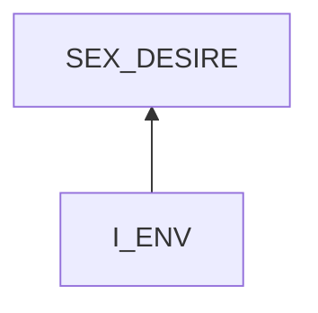

# Sexual Desire

## Examination
[problem overview]: #
[a problem can be of services or env of a system]: #

Sexual desire drives me to use dating apps and have one-night stands, which has a lot of bad effects including wasting my time and exposing me to the risks of STDs.

### Context

#### When
[Specification: year, season, daytime, during & after some events, duration]: #

- **[20's]** I am in my 20's. 
- **[HIGH_AT_NIGHT]** My sexual desire is the strongest late at night.

#### Where
[Localization]: #

- **[HOME]** I feel it when at home alone.

### Symptoms
[avoid biases]: #
[collect evidence used by hypothesis built in the root cause analysis phrase]: #
[comparison between actuation and expectation]: #
[specification: location, degree]: #

#### Vision

- **[CASUAL_SEX]** My sexual desire pushes me to use dating apps and have casual sex.

#### Hearing

#### Smell

#### Taste

#### Touch & Feel

- **[CRAVING]** I have craving for others' bodies, and my heartbeats become fast, breath becoming short and quick.

## Root Cause Analysis
[backward cause reasoning for general problems]: #
[recursive trouble shooting for engineering problems to an atomic level (build hypothesis, use evidence (examination  + unit tests))]: #

I
:   MIND
    :   RULES
        :   SEX_PLEASURE
            :   sex brings me pleasure.

            SEX_EASY
            :   It is easy to find someone to have sex with in Blued.

        STATE
        :   VIEW
            :   ~~NO_ENOUGH_SEX~~
                :   I do not have enough sex.

                    > The average frequency is [once per week](https://bedbible.com/sex-frequency-statistics/) based on my age(29) and relationship status(coupled).

                    Evidence
                    :   Neg
                        :   - I meet guys each week.

                SEX_FANTASIES
                :   I imagine some sex activities.

                    > [Sexual fantasies](/Learning/biology/psychology/sex/sexual_fantasy.md) promote sexual desire.

            EMOTIONS
            :   LONELINESS
                :   I feel lonely when alone later at night at my house.

                DEPRESSION
                :   I am not satisfied with my current life.

                LOW_INHIBITION
                :   Evidence
                    :   Pos
                        :   - no only sex, I tend to have other entertaining but time-wasting activities including watching TV programs and playing video games at that time.

                SEX_TENSION

            MENTAL_DISORDERS
            :   SEX_ADDICTION

                FETISHISM

    BODY
    :   ~~FULL_SEMEN~~
        :   Evidence
            :   Neg
                :   - I masturbate everyday.
         
        HORMONES
        :   TODO: Which hormones promote sexual desire?

ENV
:   DEP
    :   ~~ENERGY~~
        :   I have too much energy.
        
            Evidence
            :   Neg
                :   - I have no sexual desire after eating.
                    - **[HIGH_AT_NIGHT]**

        OTHER_SERVICES
        :   ~~MEDICINE~~
            :   Evidence
                :   Neg
                    :   - I have sexual desire when not taking any medicine.

    INPUTS
    :   ACTIVE
        :   ~~EXERCISES~~
            :   > Exercises can boost self images then a person is more likely to have body contact with others.   

                Evidence
                :   Neg
                    :   - I have not done exercises for 1 year.

        PASSIVE
        :   NATURAL
            :   TODO: What factors?

            TEMPTATIONS
            :   ATTRACTIVE_GUYS
            
                PHONE
                :   PICTURES

                    BLUED

                UNDERWEAR
                :   Others' underwear triggers a strong craving.

## Brainstorming
[removal of touchable physical objects is applicable]: #
[replacement V.S repair. Localize the problem to an atomic level where fixing it components is more expensive than replacing it as a whole]: #

SEX_DESIRE
:   - distraction
        - watch TV programs
    - last resorts: alternatives
        - masturbation

~~SEX_PLEASURE~~
:   This is true and human nature.

SEX_EASY
:   From my experience, it is pretty hard to find a suitable guy nearby in Blued, which usually fails or costs more than 3 hours.

NO_ENOUGH_SEX

SEX_FANTASIES
:   use distractions

LONELINESS
:   find companionship from positive communities
    - offline
    - online
        - facebook

DEPRESSION
:   find support from inspiring online communities
    - facebook
    - twitter
    - youtube

LOW_INHIBITION

SEX_TENSION

SEX_ADDICTION

FETISHISM
:   cut off the connection between attraction and underwear by searching for guys with my favorite underwear but not attractive.

PICTURES
:   - delete any triggering pictures
    - not browse or download new ones.

BLUED
:   - cancel my account.
    - uninstall the app.

UNDERWEAR
:   avoid exposure to that type of underwear.

## Analysis of Solutions

### Comparison
| Solution | Cost | Effective Duration | Side Effects & Risks |
| --- | --- | --- | --- |
|||||

### Priority & Trace
[try from treatments to prevention based on time bound]: #

## Thinking
[Lessons learned from this experience]: #

