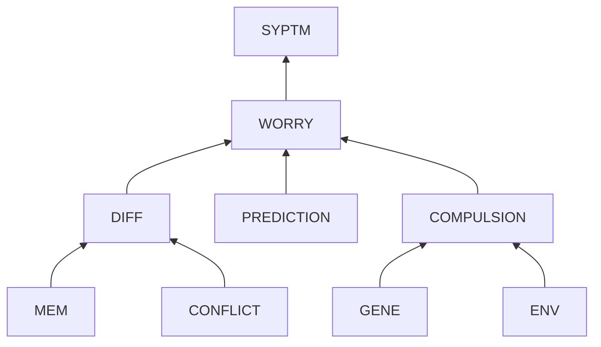

# Anxiety of Internal Knowledge "Not Good enough"

## Problem Description

### Context

When I encounter materials related to knowledge that I have learned before.

### Symptoms
I feel sweaty and short breath and want to run away.

## Root Cause Analysis

- **SYPTM**: feeling sweaty and anxious, and wanting avoidance.
- **WORRY**: I worry there might be differences between my knowledge and those materials.
- **DIFF**: These differences are highly possible.
- **MEM**: I forget what I learned.
- **CONFLICT**: My knowledge conflicts with current materials *OR* is out-dated.
- **PREDICTION**: There will be bad things happening if the differences appear.
  - **RELEARN**: I have spent much effort to learn. The differences might make me feel that my hard working does not pay back. *Or I need to relearn*. 
  - **LEGACY**: Maybe I have applied my flawed knowledge to some projects in which bad things might happen in the future.
- **COMPULSION**: Compulsion of remembering text verbatim.
- **GENE**: My mother has serious compulsion.
- **ENV**: To get full scores in history exams in middle school, I tried to  recite the textbooks verbatim.

## Possible Solutions
- ~~**SYPTM**~~: Symptoms are physiological and mental responses but **not touchable physical objects** which can be removed directly.
- ~~**WORRY**~~: mental responses.
- **DIFF**: remove the differences.
  - Escape: remove the new materials.
  - Replacement: replace the whole knowledge.
  - **Fixation**: maintain **MAIN STRUCTURE**. only updated needed components.    
- **MEM**: promote better memory
  - during learning: catch the main structure and use self-test when finishing learning.
  - later: apply the knowledge to real life when possible.
- **CONFLICT**: This conflict is very common and cannot be avoided totally. But we can reduce the frequency of conflicts by using **critical thinking & the rule of 3** to gain a more objective view when learning.
- **PREDICTION**: (CBT) Remember that nothing is perfect.
  - **RELEARN**: 
    1. The current material might be wrong. Firstly investigate it and compare it with my knowledge critically.
    2. Even if I have to update my knowledge, use the **MAIN STRUCTURE** to localize and update nesseccary parts. 
  - **LEGACY**: 
	1. GOAL ORIENTATION: I learned the knowledge to solve a problem. **As long as it helped me solve problems in the past, it was valuable.** It helped me to achieve my current stage where I can use refined tools to solve more complex problem and achieve next stage.
	2. Fixation: If I have to fix the legacy system left, I have the tools now.
- ~~**COMPULSION**~~: the symptom of a mental disorder.
- **GENE**: hard to alter. Maybe some genetic medication.
- **ENV**: stick to the strategy of catching the main structure in later study.

## Thinking 

Nothing is perfect including our memories even books which might be outdated years later.

### Goal Orientation 

meaning:

As long as our knowledge has succeeded in solving our problems, we have met our stage goal. The "flawed" tool helped us build our current platform where we can refine our tool and works. 

### Catching the main structure

differences:

**Do not try to remember the text verbatim which is not only unrealistic but useless.** The final goal of learning is to use the knowledge as a tool to solve problems. Then it is desired for the knowledge in our mind to be generic to solve a group of problems. 

- To reduce misunderstanding, use the rule of 3 to get a broad and objective view of the subject before devoting to it. 
- Always remember to test whether we have catch the main structure and internalized the knowledge immediately after learning something. 

The main structure remains stable over time as the format of target problems. It is the specific implementations of some components that will advance.
 
- When we encounter some materials related later on, compare the main structure in our mind and that of the materials. Update our knowledge if needed which is relatively easy as the main structure is concise. 
- It is fine that we do not remember some details like who, when, where and single steps. Search it when we really need it. Try to see materials like notes and books as backup when our memories fail rather than judgement of our abilities. 

### Summarized steps
1. Before learning: If **my current knowledge can hardly enable me to solve a problem I currently face**, decide to learn.
2. Start: apply Rule of 3 to get an objective view and reduce the risk of learning less useful materials.
3. In progress: catch the main structure and purpose of each components.
4. End: summarize and test whether I have internalized it **by writing down the main structure**.
5. Application: apply the learned immediately after learning.
6. Later: repeat this procedure whenever I face new problems or new knowledge.

<!--stackedit_data:
eyJoaXN0b3J5IjpbLTIxMzY5OTM5ODJdfQ==
-->