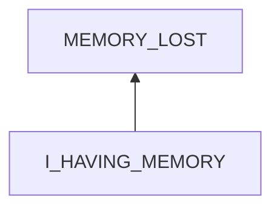
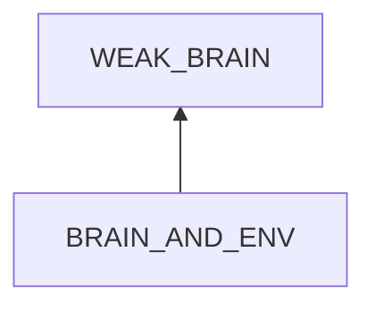

# Memory Failure about Knowledge

## Examination
[problem overview]: #
[a problem can be about services or environment of a system]: #
 
I forget what I learned.

### Context

#### When
[Specification: year, season, daytime, during & after some events, duration]: #

2 weeks after learning it.

#### Where
[Localization]: #

- VScode
    - Profiles
    - Synchronization

### Symptoms
[avoid biases]: #
[collect evidence used by hypothesis built in the root cause analysis phrase]: #
[comparison between actuation and expectation]: #
[specification: location, degree]: #

#### Vision

#### Hearing

#### Smell

#### Taste

#### Touch & Feel

- **[DEEP_UNDERSTANDING]** I can not even recall the term of profile which I spent efforts to understand.
- I have a fuzzy memory about the whole function part.
    - setting
        - user V.S workspace
        - profile V.S user V.S device
    - keybindings
    - built-in markdown support

## Root Cause Analysis
[backward cause reasoning for general problems]: #
[recursive trouble shooting for engineering problems to an atomic level (build hypothesis, use evidence (examination  + unit tests))]: #

I_HAVING_MEMORY
:   I have built the memory.

    I
    :   BODY
        :   WEAK_BRAIN
            :   My brain is incapable of keeping knowledge for long.

                Evidence
                :   Neg
                    :   - The knowledge of algorithms has been remaining in my brain for 7 years.

        MIND
        :   RULE
            :   The memory is in a bad structure for maintaining and retrieval.

            STATE
            :   VIEW
                :   There are gray zones when learning.

                    Evidence
                    :   Pos
                        :   - When reexamining the concept of profiles, I find that I have not built a clear relationship between user settings and profiles.

                        Neg
                        :   - **[DEEP_UNDERSTANDING]**
                EMOTION
                :   Bad emotions.

    MY_ENV
    :   DEPENDENCY
        :   ENERGY
            :   Not enough energy to maintain and retrieve the memory.

        INPUT
        :   PASSIVE
            :   PROMOTION
                :   No enough reinforcement.

                    Evidence
                    :   Pos
                        :   - I have not used profiles since finishing learning.

                TEMPTATION
                :   Distractions in life.

BRAIN_AND_ENV
:   BRAIN
    :   genes

    ENV
    :   DEPENDENCY
        :   NUTRIENTS
        INPUT
        :   PASSIVE
            :   SLEEP
                WORKOUT
                TOXIN    
## Brainstorming
[removal of touchable physical objects is applicable]: #
[replacement V.S repair. Localize the problem to an atomic level where fixing it components is more expensive than replacing it as a whole]: #

## Analysis of Solutions

### Comparison
| Solution | Cost | Effective Duration | Side Effects & Risks |
| --- | --- | --- | --- |
|||||

### Priority & Trace
[try from treatments to prevention based on time bound]: #

## Thinking
[Lessons learned from this experience]: #

<!--stackedit_data:
eyJoaXN0b3J5IjpbMjEzNzQ0NjcxNl19
-->