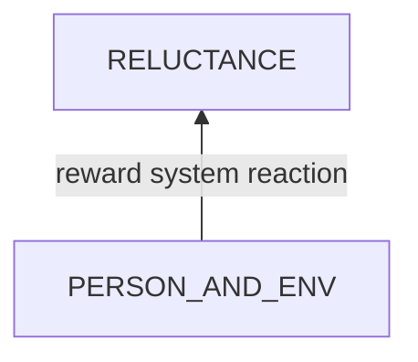
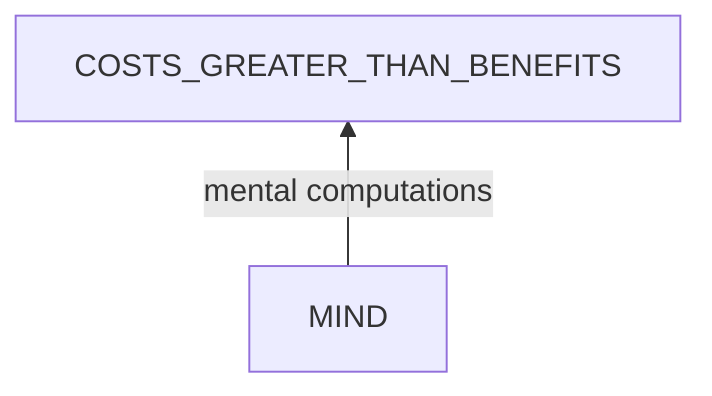
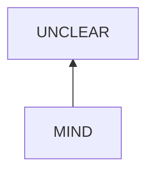
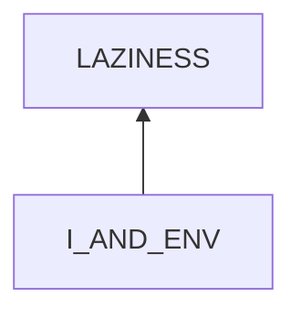

# Reluctance

## Examination
[problem overview]: #
[a problem can be of services or env of a system]: #

I feel reluctant.

### Context

#### When
[Specification: year, season, daytime, during & after some events, duration]: #

- date: 
	- 2023, Oct
	- June, 2024
- after: 
	- **[TRIP]** The trip to Guilin
	- **[COLD]** A cold.
- during: **[PEP]** Medicine of PEP
- duration: 
	- 3 weeks
- when facing challenges 

#### Where
[Localization]: #

- handling health problems
	- Zhou's knee pains
	- my cold
	- my grandmother's thirst
- practicing the modified root cause analysis model
- clear the washing machine bucket bottle plater
- repair the bath sprinkler soon for Zhou

### Symptoms
[avoid biases]: #
[collect evidence used by hypothesis built in the root cause analysis phrase]: #
[comparison between actuation and expectation]: #
[specification: location, degree]: #

#### Vision

- when facing these challenges, I tend to 
	- **[REST]** have a rest by playing phone
	- or do easier things like house cleaning

#### Hearing

#### Smell

#### Taste

#### Touch & Feel

- **[FATIGUE]** I feel fatigue.
- health problems
	- **[UNFAMILIAR]** I am not familiar of health issues
	- **[WORRY]** I worry that I can not solve these problems.
- problem solving model
	- **[UNFAMILIAR]** I have not tested the new model for new problems
	- **[WORRY]** and I worry that it will not fit these new cases.
- clean washing machine
	- **[CHALLENGE_MODEL]** I worry that my adjusted knowledge model does not fit this device well.
- repair bath sprinkler
	- **[MODEL_FIRST]** I want to firstly summarize the knowledge of adhesives and refine the problem solving model, then apply to this case. 

## Root Cause Analysis
[backward cause reasoning for general problems]: #
[recursive trouble shooting for engineering problems to an atomic level (build hypothesis, use evidence (examination  + unit tests))]: #

PERSON_AND_ENV
:	PERSON
	:	MIND
		:	RULE
			:	BETTER_METHOD
				:	I want to come up with a better method to solve the problem more efficiently.

					Evidence
					:	Pos
						:	- **[MODEL_FIRST]**

					IGNORANCE_EMERGENCY
					:	Ignore that there are emergent cases in which I do not have enough time to think of a model.
		
			VIEW
			:	COSTS_GREATER_THAN_BENEFITS
				:	I think that the costs of doing a certain thing are greater than its benefits.

			EMOTION	
			:	LAZINESS
				:	Not willing to work.
		
					Evidence
					:	Pos
						:	- **[REST]**
				
	
		WEAK_BODY
		:	My body is weak and can not support the cost.
		
			Evidence
			:	Pos
				: 	- **[FATIGUE]**
		
	ENTERTAINMENT
	:	My phone is available and tempting.
		
		Evidence
		:	Pos
			:	- **[REST]**
				

MIND
:	RULE
	:	CONSERVATION
		:	If I am unclear of something, I tend to be conservative, focusing on the worst case.

			Evidence
			:	Pos
				:	- **[WORRY]**
	
		IGNORANCE_TESTING

	STATE
	:	UNCLEAR
		:	I am unclear of these specific cases.

		COST
		:	high cost

			BASICS
			
			RISK

		BENEFIT
		:	low benefit
			

MIND
:	RULE
	:	LITTLE_KNOWLEDGE
		:	I have little previous knowledge about it.

		IGNORANCE_SPECIFICATION
		:	I forget to handle complex topics by DIVIDE & CONQUER

	STATE
	:	EMOTION
		:	IMPATIENT

I
:	SHORTCUTS
	:	I tend to take shortcuts.

	IGNORANCE_ONE_TIME_INVESTMENT

RELAXATION
:	Evidence
	:	Pos
		:	- **[TRIP]**
			
## Brainstorming
[removal of touchable physical objects is applicable]: #
[replacement V.S repair. Localize the problem to an atomic level where fixing it components is more expensive than replacing it as a whole]: #

~~RELUCTANCE~~
:	an emotion.

~~BETTER_METHOD~~
:	This belief is generally true. A reusable model is the key to improve efficiency.

IGNORANCE_EMERGENCY
:	Under this situation, practice **REALITY PRINCIPLE**. **<4>**
	- **Do not let perfect be the enemy of good.**
	- I can analyze the problem systematically later when I have enough time.

~~COSTS_GREATER_THAN_BENEFITS~~
:	a view.

WEAK_BODY
:	[Fatigue](/Problem%20Solving/health/physiology/fatigue/fatigue.md)

CONSERVATION
:	practice an open mind by **<2>**
	- doing 3 things that I am unwilling to do everyday.

IGNORANCE_TESTING
:	practice **<5>**
	- critical thinking: testing is the best method to overcome jump and biases.

~~UNCLEAR~~
:	a view.

~~BASICS~~
:	facts.

RISK
:	manage risks in the order **<6>**
	1. EVALUATE: evaluate the possibility of the bad things happening
	2. LOCALIZE: if the bad things will happen, localize the affected parts.
	3. SOLUTION: think of solutions to the effects.

~~BENEFIT~~
:	**If the benefits are low indeed compared to the costs, we choose NOT to do the thing.**

LITTLE_KNOWLEDGE
:	[learn from others](/Philosophy/learning/main.md). **<3>**

IGNORANCE_SPECIFICATION
:	remember to divide a complex topic recursively into familiar things inside our knowledge base. **<7>**

IMPATIENT
:	- have a rest to take rational thinking back. **<8>**

~~LAZINESS~~
:	an emotion.

SHORTCUTS
:	understand [when to use shortcuts](/Problem%20Solving/health/psychology/temptation/want_to_finish_soon.md#brainstorming).

IGNORANCE_ONE_TIME_INVESTMENT
:	remember that **<9>**
	- **one time investment: If an initial setup can save later long-lasting costs, we should take this step.**

ENTERTAINMENT
:	[Entertainment](/Problem%20Solving/health/psychology/temptation/entertainment.md) **<1>**

 ## Analysis of Solutions	

### Comparison
| Solution | Cost | Effective Duration | Side Effects & Risks |
| --- | --- | --- | --- |
| 4 | LOW | LONG | NO |
| 1 | HIGH | LONG | NOT_ENOUGH |
| - | - | - | - |
| 2 | LOW | ? | NOT_ENOUGH |
| 5 | MIDDLE | LONG | NO |
| 6 | MIDDLE | LONG | NO |
| - | - | - | - |
| 3 | HIGH | LONG | NOT_ENOUGH |
| 7 | MIDDLE | LONG | NO |
| 8 | LOW | ? | WASTING: waste time on entertainment |
| - | - | - | - |
| 9 | LOW | LONG | NO |

### Priority & Trace
[try from treatments to prevention based on time bound]: #

- *4*
	- 21/06/2024: I repaired the bath sprinkler with glue.
- *1*
- *5*
- *6*
	- 21/06/2024: I cleaned the wash machine bucket
		- EVALUATE: It is raw possible that simple electronics will challenge my knowledge model. (test: It not)
		- LOCALIZE: basics OR states
		- SOLUTION: 
			1. record this case
			2. learn how to learn systematically later.
- *2*
- *7*
	- for daily todo lists
- *3*
- *8*
- *9*

## Thinking
[Deduction: Lessons learned from this experience]: #

- perceptions are the interface between a person and the object to determine behaviors.
- perceptions -> ideas
- **examination is very important for overcoming biases.**
	- the root cause analysis model should consider factors which can explain symptoms.
- Evidence to support some factor
	- tests
	- effects
	- ~~**Do not use its possible causes** which is a part of backward reasoning.~~
- passive triggers of mankind include constraints
	- diseases.
	- cost
- human mind
	- rules
	- state
		- view
		- mood
		- mental disorders
- when we are handling a cause, it means that the problem has developed to the state of cause but not to its effects. We handle the cause in time to avoid further development. 
 

<!--stackedit_data:
eyJoaXN0b3J5IjpbMTk1NTg5MjQwN119
-->