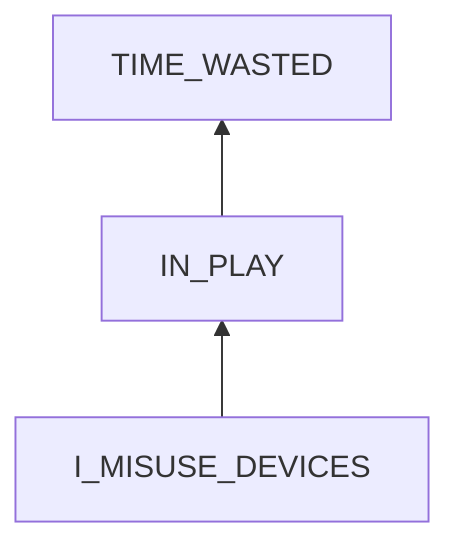
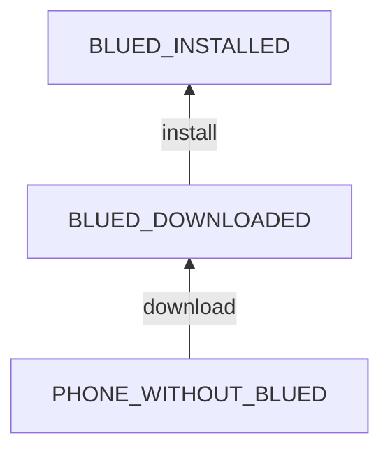

# Giving in to Entertainment

## Examination
[problem overview]: #
Time and energy is wasted in entertainment of news, videos, games, and sex.

### Context

#### When
[Specification: year, season, daytime, during & after some events, duration]: #

- News & Videos
	- Anytime.
	- Especially during and after 
		- defecation.
		- eating
	- lasting for 1 ~ 2 hours.
- Games
	- After 3:00 am and before sleep. 
	- When I am extremely tired and bored. 
	- lasting for 3 ~ 8  hours.
- Sex
	- After dinner and before 12:00 am.
	- lasting for 3 ~ 6 hours.
	- After browsing news.
	- When I am tired.

#### Where
[Localization]: #

- **[ALONE_AT_HOME]** At my house alone.
- **[ZHOU_SUPERVISION]** Not using dating apps when at ZhouBo's house.
- Still watching videos and playing games at Zhou's house.

### Symptoms
[avoid biases]: #
[comparison between actuation and expectation]: #
[collect evidence used by hypothesis built in the root cause analysis phrase]: #
[specification: location, degree]: #

#### Vision

- **[ON_BED]** I usually do these things when laying on the bed.
- News
	- **[BAIDU_WEIBO]** I watch celebrities, movies and foods vlogs in Baidu and Weibo.
- Games
	- **[GOMOKU]** I only play Gomoku.
- Sex
	- **[BLUED]** I use Blued.
	
#### Hearing

#### Smell

#### Taste

#### Touch & Feel

- **[GIVE_IN]** I know that I should not do it, but eventually I still give in.
- **[TIME_UNCONSCIOUSNESS]** Before starting, I told myself that I would stop it in one hour. But I spent much more time gradually.
- **[LOSE_CONTROL]** Sometimes I know that I should stop, but the strong craving drives me to continue.
- **[ANGER]** Even when the battery is low and the phone is about to turn off, I rush to charge it to continue, especially when I am in a match of Gomoku. 
- **[CONQUER]** I want to conquer others especially the elderly in casual sex.
- **[DEFEAT]** I only want to defeat other players in Gomoku, and I only play with low-rank players and avoid high-rank ones.

## Root Cause Analysis
[backward cause reasoning for general problems]: #
[interactions: failed good OR bad OR side effects]: #
[recursive trouble shooting for engineering problems to an atomic level (build hypothesis, use evidence (examination  + unit tests))]: #

IN_PLAY
:	I am playing these.

I_MISUSE_DEVICES
:	SYSTEM
	:	I
		:	MIND
			:	RULES
				:	~~EFFECTS_IGNORANCE~~
					:	Evidence
						:	Neg
							:	- I understand the bad effects of these activities.

					~~ADDICTION_IGNORANCE~~
					:	Evidence
						:	Neg
							:	- I understand that each time of giving in will contribute to the accumulation of $\delta$fobs which contributes to addictions.

				STATES
				:	~~VIEWS~~

					EMOTIONS
					:	DEPRESSION
						:	I feel unhappy with my life, and I seek for a feeling of self achievement.

							Evidence
							:	Pos
								:	- **[CONQUER]**
									- **[DEFEAT]**

						LOW_SELF_CONTROL
						:	Evidence
							:	Pos
								:	- **[GIVE_IN]**
									- **[TIME_UNCONSCIOUSNESS]**

					MENTAL_DISORDERS
					:	ADDICTIONS
						:	I have addictions to entertainment.

							Evidence
							:	Pos
								:	- **[LOSE_CONTROL]**
									- **[ANGER]**

			~~BODY~~
			:	My body can not support me to do what I should do.

				Evidence
				:	Neg
					:	- I can play gomoku for 8 hours, which takes more energy than some small task like repair the salt box.
						- Sometimes I still give in to TV programs in the morning. 

		I_DEVICES
		:	I use electronic devices.

			TOO_MUCH_ENTERTAINMENT
			:	time wasted

		DEVICES
		:	BLUED_INSTALLED
			:	Evidence
				: 	Pos
					:	- **[BLUED]**

			VIDEO_APPS
			:	Evidence
				: 	Pos
					:	- I use Youku and mangoTV apps.

			BROWSER
			:	BAIDU_WEIBO
				:	Evidence
					: 	Pos
						:	- **[BAIDU_WEIBO]**

				YOUTUBE
				:	MALIANJIE

					DARK_WEB_KID

					ELEPHANT_DEE

				PLAYOK
				:	Evidence
					: 	Pos
						:	- **[GOMOKU]**
						
	ENV
	:	DEP
		:	POWER

			OTHER_SERVICES
			:	NETWORK
				:	All these sites and apps need network.

					BLUED_SERVER_IP

		INPUTS
		:	~~ACTIVE~~

			PASSIVE
			:	NATURAL
				:	COMFORTABLE_BED
					:	My bed is soft and provides a nice env for me to play my phone.

						Evidence
						: 	Pos
							:	- **[ON_BED]**

					NEARBY_OUTLETS
					:	There are plugin outlets near my bed.

				TEMPTATIONS
				:	NO_SUPERVISION

					ATTRACTIVE_GUYS

					SEDUCING_PHOTOS
					:	STORAGE

						ONLINE_RECOMMENDATION

PHONE_WITHOUT_BLUED
:	PHONE

	PHONE_BLUED
	:	There are ways to download blued apk.

		OFFICIAL_APP_STORE

		SITES_FROM_BROWSERS
		:	PATHS_TO_THE_APP

	BLUED_IN_SITES

## Brainstorming
[removal of touchable physical objects is applicable]: #
[replacement V.S repair. Localize the problem to an atomic level where fixing it components is more expensive than replacing it as a whole]: #	

IN_PLAY
:	try to interrupt the process and take a cold mind back by
	- self **<1>**
		- deep breath
		- wash face with cold water
	- external reminders **<2>**
		- alarms

DEPRESSION
:	find hope by 
	- helping others **<3>**
	- joining supporting groups **<17>**

LOW_SELF_CONTROL
:	TODO

ADDICTIONS
:	- avoid stimuli by other methods
	- drink more water **<4>**
	- do exercises **<5>**

BLUED_INSTALLED
:	uninstalled it.	**<6>**

BLUED_DOWNLOADED
:	delete the package. **<7>**

~~PHONE~~
:	I need my phone for contacts and wifi.

OFFICIAL_APP_STORE
:	block it with BlockSite. **<8>** I can download needed apps from other sites.

PATHS_TO_THE_APP **<9>**
:	1. block the "blued" keyword with BlockSite.
	2. block special sites containing the package
	3. clear browser history.

~~BLUED_IN_SITES~~
:	out of my control.

VIDEO_APPS, BAIDU, WEIBO，YOUTUBE_CHANNELS
:	set blocking schedules with BlockSite. **<10>**

PLAYOK
:	block the site with BlockSite. **<11>**

~~POWER~~
:	I need to use my phone.

BLUED_SERVER_IP
:	block all blued server IPs with firewall apps. **<19>**

COMFORTABLE_BED
:	I need it for a good sleep. However, there are still something that I can do
	- practice not to use phone on bed. **<12>**
	- alternatives
		- reading **<18>**

NEARBY_OUTLETS
:	block them with sticky reminders. **<13>**

NO_SUPERVISION
:	- join supporting groups.
	- use sticky reminders. **<14>**

ATTRACTIVE_GUYS
:	practice not to watch others when outside. **<15>**

SEDUCING_PHOTOS
:	delete them all from my phone. **<16>**

## Analysis of Solutions

### Comparison
| Solution | Cost | Effective Duration | Side Effects & Risks |
| --- | --- | --- | --- |
| 1 | MIDDLE: high willpower needed | m~h | NOT_WORKING |
| 2 | LOW | m~h | NOT_WORKING |
| 3 | MIDDLE | days | NO |
| 4 | LOW | hours | NOT_ENOUGH |
| 5 | MIDDLE | 1 day | NOT_WORKING |
| 6 | LOW | hours | NO |
| 7 | LOW | days~weeks | NO |
| 8 | MIDDLE | LONG | more time to find needed apps |
| 9 | MIDDLE | LONG | NO |
| 10 | MIDDLE| LONG | NO |
| 11 | MIDDLE | LONG | NO |
| 12 | MIDDLE | ? | NO_ENOUGH_WILLPOWER |
| 13 | LOW | LONG | NO |
| 14 | LOW | LONG | NOT_WORKING |
| 15 | MIDDLE | days | NO_ENOUGH_WILLPOWER |
| 16 | LOW | days | NO |
| 17 | HIGH | LONG | ? |
| 18 | MIDDLE | 1 day | NO_ENOUGH_WILLPOWER|
| 19 | MIDDLE | LONG | NO_SUITABLE_FIREWALL |

### Priority & Trace

- *1*
- 2
- *13*
- *10*
- *11*
- 19
- 17
- *16*
- 3
- *4*
- 18
- 5
- *6*
- 12
- *14*
- *15*
- *7*
- 8
- *9*

## Thinking
[Lessons learned from this experience]: #

- We can interrupt an activity in the middle.
- **Notice the importance of evidence in supporting causes.**
- Flaws in thoughts
- Examination helps us to 
	- over confirmation biases
	- find more factors in root cause analysis
- apply solutions backwards
	- for solutions at a same layer, apply them in descending order of
		1. effective duration
		2. cost
<!--stackedit_data:
eyJoaXN0b3J5IjpbLTM1Mjk3ODQ5NV19
-->