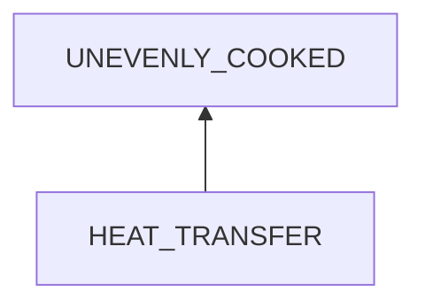
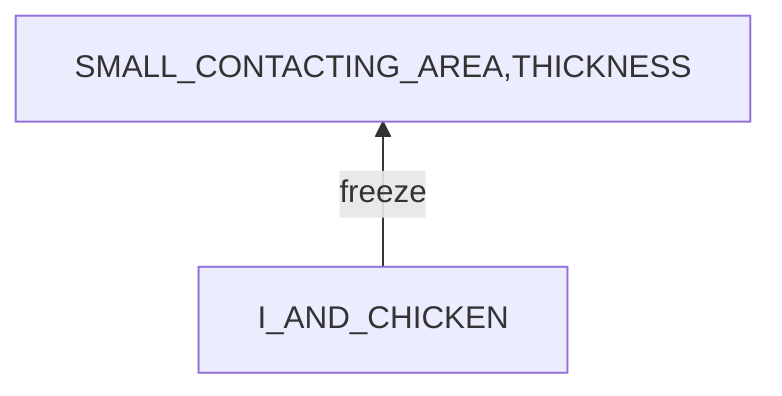
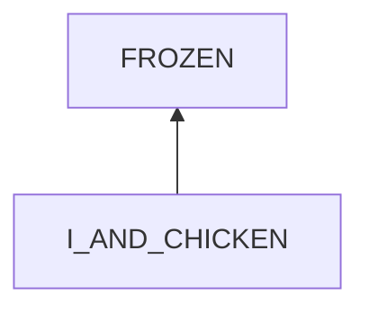

# Unevenly Cooked Meat

## Examination
[problem overview]: #
[a problem can be of services or env of a system]: #

The chicken breast gets outside charred but inside still frozen.

### Context

#### When
[Specification: year, season, daytime, during & after some events, duration]: #

- **[5MIN]** cooking duration: > 5 mins

#### Where
[Localization]: #

- on a pan
    - **[800W]**power: 800 W

### Symptoms
[avoid jumping to conclusions and confirmation biases]: #
[collect evidence used by hypothesis built in the root cause analysis phrase]: #
[comparison between actuation and expectation]: #
[specification: location, degree]: #
[when direct examination is hard, we can use tools like light and magnifiers to amplify the signals]: #

#### Vision

- when the outside is charred, the inside is still frozen.
- large smoke when putting the chicken breast into the pan.

#### Hearing

- noisy frying sounds

#### Smell

#### Taste

- The charred part tastes bitter.

#### Touch & Feel

- outside soft
- core still hard

## Root Cause Analysis
[backward cause reasoning for general problems]: #
[recursive trouble shooting for engineering problems to an atomic level (build hypothesis, use evidence (examination  + unit tests))]: #

HEAT_TRANSFER
:   SYS
    :   ~~PAN~~

        PAN-CHICKEN
        :   MISMATCH
            :   STATE
                :   SMALL_CONTACTING_AREA
                    :   the contacting area between the pan and chicken is small

                        Link
                        :   - The larger the area, the greater the heat transfer[^conduction_integral].
                        
                            [^conduction_integral]:https://en.wikipedia.org/wiki/Thermal_conduction#Integral_form

                        Evidence
                        :   Pos 
                            :   - the chicken breast is frozen as a round bulk while the pan is flat.

                BEHAVIOR
                :   MANNER
                    :   INTENSITY
                        :   too large fire

                            Link
                            :   - Based on Fourier's law[^conduction_differential], given conductivity does not change much with temp, then the greater the heat flux (fire power), the greater the temp gradient. As a result, the core of the chicken breast can be still frozen when the surface is hot and charred.

                                [^conduction_differential]:https://en.wikipedia.org/wiki/Thermal_conduction#Differential_form
                                
                                - The larger the fire, the easier to char pancakes. 

                            Evidence
                            :   Pos
                                :   - **[800W]**: there are options of 120W and 500W.

                        ~~PACE~~
                        :   no enough stir.

                            Link
                            :   - The center point of the pan is the hottest, and stirring foods enables each part to be heated evenly.

                            Evidence
                            :   Neg
                                :   - I have done this step.

                        ~~ANGLE~~
                        :   not flip the meat to heat all sides.

                            Evidence
                            :   Neg
                                :   - I flipped the meat.
                                    - The whole surface is cooked.

                    DURATION
                    :   too short cooking time for inside

                        Link
                        :   - TODO: how long it needs to make heat reach the core

                        Evidence

            ~~LOOSEN~~

        CHICKEN
        :   THICKNESS
            :   too thick
    
                Link
                :   - given a temp gradient, the thick the meat, the larger the temp difference between the surface and the core.
    
                Evidence
                :   Pos
                    :   - the chicken breast slices are frozen as a bulk not prepared in a flat shape.

            FROZEN
            :   the frozen state

                Link
                :   - frozen meats have a lower thermal conductivity than fresh ones. Given a power and thickness of the meat, frozen meats lead to larger temp diff.

                Evidence
                :   Pos
                    :   - frozen meat is put into the pan without defrosting it.
    
    ~~ENV~~

I_AND_CHICKEN
:   SYS
    :   ~~I~~

        I-CHICKEN
        :   MISMATCH
            :   ~~STATE~~

                BEHAVIOR
                :   MISSED_STEP
                    :   NOT_FLATTEN_BULK

                    ~~MANNER~~
            ~~LOOSEN~~

        CHICKEN
        :   THICK_PIECES

    ~~ENV~~

I_AND_CHICKEN
:   SYS
    :   ~~I~~

        I-CHICKEN
        :   MISMATCH
            :   ~~STATE~~

                BEHAVIOR
                :   MANNER
                    :   freeze the meat
                        
                        INTENSITY
                        :   TODO

                        DURATION
                        :   up to 1 month    

            ~~LOOSE~~

        CHICKEN
        :   fresh chicken

    ENV
    :   ~~DEP~~

        INPUT
        :   ~~ACTIVE~~

            PASSIVE
            :   NATURE
                :   GEMS

                    TEMP

                    MOISTURE

                ~~HUMAN~~

## Brainstorming
[removal of touchable physical objects is applicable]: #
[replacement V.S repair. Localize the problem to an atomic level where fixing it components is more expensive than replacing it as a whole]: #

UNEVENLY_COOKED
:   1. remove charred parts
    2. cut the bulk into smaller pieces with a spatula.
    3. cook with a small fire.

SMALL_CONTACTING_AREA
:   add oil

INTENSITY
:   switch to a smaller power

THICKNESS
:   for a frozen one which is hard, we have to firstly defrost it and lay it flat on the pan.

FROZEN
:   defrost it.

NOT_FLATTEN_BULK
:   sticky note on the freezer to remind to flatten meat before freezing.

THICK_PIECES
:   chop meat into thin pieces

## Analysis of Solutions

### Comparison
| Solution | Cost | Effective Duration | Side Effects & Risks |
| --- | --- | --- | --- |
|||||

### Priority & Trace
[try from treatments to prevention based on time bound]: #

## Thinking
[Lessons learned from this experience]: #

