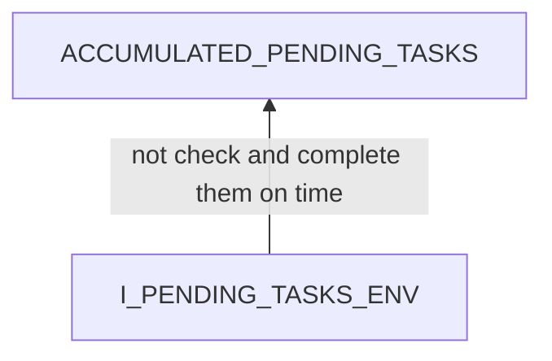
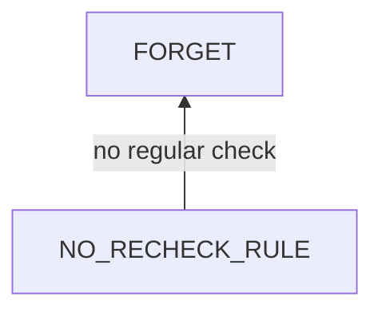
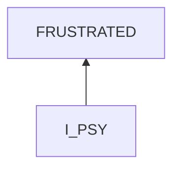
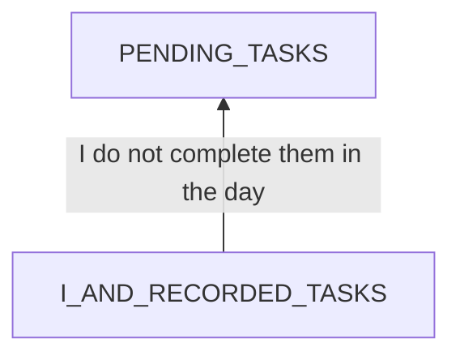
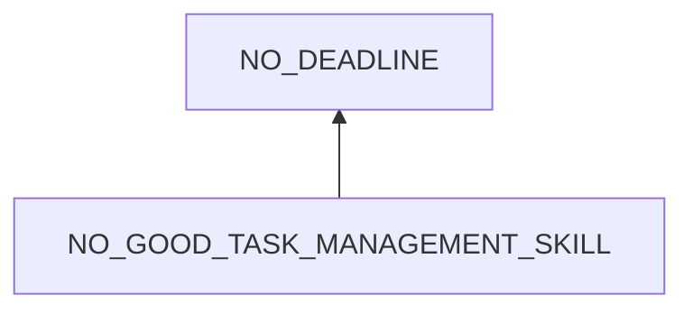

# Many Pending Tasks

## Examination
[problem overview]: #
[a problem can be of services or env of a system]: #

There are many pending tasks that I only recorded them down but have not finished.

### Context

#### When
[Specification: year, season, daytime, during & after some events, duration]: #

- From June 2023 to December 2024: one and half year.

#### Where
[Localization]: #

- Recorded Notes
    - Thinking
    - Goal achievement
    - Problem solving
    - Learning
    
### Symptoms
[avoid jumping to conclusions and confirmation biases]: #
[collect evidence used by hypothesis built in the root cause analysis phrase]: #
[comparison between actuation and expectation]: #
[specification: location, degree]: #
[when direct examination is hard, we can use tools like light and magnifiers to amplify the signals]: #

#### Vision

- Statistics
    - **[63%]** Many unchecked list items of delayed tasks
        - checked: 63%
        - unchecked: 37%
- Housing
    - Messy cabinet
    - Dirty bathroom & kitchen
    - Broken appliances
- Belongings
    - Problematic electronics
    - Incomplete models
- Activities
    - Unlearned
    - Volunteering
- Config
    - bond
    - phones
    
#### Hearing

#### Smell

- Urine odor

#### Taste

#### Touch & Feel

- **[UNSATISFIED]** Unsatisfied
- Regretful of wasted time
    - Sleep too much
    - Entertainment
    - Distraction
    
## Root Cause Analysis
[backward cause reasoning for general problems]: #
[recursive trouble shooting for engineering problems to an atomic level (build hypothesis, use evidence (examination  + unit tests))]: #

### ACCUMULATED_PENDING_TASKS

I_PENDING_TASKS_ENV
:   I_PENDING_TASKS
    :   I
        :   PSY
            :   RULE
                :   NO_RECHECK_RULE
                    :   no rules to rechecking pending tasks regularly.   

                STATE
                :   VIEW
                    :   FORGET
                        :   I already forget pending tasks recorded weeks before.

                    EMOTION
                    :   FRUSTRATED
                        :   I feel frustrated when there are so many task not completed.   

                        Evidence
                        :   Pos
                            :   - **[UNSATISFIED]**

                    ~~MENTAL_DISORDER~~

            PHY
            :   EXHAUSTED
                :   Handling daily recorded tasks makes me exhausted already late at night.

        I-PENDING_TASKS
        :   MISMATCH
            :   STATE
                :   INCAPABLE
                    :   ~~DIFFICULTY~~
                        :   Evidence
                            :   Neg
                                :   - I have the models of thinking, problem solving and goal achievement.

                        *NUMBER*
                        :   too many tasks for me each day. 

                            Evidence
                            :   - TODO: test after I grasp the task management skills.

                    DISLIKE
                    :   I do not like to complete tasks.

                        Evidence
                        :   Pos
                            :   - It is human nature that everyone likes comfort.  

                BEHAVIOR
                :   NOT_HANDLE

            ~~LOOSE~~
            :   Evidence
                :   Neg
                    :   - I have full access to these tasks, and no external restrictions prevent me from accessing it.
   
        PENDING_TASKS
        :   remaining tasks from previous days.

    ENV
    :   DEP
        :   ~~ENERGY~~
            :   Evidence
                :   Neg
                    :   - I eat a nutrient-balanced diet.

            OTHER_SERVICE
            :   LIMITED_TIME
                :   Evidence
                    :   Pos
                        :   - I only have 10 hours in which I do not lay in bed.
                            - Each dinner costs 2 hours.  

        INPUT
        :   ACTIVE
            :   NO_DEADLINE
                :   No deadline for tasks.

            PASSIVE
            :   NATURE
                :   *LIGHT*

                    ~~SOUND~~
                    :   Evidence
                        :   Neg
                            :   - I can hear little noise when wearing earplugs and keeping the curtain and windows close.

                    *TEMPERATURE*
                
                ~~HUMAN~~

### FORGET

### FRUSTRATED

I_PSY
:   RULE
    :   IGNORANCE_RULE_HANDLE_FAILURE
        :   If I do not meet my expectation, I feel frustrated.   

    STATE
    :   VIEW
        :   PENDING_TASKS

### DISLIKE

Todo: motivation, habits, determination

### PENDING_TASKS

I_AND_RECORDED_TASKS
:   I_RECORDED_TASKS
    :   I
        :   PSY
            :   RULE
                :   NO_GOOD_TASK_MANAGEMENT_SKILL

                STATE
                :   VIEW
                    :   RANDOM_THOUGHT
                        :   Suddenly I think about unrelated things.   

                    EMOTION
                    :   RELUCTANCE
                        :   Evidence
                            :   Pos
                                :   - From 2024/12/10 to 2024/12/20, I did not handle any serious tasks. I just chose to complete life and issue tasks. 

                    ~~MENTAL_DISORDER~~

            PHY
            :   NEURAL
                :   BRAIN
                    :   SHORT_CLEAR
                        :   I can only maintain a clear mind for 10 hours a day.

        I-RECORDED_TASKS
        :   MISMATCH
            :   STATE
                :   same as [state](#accumulated_pending_tasks)

                BEHAVIOR
                :   DELAY

            ~~LOOSE~~
            :   same as [loose](#accumulated_pending_tasks)

        RECORDED_TASKS
        :   SCHEDULED_TASKS

            UNEXPECTED_DEPENDENT_TASKS
            :   ENCOUNTERED_ENGLISH_WORDS

                LEARNING_IN_PROBLEM_SOLVING

    ENV
    :   same as [env](#accumulated_pending_tasks)
        
### LIMITED_TIME

[sleep problem](/Problem%20Solving/health/physiology/sleep/short_sleep.md)

### NO_DEADLINE

### RANDOM_THOUGHT

[focus problem](/Problem%20Solving/health/psychology/distraction/irrelevant_thought.md)

### SHORT_CLEAR

[problem of being energized](/Problem%20Solving/health/physiology/fatigue/fatigue.md)

## Brainstorming
[removal of touchable physical objects is applicable]: #
[replacement V.S repair. Localize the problem to an atomic level where fixing it components is more expensive than replacing it as a whole]: #

### ACCUMULATED_PENDING_TASKS

ACCUMULATED_PENDING_TASKS
:   handle them with a strategy. **<1>**

NO_RECHECK_RULE
:   think of how to check and organize left tasks. **<2>**

~~FORGET~~
:   reasoned view.

FRUSTRATED
:   deep breathe **<3>**

EXHAUSTED
:   rest **<4>**
    - at daytime: rest, nap
    - at night: sleep. 

NOT_HANDLE
:   intervention
    - sticky note **<5>**
    - mental stimulation. **<6>**

DISLIKE
:   - deep breathe. **<7>**
    - think of the benefits of completing these tasks. **<8>**

PENDING_TASKS
:   handle them with a strategy. **<9>**

~~LIMITED_TIME~~
:   The time wasted in bed is gone. Staying up late at night will disrupt my biologic clock further.

NO_DEADLINE
:   set a deadline if I really need to complete the specific task firstly and put off others. **<10>**

### FRUSTRATED

IGNORANCE_RULE_HANDLE_FAILURE
:   Practice that Each mismatch between expectation and actuation is a problem. Solve the problem and learn a lesson. **<11>**

### PENDING_TASKS

NO_GOOD_TASK_MANAGEMENT_SKILL
:   think of how to manage and complete tasks efficiently. **<12>**

RANDOM_THOUGHT
:   intervention **<13>**
    1. deep breathe
    2. recall that these thoughts are 
        - wasting my time
        - killing my willpower
    3. resume working.

RELUCTANCE
:   [reluctance problem](/Problem%20Solving/health/psychology/motivation/reluctance.md)

~~SHORT_CLEAR~~
:   transient effect

DELAY
:   intervention
    - sticky note **<14>**
    - mental stimulation **<15>**
        1. deep breathe
        2. think of the bad effects of delay
            - tasks not done
            - harm self confidence
        3. follow the task management model
            
~~RECORDED_TASKS~~
:   working part. I need them.

## Analysis of Solutions

### Comparison
| Solution | Cost | Effective Duration | Side Effects & Risks |
| --- | --- | --- | --- |
| 1 | VERY_HIGH | MONTHS | STRATEGY_INEFFICIENT |
| - |  |  |  |
| 2 | HIGH | LONG | STRATEGY_INEFFICIENT |
| 3 | LOW | DAYS | NO |
| 4 | MIDDLE | 1 DAY | NO |
| 5 | LOW | LONG | INEFFICIENT |
| 6 | LOW | 1 DAY | INEFFICIENT |
| 7 | LOW | HOURS | NO |
| 8 | LOW | HOURS | NO |
| 9 | HIGH | DAYS | STRATEGY_INEFFICIENT |
| 10 | LOW | ? | INEFFICIENT, DELAY_OTHERS |
| - |  |  |  |
| 11 | MIDDLE | LONG | NO |
| - |  |  |  |
| 12 | HIGH | LONG | INEFFICIENT |
| 13 | LOW | 20 MINUTES | NO |
| 14 | LOW | LONG | INEFFICIENT |
| 15 | LOW | HOURS | INEFFICIENT |

### Priority & Trace
[try from treatments to prevention based on time bound]: #

- 1
- *5*
- 2
- *3*
- 9
- *6*
- 4
- *7*
- *8*
- *10*
- *11*
- *14*
- 12
- *15*
- 13

## Thinking
[Lessons learned from this experience]: #

