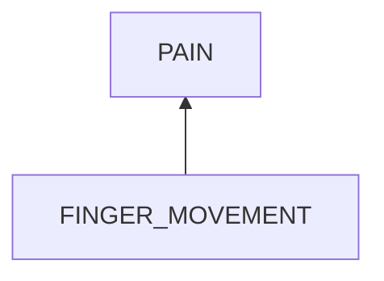
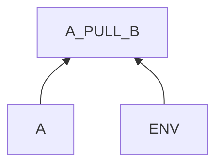

# Finger Pain in Typing

## Examination
[problem overview]: #

My fingers feel painful.

### Context

#### When
[Specification: year, season, daytime, during & after some events, duration]: #

Typing a keyboard.

#### Where
[Localization]: #

Left middle and ring fingers.

### Symptoms
[avoid biases]: #
[comparison between actuation and expectation]: #
[collect evidence used by hypothesis built in the root cause analysis phrase]: #
[specification: location, degree]: #

#### Vision

-	**[ONE_FINGER]** Move only the necessary finger.

#### Hearing

#### Smell

#### Taste

#### Touch & Feel

-	**[C]** Pain when moving left middle finger to reach key `c`
-	**[X]** Pain when moving left ring finger to reach key `x`

## Root Cause Analysis
[backward cause reasoning for general problems]: #
[recursive trouble shooting for engineering problems to an atomic level (build hypothesis, use evidence (examination  + unit tests))]: #

FINGER_MOVEMENT
:	~~BONE~~
	:	Finger bones are hurt.
	
		Evidence
		:	Neg
			:	-	No accidents recently.
				-	No painful feeling when pressing these two fingers.
		
	~~MUSCLE~~
	:	~~TISSUE_BROKEN~~
		:	Evidence
			:	Neg
				:	-	No intensive usage recently.
				
		~~ACID~~
		:	Evidence
			:	Neg
				:	-	Not after long time of typing but anytime I use these two fingers I feel pain.
					
	NERVE
	:	~~WRIST_NERVE~~
		:	The nerves at my wrist are compressed when laid on the table.
		
			Evidence
			:	Pos
				:	-	**[LIFTING]** When lifting wrist over the table during typing, the pain largely relieved.	
				
				Neg
				:	-	**[RIGHT_HAND]** Right hand middle and ring fingers do not have pain.
				    -	**[LEFT_OTHER_FINGERS]** Left thumb, index and little fingers do NOT feel this pain.
					-	==In the case that I lift my left wrist which is pressed by my right hand, my left middle and ring fingers do NOT feel pain when typing.==
		
		FINGERS_NERVE
		:	The **relative** movement between the middle finger and ring finger causes a tension in the nerve.
		
			Evidence
			:	Pos
				:	-	The nerve of the middle finger and that of the ring finger are connected.
					-	**[LEFT_OTHER_FINGERS]**
					-	**[ONE_FINGER]** If moving the two finger together, the pain disappears.
					-	**[RIGHT_HAND]** Right hand pattern of using the middle finger for key `,` and ring finger for key `.` is natural.
					-	**[C] [X]** Left hand pattern involved an unnatural inward and side-way movement.  
					-	**[LIFTING]** When lifting wrist, there is a large space for fingers to enable a less curved position to hit the keys. 

## Brainstorming
[removal of touchable physical objects is applicable]: #
[replacement V.S repair. Localize the problem to an atomic level where fixing it components is more expensive than replacing it as a whole]: #

MIDDLE & RING
:	~~replacement~~
	:	not applied

	repair
	:	Switch to a new finger position layout where left middle finger hits key `x ` and left right finger hits key `z` **<1>**

ENV
:	THE_OTHER_FINGER
	:	repair
		:	move the two fingers together. **<2>**
	
	FINGERS_ENV
	:	repair
		:	enlarge the space by lifting wrists. **<3>**
		
## Analysis of Solutions

### Comparison

| Solution | Cost | Effective Duration | Side Effects |
| --- | --- | --- | --- |
| 1 | MIDDLE: The whole left part of the bottom row is affected. It takes time to switch. | LONG | INCONSISTENCY: Most resources do not use this placement.  |
| 2 | LOW | LONG | TYPING_ERROR: Curving two fingers in such a narrow space might cause wrong hits. LESS_EFFICIENCY: Additional movements hurt speed.|
| 3 | LOW | LONG | EXTRA_ENERGY: It might cost energy to lift wrists. |
 
### Priority & Trace

1.	3
	
	[Mon Jul 17 04:49:03 PM CST 2023] Pain in fingers hugely reduced.

2.	1
3.	2

## Thinking
[Lessons learned from this experience]: #
-	The pain is a side effect of a process that I want.
- remove
	-	replacement
		- hard: replace the physical object
		- soft: turn on / off it	
	-	repair
		-	remove a component
		-	change an attribute
		-	change the action	

- the behavior model (subject + env) is good for analyzing bad interactions in which components can not be replaced and interfaces cause the bad result mainly.

<!--stackedit_data:
eyJoaXN0b3J5IjpbLTEzNTkyOTUyOTddfQ==
-->