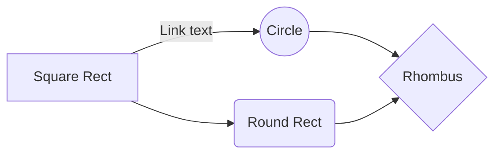
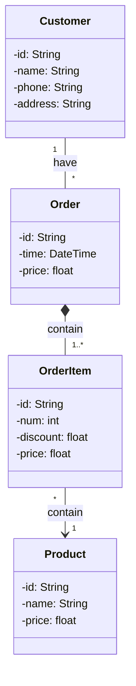

# Goals
- [x] to catch the purpose and basic layout of each type of diagrams
  - [x] Structural diagrams
    - [x] class
    - [x] component
    - [x] composite structure
    - [x] deployment
    - [x] object
    - [x] package
  - [x] Behavioral diagrams
    - [x] activity
    - [x] communication
    - [x] interaction overview
    - [x] sequence
    - [x] state
    - [x] timing
    - [x] use case 
- [x] **UML relationships**  
- to represent flows of
	- mental process
	- mechanism
		-  mechanics
		-  electronics
- to catch the structure (components, connections) of a system

# Questions
- [x] UML V.S mind map
  | Aspect | UML | Mind Map |
  | --- | --- | --- |
  | Purpose | To provide a standard way to visualize the design of systems. Being used to document, design or analyse a system. | To capture main structures and internalize knowledge |
  | Power | Containing many types of diagrams for different usages | Using tree structures to explain a center concept |
  | Easy to use | Hard. Needing to follow strict standards | Easy. The format is relatively flexible |
  | Learning curve | steep | slow |
  | Flow diagrams supported | yes(activity diagrams) | no |
  | Component diagrams supported | yes | yes |
  
  
- [ ] **different materials of learning UML (**critical thinking**)**
  - [ ] **comparison**
    | Content | lucidchat | tutorialspoint | Visual Paradigm | http://www.cs.sjsu.edu/ | uml-diagrams.org |
    | --- | --- | --- | --- | --- | --- |
    | Purposes | yes | yes| yes ||yes|
    |TOC| yes | no | yes|| no |
    |Context| yes | yes | yes || no |
    |Syntax| partial | no | yes || yes |
    |Thought steps| no | no | partial || yes |
    |Examples| yes | partial | yes || yes |
    
  - [x] combination 
- [x] **association V.S dependency**
- [x] aggregation V.S composition
- [x] flowchart V.S activity diagram
- [ ] activity diagram V.S state diagram
- [ ] flowchart
  - [x] focusing on states or processes? processes 
  - [x] can I use it for cause-effect relationships? yes
- [x] which diagrams to represent components and connections in a system? Component diagrams or C4
- [x] plantUML V.S mermaid

# Test
 
## plantUML

@startuml
Class01 <|-- Class02
@enduml

@startuml
class Customer {
 name: String
 phone: String
 address: String
}
class Product {
 name: String
 price: float
}
class Order {
 time: DateTime
 price: float
 items: Collection<OrderItem>
}
class OrderItem {
 product: Product
 num: int
 discount: float
 price: float
}

Customer "1" -- "*" Order
Order *-- "1..*" OrderItem
OrderItem "*" --> "1" Product
@enduml

## mermaid

<!--stackedit_data:
eyJoaXN0b3J5IjpbMTA4MjkwMjM1Nl19
-->