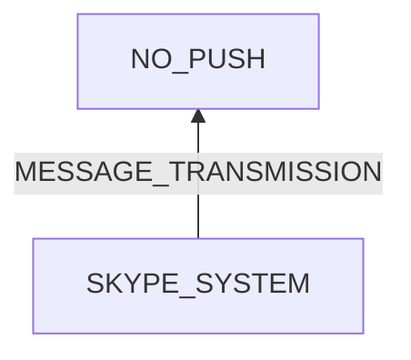

# Skype Without Push Notifications

## Examination
[problem overview]: #
[a problem can be the output or input of a process. For output, it can be a bad output. For input, it can be a waste of resources]: #

There is no push notifications of Skype.

### Context

#### When
[Specification: year, season, daytime, during & after some events, duration]: #

- Since installation of Skype

#### Where
[Localization]: #

- OPPO A36
	- Android 12
	- Skype 8.96.0.409
- HONOR DUA-AL00
	- Android 8.1.0
	- Skype 8.101.0.212

### Symptoms
[avoid biases]: #
[comparison between actuation and expectation]: #
[collect evidence used by hypothesis built in the root cause analysis phrase]: #
[specification: location, degree]: #

#### Vision

- When a text message is sent to a contact
	- Skype on phone has no push notifications.
	- **[UBUNTU_WORKING]** Skype on Ubuntu has push notifications.
- **[BACKGROUND_LATENCY]** When Skype is not at foreground and open it on phone
	- if in the main page, a pop-up showing "loading" is displayed before the new message.
	- if in the conversation page, a pop-up showing "updating conversation" appears before the new message.
- **[FOREGROUND_REALTIME]** When Skype is at foreground, a sent message is immediately received and displayed.
- **[CHINA_VERSION_WORKING]** China version of Skype can send push notifications.

#### Hearing

#### Smell

#### Taste

#### Touch & Feel

## Root Cause Analysis
[backward cause reasoning for general problems]: #
[
process
	- stable
		- expected
		- unexpected
	- human	
]: #
[recursive trouble shooting for expected process to an atomic level (build hypothesis, use evidence (examination  + unit tests))]: #

SKYPE_SYSTEM
:	~~TRIGGER~~
	:	POWER
		NEW_MESSAGE
		
	STRUCTURE
	:	PHONE
		:	HW
		
			~~ANDROID~~
			:	Evidence
				:	Neg
					:	- Many other apps shows.
			
			ANDROID_SKYPE
			:	Evidence
				:	Pos
					:	- **[CHINA_VERSION_WORKING]**
					
					Neg
					:	- battery optimization for Skype is off.
						- notification permission is grant.
			
			~~SKYPE~~
			:	Evidence
				:	Neg
					:	- The setting of push notifications is on.
	
			
			RECEIVING_MESSAGES
			:	Skype does not pull messages when at background.
			
				Evidence
				:	Pos
					:	- **[BACKGROUND_LATENCY]**
						- **[FOREGROUND_REALTIME]**

			GENERATING_NOTIFICATIONS
			:	Evidence
				:	Pos
					: - when Skype is open and a message is received but not read, there is still no notifications on Android home.
			
		~~INTERNET~~
		:	Evidence
			:	Neg
				:	- **[UBUNTU_WORKING]** The laptop running Ubuntu is at my house along with the 2 phones, and it and the OPPO phone use the WIFI hot spot from the HONOR phone.
				
		~~SKYPE_SERVER~~
		:	Evidence
			:	Neg
				:	- **[UBUNTU_WORKING]**
	

## Brainstorming
[removal of touchable physical objects is applicable]: #
[replacement V.S repair. Localize the problem to an atomic level where fixing it components is more expensive than replacing it as a whole]: #
 
## Analysis of Solutions

### Comparison
| Solution | Cost | Effective Duration | Side Effects & Risks |
| --- | --- | --- | --- |
|||||

### Priority & Trace
[try from treatments to prevention based on time bound]: #

## Thinking
[Lessons learned from this experience]: #

<!--stackedit_data:
eyJoaXN0b3J5IjpbLTE3NTk2NjI1OTVdfQ==
-->