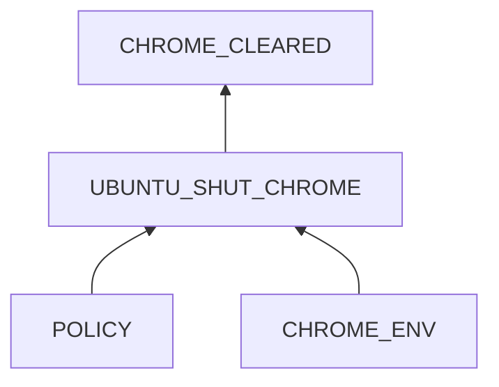
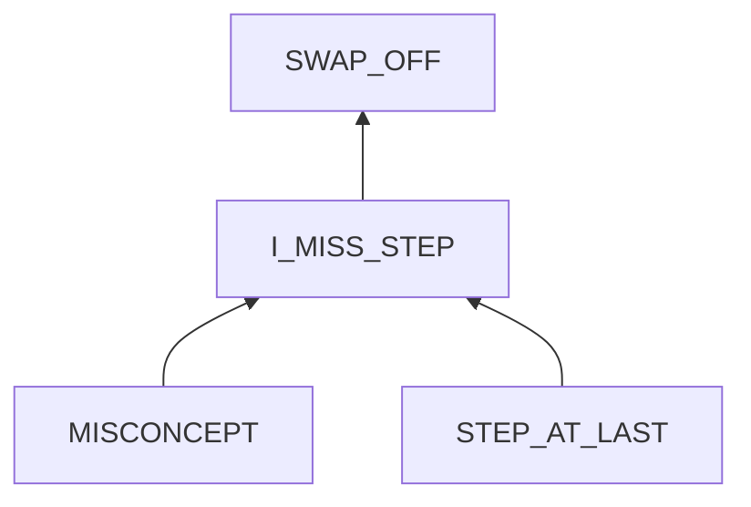

# Chrome automatically cleared

## Examination
[problem overview]: #

All open pages in Chrome are automatically cleared.

### Context

#### When
[Specification: year, season, daytime, after some events]: #

- usually overnight
- sometimes when using the browser, it suddenly has no response and then closes.

#### Where
[Localization]: #

Hardware
: Thinkpad T460s

Software
: OS
  : 5.19.0-42-generic #43~22.04.1-Ubuntu
  
  Browser
  : Google Chrome 114.0.5735.133
  
### Symptoms
[why: avoid biases]: #
[how: comparison between actuation and expectation]: #
[why: collect evidence used by hypothesis built in the root cause analysis phrase]: #
[specification: location, degree]: #

#### Vision

- **[NIGHT_CLEAR]** When I relogin to my locked laptop at the beginning of a day, previous opened Chrome web pages are all closed.
- Sometimes when using the browser, it suddenly has no response and then closes.
- **[FORCE_DOWN_ERR]** After reopening Chrome, it shows the error message of an unexpected close.
- **[OOMK_LOG]** From systemd journal, there is a message that **oomk clears chrome processes because their memory usage exceeds the threshold**.

#### Hearing

- When Chrome freezes, the fan becomes noisy until Chrome is shut down.
  
#### Smell

#### Taste

#### Touch

## Root Cause Analysis
[backward cause reasoning for general problems]: #
[recursive trouble shooting for engineering problems to an atomic level (build hypothesis, use evidence (examination  + unit tests))]: #

UBUNTU_SHUT_CHROME
: Evidence
  : Pos
    : - **[FORCE_DOWN_ERR]**

POLICY
: The oomk kills all chrome processes.
      
  Evidence
  : Pos
    : - **[OOMK_LOG]**
      - **[NIGHT_CLEAR]**     

CHROME_ENV
: Chrome takes up too much memory.
  
  CHROME
  : Evidence
    : Pos 
      : - **[CHROME_MULTI_PROCESSES]** Through examining active processes, I find that Chrome creates many processes.

  MEMORY
  : The memory is not enough.
    
    Evidence
    : Pos
      : - ==the swap area is off==.

---    

I_MISS_STEP
: I missed the critical step to make the change lasting.

MISCONCEPT
: - no idea that changes in software systems often need to be written to config files to be lasting, and running commands from a terminal only makes it valid at the current session.
  - the thought that things at last are less important, which triggers my temptation to skip them.
  - I did not specify the goal of lasting config enough.

## Brainstorming
[removal of touchable physical objects is applicable]: #
[replacement V.S repair. Localize the problem to an atomic level where fixing it components is more expensive than replacingmany  it as a whole]: #

CHROME_CLEARED
: reopen it.

UBUNTU
: - ~~replacement~~: There is only one OS in my laptop. The Ubuntu is needed to run Chrome. 
  - repair: disable `oomk`
 
POLICY
: loose the policy by increasing threshold. 

CHROME_ENV
: CHROME
  : - replacement: use another browser like Firefox.
    - repair: 
	    - change chrome's behaviors
	    - close unused tabs
	   
  MEMORY
  : - replacement: use a chip with a larger memory size.
    - repair: repair the swap area.   

SWAP_OFF
: turn on it by command `swapon`

~~I_MISS_STEP~~

MISCONCEPT
: After this experience,
  - I understand the importance of lasting config files.
  - To overcome the temptation of skipping the last step, keep **checking and understanding TOC**.
  - To avoid missing an important step, check whether I have met my goals one by one. **Never jump to conclusions!**

~~STEP_AT_LAST~~
: out of my control 
		    
## Thinking
[Lessons learned from this experience]: #
- Logs are very important and powerful in catching the problem.
TOC**.

		    
## Thinking
[Lessons learned from this experience]: #

<!--stackedit_data:
eyJoaXN0b3J5IjpbMTk4NTQ4NjI4LDE3MDExNDg2MjVdfQ==
-->