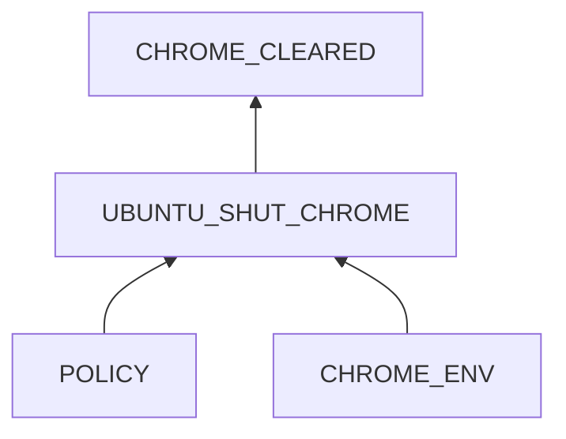
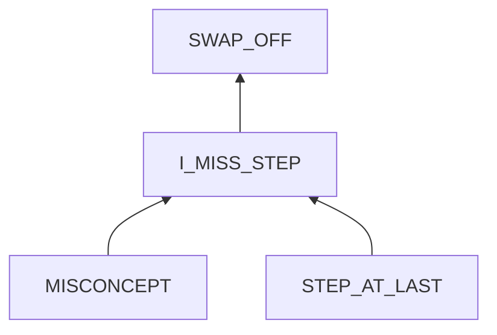

# Chrome automatically cleared

## Examination
[problem overview]: #

All open pages in Chrome are automatically cleared.

### Context

#### When
[Specification: year, season, daytime, after some events]: #

- usually overnight
- sometimes when using the browser, it suddenly has no response and then closes.

#### Where
[Localization]: #

Hardware
: Thinkpad T460s

Software
: OS
  : 5.19.0-42-generic #43~22.04.1-Ubuntu
  
  Browser
  : Google Chrome 114.0.5735.133
  
### Symptoms
[why: avoid biases]: #
[how: comparison between actuation and expectation]: #
[why: collect evidence used by hypothesis built in the root cause analysis phrase]: #
[specification: location, degree]: #

#### Vision

- **[NIGHT_CLEAR]** When I relogin to my locked laptop at the beginning of a day, previous opened Chrome web pages are all closed.
- Sometimes when using the browser, it suddenly has no response and then closes.
- **[FORCE_DOWN_ERR]** After reopening Chrome, it shows the error message of an unexpected close.
- **[OOMK_LOG]** From systemd journal, there is a message that **oomk clears chrome processes because their memory usage exceeds the threshold**.

#### Hearing

- When Chrome freezes, the fan becomes noisy until Chrome is shut down.
  
#### Smell

#### Taste

#### Touch

## Root Cause Analysis
[backward cause reasoning for general problems]: #
[recursive trouble shooting for engineering problems to an atomic level (build hypothesis, use evidence (examination  + unit tests))]: #

UBUNTU_SHUT_CHROME
: Evidence
  : Pos
    : - **[FORCE_DOWN_ERR]**

POLICY
: The oomk kills all chrome processes.
      
  Evidence
  : Pos
    : - **[OOMK_LOG]**
      - **[NIGHT_CLEAR]**     

CHROME_ENV
: Chrome takes up too much memory.
  
  CHROME
  : Evidence
    : Pos 
      : - **[CHROME_MULTI_PROCESSES]** Through examining active processes, I find that Chrome creates many processes.
   
      Neg
      : - from cgroups data, Firefox costs more memory than Chrome when opening the same tabs.

  MEMORY
  : The memory is not enough.
    
    Evidence
    : Pos
      : - ==the swap area is off==.

---    

I_MISS_STEP
: I missed the critical step to make the change lasting.

MISCONCEPT
: - no idea that changes in software systems often need to be written to config files to be lasting, and running commands from a terminal only makes it valid at the current session.
  - the thought that things at last are less important, which triggers my temptation to skip them.
  - I did not specify the goal of lasting config enough.

## Brainstorming
[removal of touchable physical objects is applicable]: #
[replacement V.S repair. Localize the problem to an atomic level where fixing it components is more expensive than replacing it as a whole]: #

CHROME_CLEARED
: reopen it. **<1>**

UBUNTU
: - ~~replacement~~: There is only one OS in my laptop. The Ubuntu is needed to run Chrome. 
  - repair: disable `oomd` **<2>**
 
POLICY
: loose the policy by increasing threshold. **<3>** 

CHROME_ENV
: CHROME
  : - replacement: use another browser ~~like Firefox~~. **<4>**
    - repair: 
	    - change chrome's behaviors **<5>**
	    - close unused tabs **<6>**
	   
  MEMORY
  : - replacement: use a chip with a larger memory size. **<7>**
    - repair: repair the swap area. **<8>**   

SWAP_OFF
: turn on it by command `swapon` **<9>**

~~I_MISS_STEP~~

MISCONCEPT
: After this experience, **<10>**
  - I understand the importance of lasting config files.
  - To overcome the temptation of skipping the last step, keep **checking and understanding TOC**.
  - To rescue, check whether I have met my goals one by one. **Never jump to conclusions!**

~~STEP_AT_LAST~~
: out of my control 

## Analysis of Solutions

### Comparison

| Solution | Cost | Effective Duration | Side Effects |
| --- | --- | --- | --- |
| 1 | LOW: just reopen Chrome. | SHORT: till the 2nd day. | LITTLE: Chrome can record pages closed unexpectedly |
| 2 | LOW: just a command. | LONG: forever | SERIOUS: might cause OOM. |
| 3 | MIDDLE: need to learn `oomd` and fine turning. | LONG: forever | RISK: inappropriate config might cause OOM. |
| 4 | MIDDLE: need to find a broswer using less memory than Chrome. And bookmarks transfer is needed. | LONG | WRONG_BROWSER: some browsers like Firefox cost more memory than Chrome.|
| 5 | MIDDLE: need to learn how to configure Chrome. | LONG | LESS_EFFECTIVE: might not save enough memory. |
| 6 | LOW: just close a tab when finishing it. | SHORT: only for current session. | FORGET: easy to forget this step. |
| 7 | HIGH: this method is expensive and time-consuming, so it should be the last resort. | LONG | LITTLE |
| 8 | LOW: I already know know to do it which is just adding a line in a config line. | LONG | LITTLE |
| 9 | LOW | SHORT: current session. | FORGET |
| 10 | MIDDLE: need to practice this habit | LONG | LITTLE |

### Priority
1.	8
	
	[Sun Jul 16 05:42:30 PM CST 2023] After repairing the swap file, Chrome has been killed only once in a week.

2.	10

	practicing
	
3.	3   
	
	NOT applied
	
## Thinking
[Lessons learned from this experience]: #
- Logs are very important and powerful in catching the problem.

<!--stackedit_data:
eyJoaXN0b3J5IjpbLTQ5MDU0NjIyMCwtMTU5MzA5MDEzNywtND
Q5MzMwMTI2LDE3MDExNDg2MjUsMTk4NTQ4NjI4XX0=
-->