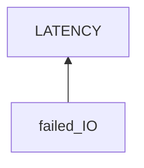

# Chrome Latency

## Examination
[problem overview]: #

Chrome browser runs slowly.

### Context

#### When
[Specification: year, season, daytime, after some events]: #

When editing files on StackEdit web pages in Chrome.

#### Where
[Localization]: #

Hardware
: Thinkpad T460s

Software
: OS
  : 5.19.0-42-generic #43~22.04.1-Ubuntu
  
  Browser
  : Google Chrome 114.0.5735.133
  
  Web
  : StackEdit
  

### Symptoms
[avoid biases]: #
[comparison between actuation and expectation]: #
[collect evidence used by hypothesis built in the root cause analysis phrase]: #
[specification: location, degree]: #

#### Vision

- **[LATENCY]** After using Chrome for a while in a session, the response time when editing files becomes long. Specifically, a character appears on the screen seconds after typing it.
- 
   
#### Hearing

#### Smell

#### Taste

#### Touch 

## Root Cause Analysis
[backward cause reasoning for general problems]: #
[recursive trouble shooting for engineering problems to an atomic level (build hypothesis, use evidence (examination  + unit tests))]: #

IO
: ~~KEYBOARD_SYS~~
  : The cherry usb keyboard is problematic
  
    Evidence
    : Neg
      : - 
        - **[BUILTIN_KEYBOARD]** For the built-in keyboard
          - The latency still happens.
          - It does not use USB.
  
  INPUT_BUS
  : ~~USB~~
    : Evidence
      : Neg
        : **[BUILTIN_KEYBOARD]**
       
    PCI
    : ?
     
  PROCESSOR_SYS
  : CP
  
  OUTPUT_BUS
  DISPLAY
    
  

## Brainstorming
[removal of touchable physical objects is applicable]: #

[replacement V.S repair. Localize the problem to an atomic level where fixing it components is more expensive than replacing it as a whole]: #
 
## Thinking
[Lessons learned from this experience]: #
- process flow of a specific use case for unfamiliar fields.

<!--stackedit_data:
eyJoaXN0b3J5IjpbLTE5OTUzOTMwMzBdfQ==
-->