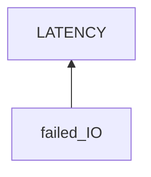

# StackEdit Latency

## Examination
[problem overview]: #

StackEdit becomes very slow.

### Context

#### When
[Specification: year, season, daytime, after some events]: #

When editing files.

#### Where
[Localization]: #

Hardware
: Thinkpad T460s

Software
: OS
  : 5.19.0-42-generic #43~22.04.1-Ubuntu
  
  Browser
  : Google Chrome 114.0.5735.133
  
  Web
  : StackEdit
  

### Symptoms
[avoid biases]: #
[comparison between actuation and expectation]: #
[collect evidence used by hypothesis built in the root cause analysis phrase]: #
[specification: location, degree]: #

#### Vision

- **[LATENCY]** A character appears in the editor seconds after typing it.
   
#### Hearing

- **[NOISE]** The fan spinning noise late at night.

#### Smell

#### Taste

#### Touch 

## Root Cause Analysis
[backward cause reasoning for general problems]: #
[recursive trouble shooting for engineering problems to an atomic level (build hypothesis, use evidence (examination  + unit tests))]: #

IO
: ~~KEYBOARD_SYS~~
  : The cherry usb keyboard is problematic
  
    Evidence
    : Neg
      : - **[PERIOD]** Only sometimes the latency happens and continues.
        - **[BUILTIN_KEYBOARD]** For the built-in keyboard
          - The latency still happens.
          - It does not use USB.
  
  ~~INPUT_BUS~~
  : ~~USB~~
    : Evidence
      : Neg
        : **[BUILTIN_KEYBOARD]**
       
    ~~PCI~~
    : Evidence
      : Neg
        : - **[PERIOD]**
          - **[OTHER_JOBS]**
     
  PROCESSOR_SYS
  : ~~CPU~~
	: Evidence
	  : Neg
	    : - **[OTHER_JOBS]** Most activities in the laptop are fine.
    
    MEMORY
    : ~~HARDWARE~~
      : Evidence
        : Neg
          : - **[OTHER_JOBS]**
          
      SOFTWARE
      : OS
        : Evidence
          : Pos
            : - **[BOOSTNOTES]** I encountered this typing latency when using Boostnotes desktop app in Ubuntu 18.
        
        
        CHROME
        : Chrome takes too much memory.
          
          Evidence
          : Pos
            : - **[CHROME_CRASH]** Chrome often crashes and closes overnight.

        STACKEDIT
        : Evidence
          : Pos
            : - **[INIT_SYNC_SLOW]** Without VPN, the initialization and synchronization of StackEdit work stations are slow. 
            
            Neg
            : - **[JS]** Editing is at client side, and no network is needed.    
      
  ~~OUTPUT_PCI~~
  : Evidence
    : Neg
      : - **[PERIOD]**
        - **[OTHER_JOBS]**
  
  ~~DISPLAY~~
  : Evidence
    : Neg
      : - **[PERIOD]**
        - **[OTHER_JOBS]**
  
    
  

## Brainstorming
[removal of touchable physical objects is applicable]: #

[replacement V.S repair. Localize the problem to an atomic level where fixing it components is more expensive than replacing it as a whole]: #
 
## Thinking
[Lessons learned from this experience]: #
- use process flow of a specific use case for unfamiliar fields.
- when the problem happens sometimes but now is not present, how to gather evidence. --> **LOG**
- for electronic devices, there are many different use cases each of which involves different components. --> unit tests.
- unit test skills!
- **trouble shooting: top-down V.S down-top**

<!--stackedit_data:
eyJoaXN0b3J5IjpbLTE1MDY4OTU0NDVdfQ==
-->