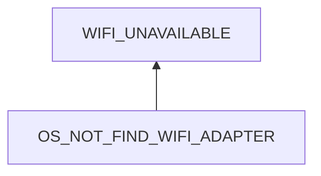

# WIFI Unavailable

## Examination
[problem overview]: #
[a problem can be the output or input of a process. For output, it can be a bad output. For input, it can be a waste of resources]: #

Wifi becomes unavailable suddenly.

### Context

#### When
[Specification: year, season, daytime, during & after some events, duration]: #

- **[VPN]** **After disconnecting ExpressVPN.**

#### Where
[Localization]: #

- Hardware: My Thinkpad T460s
- OS: GNU/Linux 5.19.0-42-generic #43~22.04.1-Ubuntu

### Symptoms
[avoid biases]: #
[comparison between actuation and expectation]: #
[collect evidence used by hypothesis built in the root cause analysis phrase]: #
[specification: location, degree]: #

#### Vision

- The wifi icon: blank.
- The wifi page in settings: displays `No Wi-Fi Adapter Found`.
- `lshw`
	- **[WIFI_DISABLED]** wifi is `DISABLED`
	- **[LSHW_DRIVER]** the driver info is there.
- `nmcli d`: shows `wlp4s0 wifi unmanaged`

#### Hearing

#### Smell

#### Taste

#### Touch & Feel

## Root Cause Analysis
[backward cause reasoning for general problems]: #
[interactions: failed good OR bad OR side effects]: #
[recursive trouble shooting for engineering problems to an atomic level (build hypothesis, use evidence (examination  + unit tests))]: #

OS_NOT_FIND_WIFI_ADAPTER
:	NETWORK_MANAGER
	:	MANAGER_PROBLEMATIC
		:	ExpressVPN makes the network manager problematic.
			
			Evidence
			:	Pos
				:	- **[VPN]**
					- **[SET_DEVICE_NOT_WORKING]** `nmcli device set wlp4s0 yes` not working.
					- ==After restarting the network manager, wifi becomes available.==
		
		MANAGER_CONFIG
		: 	The manage disables wifi.
			
			Evidence
			:	Pos
				:	- **[WIFI_DISABLED]**

				Neg
				:	- **[SET_DEVICE_NOT_WORKING]**
		
	DRIVER
	:	~~MISSED~~
		:	Evidence
			:	Neg
				:	- **[LSHW_DRIVER]**
					- `lsmod` displays `iwlwifi`

		~~NOT_MATCHED~~
		:	Evidence
			:	Neg
				:	- `modinfo iwlwifi` contains the compatible firmware currently used. 

		CONFIG_WRONG

	BUS
	:	~~PCI~~
		:	Evidence
			:	Neg
				:	- The communication between other devices like the keyboard and the monitor and the CPU    is fine, which needs PCI.
				
		~~PCI_BRIDGE~~

	WIFI_ADAPTER
	:	~~HW~~
		
		~~SW~~
		:	The firmware is problematic.
			
			Evidence
			:	Neg
				:	- An matched firmware is here.
				

	~~WIFI_CHIP~~
	:	BROKEN
	
		LOOSEN
	
## Brainstorming
[removal of touchable physical objects is applicable]: #
[replacement V.S repair. Localize the problem to an atomic level where fixing it components is more expensive than replacing it as a whole]: #
 
NETWORK_MANAGER
:	restarting it. <1>

## Analysis of Solutions

> Notice:
> -	The root cause has not been found.

### Comparison
| Solution | Cost | Effective Duration | Side Effects & Risks |
| --- | --- | --- | --- |
| 1 | LOW | UNKNOWN | UNKNOWN |

### Priority & Trace
- 1
	- [Wed Aug 16 11:28:04 AM CST 2023] wifi available 

## Thinking
[Lessons learned from this experience]: #

- Recursive Localization: To localize the problem to the level that I can handle. 
	- In the past I would restart my laptop to try to solve the problem.
	- currently, I use logs and unit tests to localize it to the network manager as I do not know what happened inside. I replace it.
	- Maybe in the future after I learn and know more about it, I can localize the problem further like some arguments disables wifi or some component is problematic. 
- What ExpressVPN did to the network manager.

<!--stackedit_data:
eyJoaXN0b3J5IjpbMTA4ODc1Mzg4N119
-->