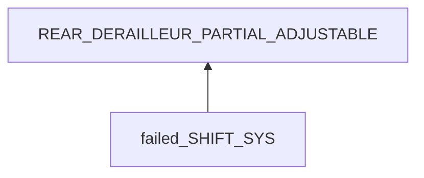
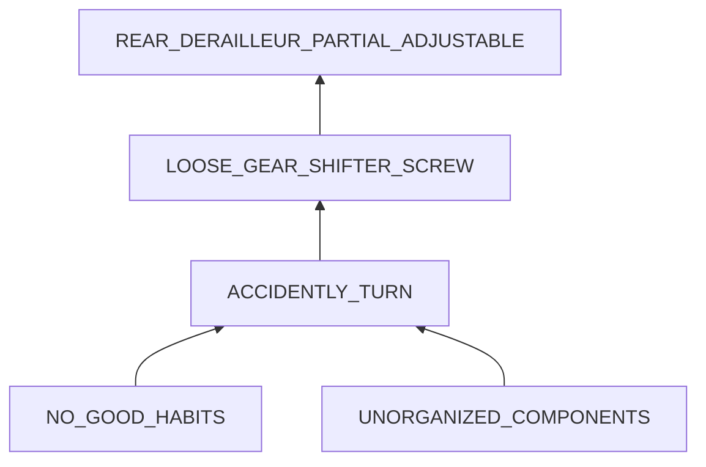

# Fix the speed switch system
## Examination

rear gear shifter cannot shift the chain to the inner part of the cogset.
 
### Context
#### When
[Specification: year, season, daytime, after some events]: #
From purchase of the bike.

#### Where
[Localization]: #
- Rear gear shifter
- Rear derailleur

### Symptoms
[specification: location, time, degree]: #
[avoid biases]: #
[comparison between actuation and expectation]: #
[collect evidence used by hypothesis built in the root cause analysis phrase]: #

#### Vision  
- **[OUTER_RANGE]** The rear derailleur moves only in the outer part not the inner part.
- **[BOUNCE_BACK]** The rear gear shifter tends to bounce back if pushing to - side hard.
- **[SCREW_LOOSE]** The screw used to fasten components of the rear gear shifter is loose.
  
#### Hearing
- The freq of sound of turning the rear gear shifter increases from + side to - side, while at the + side the sound is very low.
- The freq of sound of turning the front gear shifter is relatively stable. The sound remains crisp.

#### Smell
#### Taste
#### Touch
- **[TIGHT]** The force needed to turn the rear gear shifter increases from + to -. The + side is totally free, but the - side is so tight that I can only turn the pointer to the middle.
- **[EVEN]** The front shifter can be turned smoothly with even force. Both sides are reachable.  
  
## Root Cause Analysis
[backward cause reasoning for general problems]: #
[recursive trouble shooting for engineering problems to an atomic level (build hypothesis, use evidence (examination  + unit tests))]: #

SHIFT_SYS
: GEAR_SHIFTER
  : unit test
	: unit test <-- disassemble the shift <-- know its structure
	
    Theory 1
    : at middle inside the shifter the cable is hindered.
	  
	  Evidence
	  : Pos
	    : - **[TIGHT]**
	      - **[BOUNCE_BACK]**
	
	Theory 2
	: the tool inside to fasten the cable is problematic

	  Evidence
	  : Pos
	    : - **[TIGHT]**
	      - **[EVEN]**
	      - **[BOUNCE_BACK]**
	      - **[SCREW_LOOSE]**
		
		 
  ~~CABLE~~
  : Examination
    : - strength: strong
      - form: well
      - function: can transfer tension
    
  DERAILLEUR
  : Theory 3
    : the inward movement of derailleur is hindered by the rear gear set.
      
      Evidence
      : Pos
        : - **[OUTER_RANGE]**

The theory 2 has the most evidence to support it. After rearranging components and fasten the screw of the gear shift, the problem disappears.

## Brainstorming
[removal of touchable physical objects is applicable]: #
[replacement V.S repair. Localize the problem to an atomic level where fixing it components is more expensive than replacing it as a whole]: #
LOOSE_GEAR_SHIFTER_SCREW
: fasten it.

NO_GOOD_HABITS
: practice the good habit that never disassemble any device before knowing its basic structure.

UNORGANIZED_COMPONENTS
: organize components if there are many to avoid forgetting something done.
 
## Thinking
[Lessons learned from this experience]: #
For problems that different components are tightly bound and unit tests are hard to implement to like medical problems or those with limited resources, try to gather as many symptoms as possible. **Many factors can cause the same symptom, but if a factor has more matching symptoms, it is more possible. (hypothetical deduction)**

Try from the most possible factor.   

<!--stackedit_data:
eyJoaXN0b3J5IjpbMTQ0NjQ5OTYwMV19
-->