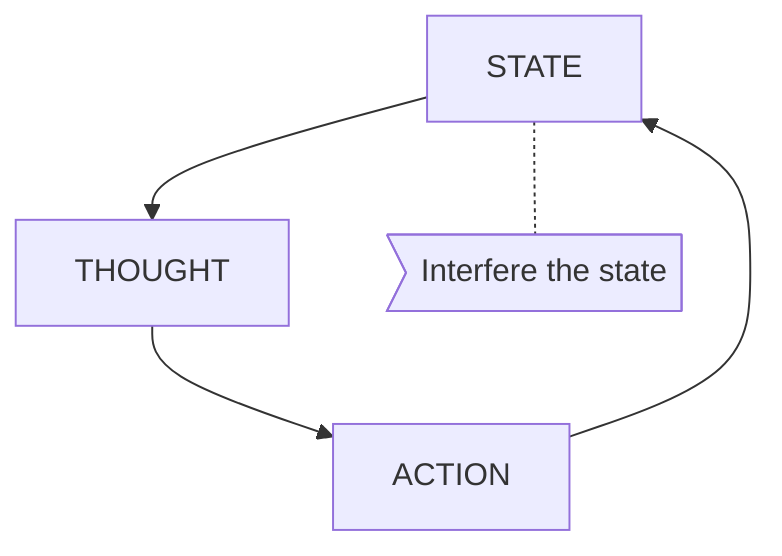

# [Fix the speed switch system]
## Examination

The handle cannot switch the chain to the inner [teeth wheels] of the rear set.
 
### Context
#### When
[Specification: year, season, daytime, after some events]: #
From purchase of the bike.

#### Where
[Localization]: #
- Rear Handle
- Inner teeth wheels of the rear set.

### Symptoms
[specification: location, time, degree]: #
[avoid biases]: #
[comparison between actuation and expectation]: #
[collect evidence used by hypothesis built in the root cause analysis phrase]: #

#### Vision  
- The rear switcher moves only in the outer part not the inner part.
  
#### Hearing
- The freq of sound of turning the rear handler increases from + side to - side, while at the + side the sound is very low.
- The freq of sound of turning the front handler is relatively stable. The sound remains crisp.

#### Smell
#### Taste
#### Touch
- The force needed to turn the rear handler increases from + to -. The + side is totally free, but the - side is so tight that I can only turn the pointer to the middle.
- The front handler can be turned smoothly with even force. Both sides are reachable.  
  
## Root Cause Analysis
[backward cause reasoning for general problems]: #
[recursive trouble shooting for engineering problems to an atomic level (build hypothesis, use evidence (examination  + unit tests))]: #

## Brainstorming
[removal of touchable physical objects is applicable]: #
Human Behavior

Natural Events
STATE MACHINE

[replacement V.S repair. Localize the problem to an atomic level where fixing it components is more expensive than replacing it as a whole]: #
 
## Thinking
[Lessons learned from this experience]: #

<!--stackedit_data:
eyJoaXN0b3J5IjpbMjY1NjI2ODQ1XX0=
-->