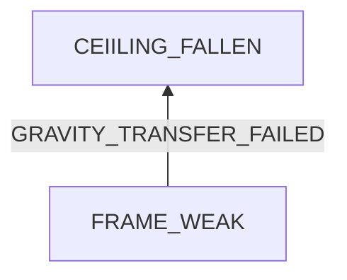

# Bathroom Ceiling Fallen

## Examination
[problem overview]: #
[a problem can be the output or input of a process. For output, it can be a bad output. For input, it can be a waste of resources]: #

Some pieces of ceiling are fallen.

### Context

#### When
[Specification: year, season, daytime, during & after some events, duration]: #

- Year: 2023

#### Where
[Localization]: #

- In my bathroom.
- Below waste water pipes of the upper floor.
- Above my water heater.

### Symptoms
[avoid biases]: #
[comparison between actuation and expectation]: #
[collect evidence used by hypothesis built in the root cause analysis phrase]: #
[specification: location, degree]: #

#### Vision

- One piece is fallen.
- Frames connecting it to surround pieces are rusted and brittle.

#### Hearing

#### Smell

#### Taste

#### Touch & Feel

- Most of other pieces are tight.

## Root Cause Analysis
[backward cause reasoning for general problems]: #
[
process
	- stable
		- expected
		- unexpected
	- human	
]: #
[recursive trouble shooting for engineering problems to an atomic level (build hypothesis, use evidence (examination  + unit tests))]: #

## Brainstorming
[removal of touchable physical objects is applicable]: #
[replacement V.S repair. Localize the problem to an atomic level where fixing it components is more expensive than replacing it as a whole]: #
 
## Analysis of Solutions

### Comparison
| Solution | Cost | Effective Duration | Side Effects & Risks |
| --- | --- | --- | --- |
|||||

### Priority & Trace
[try from treatments to prevention based on time bound]: #

## Thinking
[Lessons learned from this experience]: #

<!--stackedit_data:
eyJoaXN0b3J5IjpbLTM3MjI2MDU2NF19
-->