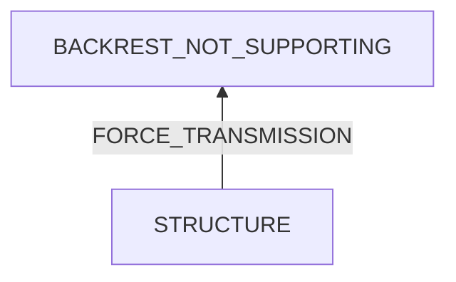

# Chair Backrest Not Supporting Enough

## Examination
[problem overview]: #
[a problem can be the output or input of a process. For output, it can be a bad output. For input, it can be a waste of resources]: #

The backrest of my working chair does not support my back enough.

### Context

#### When
[Specification: year, season, daytime, during & after some events, duration]: #

- Always

#### Where
[Localization]: #

- The backrest.

### Symptoms
[avoid biases]: #
[comparison between actuation and expectation]: #
[collect evidence used by hypothesis built in the root cause analysis phrase]: #
[specification: location, degree]: #

#### Vision

- There is a gap at the connection between the backrest and frame.
- Screws connecting the backrest and frame are loose.
- After applied for weeks, paper sheets inserted into the gap are fallen.
- the backrest is far from the seat.

#### Hearing

#### Smell

#### Taste

#### Touch & Feel

- The backrest can be shaken up and down easily.

## Root Cause Analysis
[backward cause reasoning for general problems]: #
[
process
	- stable
		- expected
		- unexpected
	- human	
]: #
[recursive trouble shooting for engineering problems to an atomic level (build hypothesis, use evidence (examination  + unit tests))]: #

STRUCTURE
:	BACKREST
	:	UPPER_PART
		:	MAIN
			:	The main part of backrest is curved backwards.
			
			SUPPORTING_GADGET
			:	Evidence
				:	Pos
					:	- After test, I find that it is not to its maximum.
		
	
		~~UPPER_PART-BACKREST_CONNECTOR~~
		:	the connection is not fasten enough.

			Evidence
			:	Neg
				:	- these screws are tight under test.
		
		~~BACKREST_CONNECTOR~~
		:	Evidence
			:	Neg
				:	- the backrest connector is a whole piece of metal, compact.

	BACKREST-FRAME
	:	INTERFACE_MISMATCH
		:	Screws are installed at wrong holes
			
			Evidence
			:	Pos
				:	- The position of screws are adjustable.
					- Current position does not make the backrest the nearest to the seat.
		
		INTERFACE_LOOSE
		:	The loose screw enables a moving space between the contacting point between the screw and the backrest connector and the screw head. The movement of the backrest is circular around the connection. 
	
			Evidence
			:	Pos
				:	- == The tilting is reduced after fastening the screws.==
				~~Neg~~
				:	- ~~The connector of the backrest is above that of the frame, so if fastening the screws, the backrest will be fastened backwards.~~
			
	FRAME
	
## Brainstorming
[removal of touchable physical objects is applicable]: #
[replacement V.S repair. Localize the problem to an atomic level where fixing it components is more expensive than replacing it as a whole]: #

MAIN
:	add a pillow. **<1>**

SUPPORTING_GADGET
:	adjust it to the end. **<2>**

INTERFACE_MISMATCH
:	use the hole making the backrest the nearest to the seat. **<3>**

INTERFACE_LOOSE
:	fasten screws. **<4>**

## Analysis of Solutions

### Comparison
| Solution | Cost | Effective Duration | Side Effects & Risks |
| --- | --- | --- | --- |
| 1 | MIDDLE | LONG | NO |
| 2 | LOW | LONG | NO |
| 3 | LOW | LONG | BROKEN |
| 4 | MIDDLE | LONG | NO |

BROKEN
:	In the before case, two screws are used. If switching to the new position, only one screw can be used, which doubles the shear force on it.

### Priority & Trace
[try from treatments to prevention based on time bound]: #

- *2*

	[Wed Sep 13 04:19:55 AM CST 2023] applied
	
- *4*

	[Wed Sep 13 04:19:55 AM CST 2023] applied
	
- *3*

	[Wed Sep 13 04:19:55 AM CST 2023] applied. To handle the risk of being broken, use a **nut**.
	
- 1
## Thinking
[Lessons learned from this experience]: #

- For this case, the cause-effect relation is not obvious, then caution is needed to analyse the structure and force.
- It is time-saving to learn how to use a device systematically BEFORE using it.

<!--stackedit_data:
eyJoaXN0b3J5IjpbMTMyOTY5MTAxNV19
-->