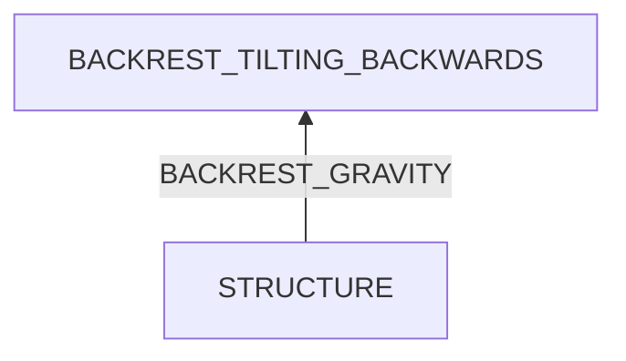

# Chair Backrest Tilting Backwards

## Examination
[problem overview]: #
[a problem can be the output or input of a process. For output, it can be a bad output. For input, it can be a waste of resources]: #

The backrest of my working chair tilts backwards.

### Context

#### When
[Specification: year, season, daytime, during & after some events, duration]: #

- Always

#### Where
[Localization]: #

- The connection between the backrest and frame.

### Symptoms
[avoid biases]: #
[comparison between actuation and expectation]: #
[collect evidence used by hypothesis built in the root cause analysis phrase]: #
[specification: location, degree]: #

#### Vision

- There is a gap at the connection between the backrest and frame.
- Screws connecting the backrest and frame are loose.
- After applied for weeks, paper sheets inserted into the gap are fallen.

#### Hearing

#### Smell

#### Taste

#### Touch & Feel

- The backrest can be shaken back and forth easily.

## Root Cause Analysis
[backward cause reasoning for general problems]: #
[
process
	- stable
		- expected
		- unexpected
	- human	
]: #
[recursive trouble shooting for engineering problems to an atomic level (build hypothesis, use evidence (examination  + unit tests))]: #

STRUCTURE
:	BACKREST
	:	UPPER_PART
		CONNECTOR

	~~BACKREST_FRAME~~
	:	The loose connection is the cause.
	
		Evidence
		:	Neg
			:	- The connector of the backrest is above that of the frame, so if fastening the screws, the backrest will be fastened backwards.
			
	FRAME
	
## Brainstorming
[removal of touchable physical objects is applicable]: #
[replacement V.S repair. Localize the problem to an atomic level where fixing it components is more expensive than replacing it as a whole]: #
 
## Analysis of Solutions

### Comparison
| Solution | Cost | Effective Duration | Side Effects & Risks |
| --- | --- | --- | --- |
|||||

### Priority & Trace
[try from treatments to prevention based on time bound]: #

## Thinking
[Lessons learned from this experience]: #

<!--stackedit_data:
eyJoaXN0b3J5IjpbODk2ODkzMDc0XX0=
-->