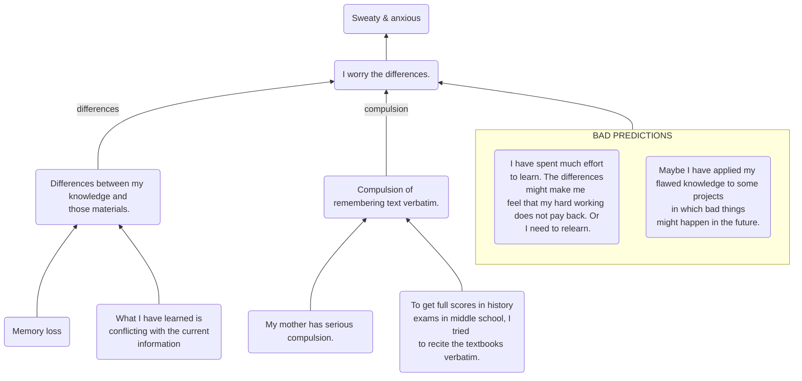

# Anxiety of Internal Knowledge "Not Good enough"

## Problem Description

I feel sweaty and short breath *when I encounter materials related to knowledge that I have learned before*. As a result, I avoid touching them.

## Root Cause Analysis

symptoms <- I worry there might be differences between my knowledge and those materials. 

worry <-
	
- I have spent much effort to learn. The differences might make me feel that my hard working does not pay back. *Or I need to relearn*. 
- Maybe I have applied my flawed knowledge to some projects in which bad things might happen in the future.
- Compulsion of remembering text verbatim.  

**Compulsion** <- 

- genetics: My mother has compulsion.
- env: To get full scores in history exams in middle school, I tried to  recite the textbooks verbatim.

differences <- I forget or what I have learned is conflicting with the current information.
  

## Possible Solutions

Nothing is perfect including our memories even books which might be outdated years later.

### Goal Orientation 

meaning:

As long as our knowledge has succeeded in solving our problems, we have met our stage goal. The "flawed" tool helped us build our current platform where we can refine our tool and works. 

### Catching the main structure

differences:

**Do not try to remember the text verbatim which is not only unrealistic but useless.** The final goal of learning is to use the knowledge as a tool to solve problems. Then it is desired for the knowledge in our mind to be generic to solve a group of problems. 

- To reduce misunderstanding, use the rule of 3 to get a broad and objective view of the subject before devoting to it. 
- Always remember to test whether we have catch the main structure and internalized the knowledge immediately after learning something. 

The main structure remains stable over time as the format of target problems. It is the specific implementations of some components that will advance.
 
- When we encounter some materials related later on, compare the main structure in our mind and that of the materials. Update our knowledge if needed which is relatively easy as the main structure is concise. 
- It is fine that we do not remember some details like who, when, where and single steps. Search it when we really need it. Try to see materials like notes and books as backup when our memories fail rather than judgement of our abilities. 

<!--stackedit_data:
eyJoaXN0b3J5IjpbMTIyMTc0Mjg0MiwtMTMzNTUyMTk2OF19
-->