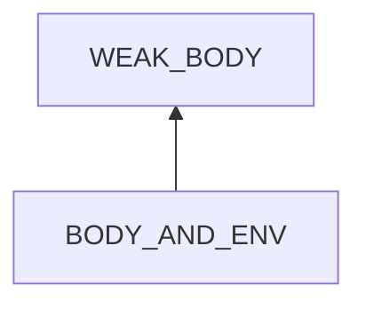
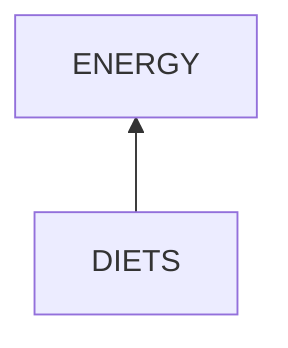
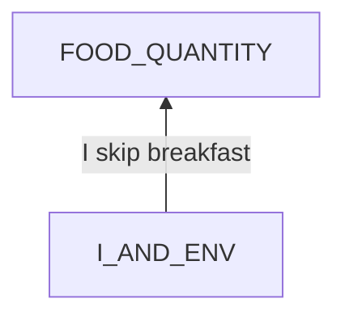
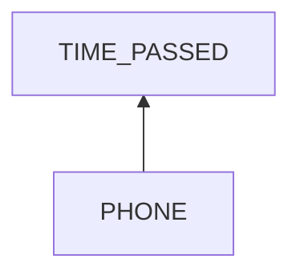
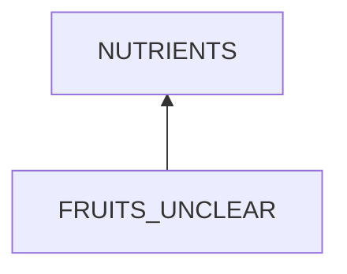
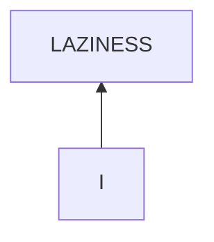

# Reluctance

## Examination
[problem overview]: #
[a problem can be of services or env of a system]: #

I feel reluctant to do challenging things.

### Context

#### When
[Specification: year, season, daytime, during & after some events, duration]: #

- date: 2023, Oct
- after: 
	- **[TRIP]** The trip to Guilin
	- **[COLD]** A cold.
- during: **[PEP]** Medicine of PEP
- duration: 3 weeks

#### Where
[Localization]: #

- handling health problems
	- Zhou's knee pains
	- my cold
	- my grandmother's thirst
- practicing the modified root cause analysis model

### Symptoms
[avoid biases]: #
[collect evidence used by hypothesis built in the root cause analysis phrase]: #
[comparison between actuation and expectation]: #
[specification: location, degree]: #

#### Vision

- when facing these challenges, I tend to 
	- **[REST]** have a rest by playing phone
	- or do easier things like house cleaning

#### Hearing

#### Smell

#### Taste

#### Touch & Feel

- **[FATIGUE]** I feel fatigue.
- health problems
	- I am not familiar of health issues
	- I worry that I can not solve these problems.
- problem solving model
	- I have not tested the new model for new problems
	- and I worry that it will not fit these new cases.

## Root Cause Analysis
[backward cause reasoning for general problems]: #
[recursive trouble shooting for engineering problems to an atomic level (build hypothesis, use evidence (examination  + unit tests))]: #

PERSON_AND_ENV
:	PERSON
	:	WEAK_BODY
		:	My body is weak and does not reach its optimal performance.
		
			Evidence
			:	Pos
				: 	- **[FATIGUE]**
		
		MIND
		:	COSTS_GREATER_THAN_BENEFITS
			:	I think that the costs of doing a certain thing are greater than its benefits.
			
			LAZINESS
			:	Not willing to work.
	
				Evidence
				:	Pos
					:	- **[REST]**
			
	PHONE
	:	My phone is available and tempting.
		
		Evidence
		:	Pos
			:	- **[REST]**

BODY_AND_ENV
:	~~NORMAL_BODY~~

	ENV
	:	FOODS
		:	ENERGY
			:	no enough energy
				
				Evidence
				:	Pos
					:	- **[IRREGULAR_DIETS]** Breakfasts are usually skipped. Lunch time is not fixed.
						- I usually feel hungry late at night.

			NUTRIENTS
			:	no enough nutrients
	
				Evidence
				:	Pos
					:	- *search symptoms of lack of nutrients*
		SLEEP
		:	no enough sleep
			
			Evidence
			:	Pos
				:	- hard to achieve 8 hours of sleep each night.	
						
		DISEASE
		:	Evidence
			:	Pos
				:	- **[COLD]**
					- *search symptoms*
 
		MEDICINE
		:	Evidence
			:	Pos
				:	- **[PEP]**
					- *search symptoms*

DIETS
:	~~QUALITY~~
	:	Evidence
		:	Neg
			:	- **[HIGH_CALORIES]** I eat rice and noodles which contain high amounts of energy.
			
	FOOD_QUANTITY
	

I_AND_ENV
:	I
	:	~~BODY~~
		:	Evidence
			:	Neg
				:	- I have appetites.
					- I can eat much.
		
		MIND
		:	BREAKFAST_UNCLEAR
			:	I am unclear of the importance of breakfast.

	TIME_PASSED
	:	I often get up near lunch time.

 PHONE
 :	playing phone late at night.

FRUITS_UNCLEAR
:	I am unclear of the importance of fruits.
				

UNCERTAINTY
:	UNCLEAR
	:	I am unclear of these things.

	CONSERVATION
	:	If I am unclear of something, I tend to be conservative, focusing on the worst case.
	 
LESS_INFORMATION
:	LITTLE_KNOWLEDGE
	:	little previous knowledge about the case.
	
	CHALLENGE
	:	Hard to figure out costs and benefits.

	I_CHALLENGE
	:	**I have not examined the case enough.** 

I
:	SHORTCUTS
	:	I tend to take shortcuts.
	
	RELAXATION
	:	Evidence
		:	Pos
			:	- **[TRIP]**
			
## Brainstorming
[removal of touchable physical objects is applicable]: #
[replacement V.S repair. Localize the problem to an atomic level where fixing it components is more expensive than replacing it as a whole]: #

~~RELUCTANCE~~
:	an emotion.

~~COSTS_GREATER_THAN_BENEFITS~~
:	an idea.

PHONE
:	refer to the problem solving of *health.psychology.temptation.entertainment* **<1>**

~~UNCLEAR~~
:	an idea.

CONSERVATION
:	practice an open mind by **<2>**
	- doing 3 things that I am unwilling to do everyday.
	- relaxation including deep breath.

LITTLE_KNOWLEDGE
:	learn its basics online. **<3>**

CHALLENGE
:	learn whether the problem is solvable and deserves my effort online. **<4>**

I_CHALLENGE
:	This is a **chicken-egg** problem. 

	*I have NOT tested it enough. -> reluctance -> I do not want to test it.*

	**Incremental improvement**: 
	- Initial triggers:	By firstly handling other causes, the reluctance will be reduced, then I will start to touch it.
	- Divide and conquer: specify the process recursively, and take a small step each time. **<5>**
 
WEAK_BODY
ENERGY
NUTRIENTS
 ## Analysis of Solutions	

### Comparison
| Solution | Cost | Effective Duration | Side Effects & Risks |
| --- | --- | --- | --- |
| 1 | HIGH | ? | NOT_ENOUGH |
| 2 | LOW | ? | NOT_ENOUGH |
| 3 | MIDDLE | LONG | NOT_ENOUGH |
| 4 | MIDDLE | LONG | NOT_ENOUGH |
| 5 | MIDDLE | LONG | LITTLE |

### Priority & Trace
[try from treatments to prevention based on time bound]: #

- 3 
- 4
- 5
- 2
- 1

## Thinking
[Deduction: Lessons learned from this experience]: #

- perceptions are the interface between a person and the object to determine behaviors.
- perceptions -> ideas
- **examination is very important for overcoming biases.**
	- the root cause analysis model should consider factors which can explain symptoms.
- Evidence to support some factor
	- tests
	- effects
	- ~~**Do not use its possible causes** which is a part of backward reasoning.~~

<!--stackedit_data:
eyJoaXN0b3J5IjpbMTAxNzUxMDcyMV19
-->