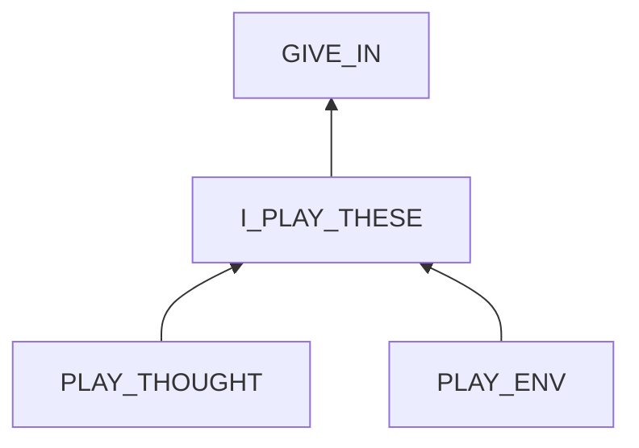
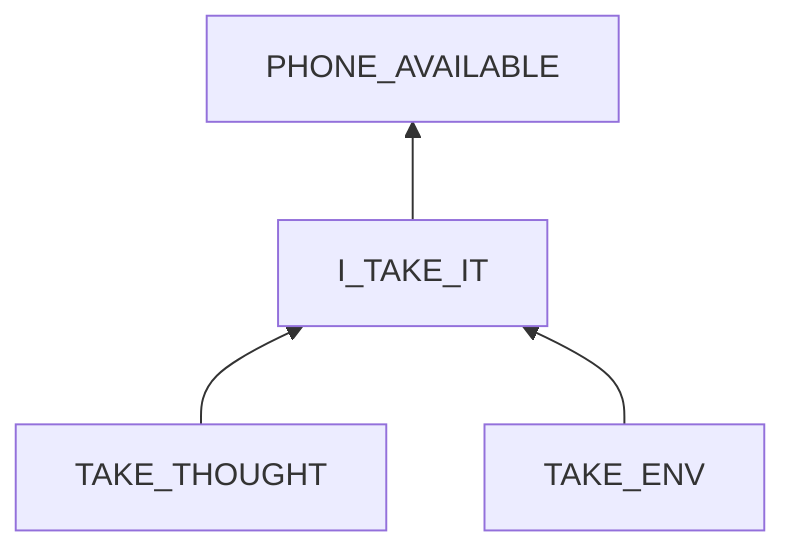

# Giving in to Entertainment

## Examination
[problem overview]: #
Time and energy is wasted in entertainment of news, games, and sex.

### Context

#### When
[Specification: year, season, daytime, during & after some events, duration]: #

- News
	- Anytime.
	- Especially during and after defecation.
	- lasting for 1 ~ 2 hours.
- Games
	- After 3:00 am and before sleep. 
	- When I am extremely tired and bored. 
	- lasting for 3 ~ 8  hours.
- Sex
	- After dinner and before 12:00 am.
	- lasting for 3 ~ 6 hours.
	- After browsing news.
	- When I am tired.

#### Where
[Localization]: #

- **[ALONE_AT_HOME]** At my house alone.
- Not using dating apps when at ZhouBo's house.

### Symptoms
[avoid biases]: #
[comparison between actuation and expectation]: #
[collect evidence used by hypothesis built in the root cause analysis phrase]: #
[specification: location, degree]: #

#### Vision

- **[ON_BED]** I usually do these things when laying on the bed.
- News
	- **[BAIDU_WEIBO]** I watch celebrities, movies and foods vlogs in Baidu and Weibo.
- Games
	- **[GOMOKU]** I only play Gomoku.
- Sex
	- **[BLUED]** I use Blued.
	
#### Hearing

#### Smell

#### Taste

#### Touch & Feel

- **[TIME_UNCONSCIOUSNESS]** Before staring, I told myself that I would stop it in one hour. But I spent much more time gradually.
- **[CRAVING]** Sometimes I know that I should stop, but the strong craving drives me to continue.
- **[CHARGING]** Even when the battery is low and the phone is about to turn off, I rush to charge it to continue, especially when I am in a match of Gomoku. 

## Root Cause Analysis
[backward cause reasoning for general problems]: #
[interactions: failed good OR bad OR side effects]: #
[recursive trouble shooting for engineering problems to an atomic level (build hypothesis, use evidence (examination  + unit tests))]: #

I_PLAY_THESE
: a bad interaction.

PLAY_THOUGHT
:	I understand what I should do and the bad effects of these temptations, but I still give in.

	- I forget to remind myself that this give-in will worsen the addiction situation.
	- I feel empty and think that I must do something before sleeping.

PLAY_ENV
:	PHONE_AVAILABLE
	:	The phone is highly available.

		Evidence
		:	Pos
			:	- **[ALONE_AT_HOME]** No others limits me.
			
				
		BROWSER
		:	BAIDU_WEIBO
			: 	for news
	
				Evidence
				:	Pos
					:	- **[BAIDU_WEIBO]**

			PLAYOK
			:	for Gomoku.
			
				Evidence
				:	Pos
					:	- **[GOMOKU]**
			
		BLUED
		:	for sex.

			Evidence
			:	Pos
				:	- **[BLUED]**
		
	BEDROOM_ALONE
	:	I am alone laying in the bedroom. It is relaxing to play phone on bed.
		
		Evidence
		:	Pos
			:	- **[ALONE_AT_HOME]**
				- **[ON_BED]** 
				- **[TIME_UNCONSCIOUSNESS]**
	
	ADDICTION
	:	I have addictions of these for years.

		Evidence
		:	Pos
			:	- **[CRAVING]**
				- **[CHARGING]**

I_TAKE_IT
:	I take the phone from the balcony to the bedroom.

TAKE_THOUGHT
:	I overestimate my self-discipline.
	
	Evidence
	:	Pos
		:	- **[TIME_UNCONSCIOUSNESS]**
			- **[CRAVING]**

TAKE_ENV
:	There are just a few steps between.

## Brainstorming
[removal of touchable physical objects is applicable]: #
[replacement V.S repair. Localize the problem to an atomic level where fixing it components is more expensive than replacing it as a whole]: #

I_PLAY_THESE
:	When alone, self control in the middle of playing is almost impossible.

PLAY_THOUGHT
:	Remind myself **<1>**
	- that this time of giving in will contributes to the accumulation of $\nabla Fobs$ which contributes to addiction.
	- that it is useless to spend time in these.
	- that pleasure is NOT happiness.
	- that ==to live a full life, do meaningful things like working, exercising and being with friends==. 

PHONE_AVAILABLE
:	I cannot remove the phone from my house, as I need its wifi hot spot to work on my laptop.
 
BROWSER
:	not applicable to remove browsers.
	- the built-in browser cannot be deleted.
	- I need a browser to access StackEdit.

BAIDU_WEIBO
:	ban baidu & weibo on the whole phone **<2>**

BLUED
:	ban blued app **<3>**

BEDROOM_ALONE
:	Do not use the phone on the bed. **<4>**

ADDICTION
:	treat the addition by **<5>**
	- cutting the contact with stimuli by alternatives.
		- APNews 
		- Music
		- Facebook / Twitter / Reddit
	- drinking more water
	- having enough sleep
	- doing exercises regularly.

TAKE_THOUGHT
:	reminders. **<6>**
	
## Analysis of Solutions

### Comparison
| Solution | Cost | Effective Duration | Side Effects & Risks |
| --- | --- | --- | --- |
| 1 | LOW | LONG | FORGET |
| 2 | MIDDLE | LONG | NOT_APPLICABLE |
| 3 | MIDDLE | LONG | NOT_APPLICABLE |
| 4 | MIDDLE | LONG | FORGET |
| 5 | HIGH | LONG | LITTLE |
| 6 | LOW | LONG | FORGET |

### Priority & Trace
- *1*
- *6*
- *4*
- 2
- 3
- 5

## Thinking
[Lessons learned from this experience]: #

- We can interrupt an activity in the middle.
- **Notice the importance of evidence in supporting causes.**
- Flaws in thoughts

<!--stackedit_data:
eyJoaXN0b3J5IjpbLTM0MzEzMzE4NV19
-->