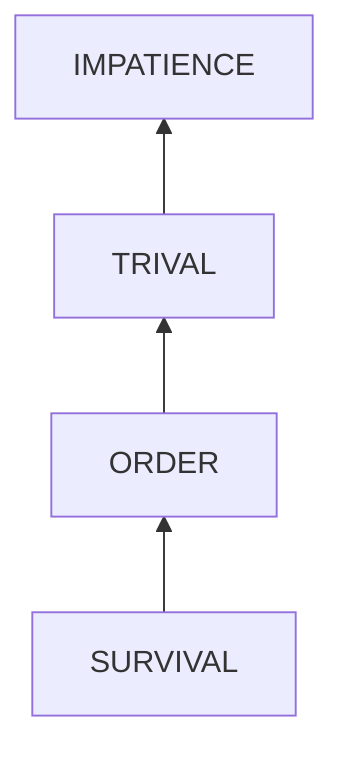

# Doing things impatiently

## Examination

I am impatient and my brain is hot. As a result, I waste a lot of time, getting stuck and exhausted.

### Context

#### When

Doing handwork 
	
#### Where

In unfamiliar fields
- fixing broken cabinet doors
- fixing loosen the bed frame
- adjusting my bike

### Symptoms
[collect evidence used by hypothesis built in the root cause analysis phrase]: #
[comparison between actuation and expectation]: #
[avoid biases]: # 

#### Vision

- fixing broken cabinet doors 
	- **without careful layout calculation**, the door reinstalled was not even and did not fit into the frame.  
	- **without analyzing the damaged interface** (the fibers around the previous used holes for screws were dusty), new fasteners installed to the location are loosen.
- fixing loosen the bed frame
	- **without analyzing different types of fasteners**, I jumped to a conclusion and waited for unnecessary screw drivers and delayed the process.
- adjusting my bike
	- **without learning bike structure knowledge before repairing**, I took a risk of disassembling some components, which cost me much time and effort to reassemble them.
	- **As to adjusting the brake component, without organizing possible solutions and reasoning the validity of each one before acting**, I tried a method when it comes through my mind even multiple times for luck. I spent over 2 hours but the problem is still not solved.

#### Hearing
#### Smell
#### Taste
#### Touch

## Root Cause Analysis
[backward cause reasoning for general problems]: #
[recursive trouble shooting for engineering problems to an atomic level (build hypothesis, use evidence (examination  + unit tests))]: #

IMPATIENCE
: Skip of preparation and planning

TRIVAL
: These things are not that important to my life. I should finish them quickly to spare time for more crucial ones.

ORDER
: To me, things like learning 
	- critical thinking
	- problem solving
	- time management
	- personal finance

  are much more important than these.

SURVIVAL:
Human

## Brainstorming
[replacement V.S fixation. Localize the problem to an atomic level where fixing it components is more expensive than replacing it as a whole]: #
## Thinking
[Lessons learned from this experience]: #

<!--stackedit_data:
eyJoaXN0b3J5IjpbMTkxNTgwMTg2Ml19
-->