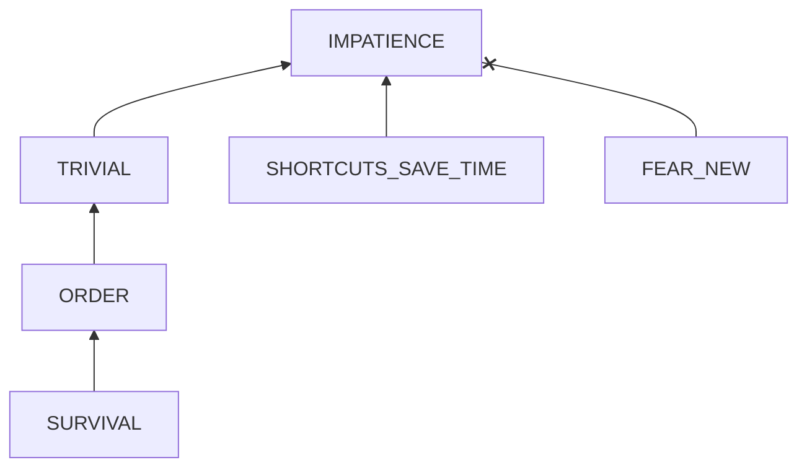

# Doing things impatiently

## Examination

I am impatient and my brain is hot. As a result, I waste a lot of time, getting stuck and exhausted.

### Context

#### When

Doing some types of handwork the first time. 
	
#### Where

In unfamiliar fields
- fixing broken cabinet doors
- fixing loosen the bed frame
- adjusting my bike

### Symptoms
[collect evidence used by hypothesis built in the root cause analysis phrase]: #
[comparison between actuation and expectation]: #
[avoid biases]: # 

#### Vision

- fixing broken cabinet doors 
	- **without careful layout calculation**, the door reinstalled was not even and did not fit into the frame.  
	- **without analyzing the damaged interface** (the fibers around the previous used holes for screws were dusty), new fasteners installed to the location are loosen.
- fixing loosen the bed frame
	- **without analyzing different types of fasteners**, I jumped to a conclusion and waited for unnecessary screw drivers and delayed the process.
- adjusting my bike
	- **without learning bike structure knowledge before repairing**, I took a risk of disassembling some components like the brake levels and brake catcher, which cost me much time and effort to reassemble them that might be damaged.
	- **As to adjusting the brake component, without organizing possible solutions and reasoning the validity of each one before acting**, I tried a method when it comes through my mind even multiple times for luck. I spent over 2 hours but the problem is still not solved.

#### Hearing
#### Smell
#### Taste
#### Touch

## Root Cause Analysis
[backward cause reasoning for general problems]: #
[recursive trouble shooting for engineering problems to an atomic level (build hypothesis, use evidence (examination  + unit tests))]: #

IMPATIENCE
: Skip of preparation and planning

TRIVIAL
: These things are not that important to my life. I should finish them quickly to spare time for more crucial ones. **My intent is to gain the small value by small effort.**
  
  Evidence
  : POS
    : - **[LEARNING]** When learning new but important knowledge like markdown or UML, I did a comprehensive research on background information and purposes before devoting myself.
	  - **[GOMOKU]** I only play with low-ranked players. To beat a high-ranked opponent I need to learn GOMOKU systematically, which I think is not worth.
 
SHORTCUTS_SAVE_TIME
: I think that shortcuts can save time.
  
  Evidence
  : POS
    : - **[STUDY_BEFORE_EXAMS]** I studied hard just before exams, which helped me get high scores.  
    
~~FEAR_NEW~~
: The fear of new things and uncertainty. 

  Evidence
  : NEG
    : - **[PERSONALITY]** I generally like to touch new things. Specifically, I am very interested in mechanics and engineering.
 

ORDER
: To me, things like learning 
	- critical thinking
	- problem solving
	- time management
	- personal finance

  are top important.

SURVIVAL
: Human's root goal to survive.

## Brainstorming
[replacement V.S repair. Localize the problem to an atomic level where fixing it components is more expensive than replacing it as a whole]: #

IMPATIENCE
: **(replacement of skip)** Before and during action, frequently ask myself (per 10 mins):
	- What am I doing?
	- What is my goal?
	- Can my action lead to my goal?
	
  If I am not clear about the answers of these questions, pause and think it.
  
TRIVIAL
: **(repair of the trivial thought)** Notice that maybe repairing furniture or bikes itself is not relevant to my life goal, but 
  - **It is a great chance to practice and improve problem solving skills**.
  - It is an experience to learn something useful. 
  - The long-term benefits of repairing the bike and bed are promising
    - a good bike promotes exercise which has many benefits
    - a stable bed promotes good sleep.
    
SHORTCUTS_SAVE_TIME
: **(repair of the thought)** Shortcuts usually tell us how to use something in syntax level, not the proof or context info. They save time when we already have a good understanding of the subject. The purpose of shortcut is mainly to
  - fetch some detail operations
  - refer to it when memory fails
  
  It will be messy and cost us much time in failed trials to rely on shortcuts before we have a clear overall picture.

    
  
~~ORDER~~
: This order makes sense.

~~SURVIVAL~~
: Natural rule.
	
## Thinking
[Lessons learned from this experience]: #

From my past experience, the temptation to shortcuts often results in more time wasted, especially in unfamiliar fields.

<!--stackedit_data:
eyJoaXN0b3J5IjpbMTAyMTQ4ODExMV19
-->