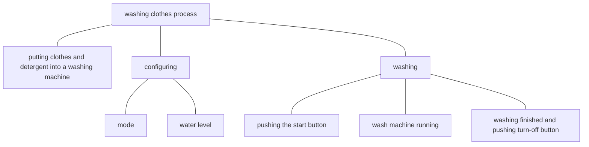

# Thoughts

## Testing & Acting

Each instance we are at some state. Testing and acting are two types of states related to goal achievement.

Testing is one when we are analyzing our current situation. During a testing process, following steps are performed.

1. specify or recall our goal.
2. examine our current situation.
3. compare differences between the situation and goal.
4. plan or check a path from the situation to the goal.

We use testing to

1. plan a path to achieve a goal at the beginning.
2. test whether or not we have achieved the goal or a sub goal.
3. clarify whether or not we are on the path when we feel lost, and make adjustment accordingly.
 
Acting is one when we are doing something to achieve our goals. It means that we are on the path.

## Abstraction Degrees

Anything can be divided into smaller parts recursively. For instance, 

Abstraction degrees mean how abstract or specific the description of a procedure is. However what procedures are obvious are various among people and among different stages of the same person. AT the beginning when we do not know how to use a wash machine, simple physical actions like *opening the lid* and *pushing the mode selection button* are obvious. After times of using, when we see higher-level instructions like "configure" and "wash clothes with a wash machine", we directly know how to do it without much thinking.

## Plan

In goal achievement, a goal is a state, and a path is a procedure. 

To make the final goal achievable and manageable, a top-down approach is applied. If we dive to specific steps too soon, the whole path will contain many steps, which is not flexible then not robust. Even we might be detoured and lost. 

For a vague path,
- reason backwards from the goal to find its dependency recursively till the starting point is reached.
- no more than 5 dependencies (sub goals) along the path.
- for each sub path, the above steps are applied recursively till a sub path (sub procedure) is obvious. 

<!--stackedit_data:
eyJoaXN0b3J5IjpbMTUwMzI2NTA3N119
-->