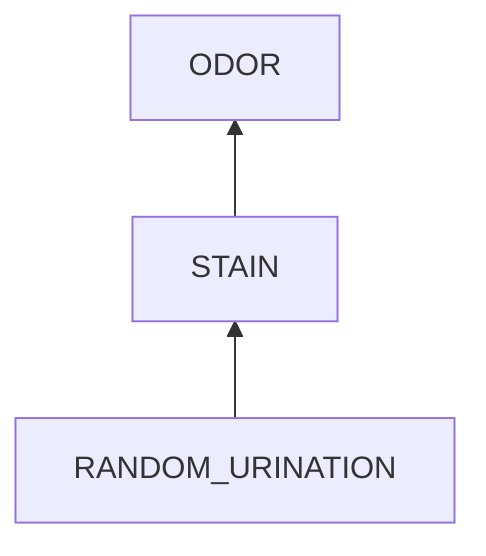

# Costs and Benefits of Solutions

For different solutions, the costs and benefits are different.

## Benefits

The benefit of a solution is the effective duration of the solution. 

### Effective Duration

The effective duration is how long a factor will appear again since a solution removes the factor. For instance, in the problem that a room has urine odor, the cause chain is illustrated in the following graph.

- It takes 1 day for a urine stain to produce and spread the odor.
- It takes 1 month for a urine stain to accumulate enough from random urination.

Then, 
1. If we remove the odor, it appears again the next day.
2. If we remove the stain, it appears one month later.
3. If we remove the bad thought and form a good habit, the good one manner is relatively stable.

## Costs

The cost of a solution is that spent when the solution is executed **once**.  It includes cost of time, energy and money. Take the urine odor example again,

- solution 1: 30 minutes of air cleaning
- solution 2: 5 minutes of floor washing
- solution 3: 1 week of practice

Costs of solutions to final results are high for some cases like device repair and medical treatments. In the extreme cases like traffic accidents caused by drunk driving or driving while using phone, the cost is death and there is no solution. 

### Costs of Plans

At some time, we analyse a problem and write down the plans. Later when the problem relapse, we need to refer to the document.

**To lower the cost of referring**,
-	to avoid analyzing again, we catch the tree structure of root cause analysis during the initial analysis.

## General Rules
- Some small behaviors might have accumulated effects and cause devastating results eventually.
- In general, prevention is better than treatment. **Because things develop slowly at the beginning and worsen faster later**,
	- prevention has longer effective time.
	- prevention is cheaper. 
<!--stackedit_data:
eyJoaXN0b3J5IjpbNzY0NTYyOTQyXX0=
-->